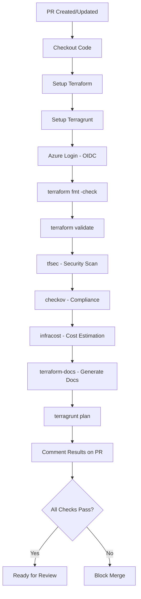
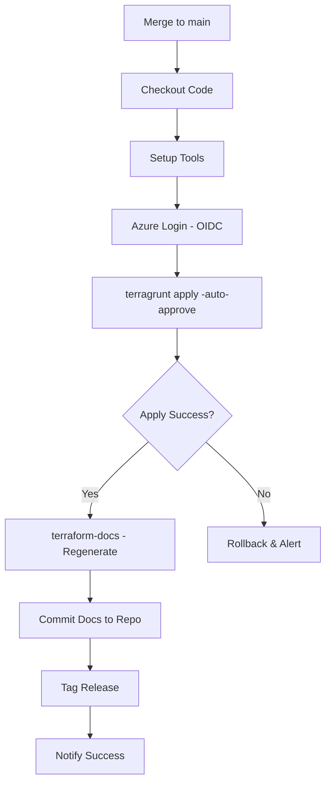

# DXC Cloud Mind - Technical Architecture

**Proyecto**: DXC Cloud Mind PoC  
**Repositorio**: DXC_PoC_Nirvana  
**Versión**: 2.1  
**Fecha**: 14 Octubre 2025

---

## 🏗️ Arquitectura General

### Diagrama de Arquitectura

```
┌─────────────────────────────────────────────────────────────────┐
│                        GitHub Repository                         │
│                       DXC_PoC_Nirvana                           │
└────────────────────────┬────────────────────────────────────────┘
                         │
         ┌───────────────┴───────────────┐
         │                               │
    ┌────▼─────┐                   ┌────▼─────┐
    │  Branch  │                   │  Branch  │
    │   main   │                   │ feature/ │
    └────┬─────┘                   └────┬─────┘
         │                               │
         │ PR Creation                   │
         │◄──────────────────────────────┘
         │
    ┌────▼──────────────────────────────────────┐
    │      GitHub Actions - PR Workflow         │
    │  ┌─────────────────────────────────────┐ │
    │  │ 1. terraform fmt -check             │ │
    │  │ 2. terraform validate               │ │
    │  │ 3. tfsec (security scan)            │ │
    │  │ 4. checkov (compliance)             │ │
    │  │ 5. infracost (cost estimation)      │ │
    │  │ 6. terraform-docs (update docs)     │ │
    │  │ 7. terragrunt plan (preview)        │ │
    │  └─────────────────────────────────────┘ │
    └────┬──────────────────────────────────────┘
         │
         │ Comment on PR with results
         │
    ┌────▼─────┐
    │ Manual   │
    │ Review & │
    │ Approval │
    └────┬─────┘
         │
         │ Merge to main
         │
    ┌────▼──────────────────────────────────────┐
    │   GitHub Actions - Deploy Workflow        │
    │  ┌─────────────────────────────────────┐ │
    │  │ 1. terragrunt apply (auto-approve)  │ │
    │  │ 2. Update state in Azure Storage    │ │
    │  │ 3. terraform-docs (regenerate)      │ │
    │  │ 4. Commit updated docs to repo      │ │
    │  └─────────────────────────────────────┘ │
    └────┬──────────────────────────────────────┘
         │
         │
    ┌────▼────────────────────────────────────────────┐
    │         Azure Cloud Infrastructure              │
    │                                                 │
    │  ┌──────────────────────────────────────────┐  │
    │  │  Hub Subscription (739aaf91...)          │  │
    │  │  ┌────────────────────────────────────┐  │  │
    │  │  │ Shared Services                    │  │  │
    │  │  │ - Terraform State Storage          │  │  │
    │  │  │ - Azure Key Vault (Secrets)        │  │  │
    │  │  │ - Existing Dify Infrastructure     │  │  │
    │  │  │   * AKS (dify-aks)                 │  │  │
    │  │  │   * PostgreSQL                     │  │  │
    │  │  │   * VNet (dify-private-vnet)       │  │  │
    │  │  └────────────────────────────────────┘  │  │
    │  └──────────────────────────────────────────┘  │
    └─────────────────────────────────────────────────┘
```

---

## 🔄 CI/CD Pipeline Architecture

### 1. Pull Request Workflow

**Trigger**: Pull request to `main` branch  
**File**: `.github/workflows/terraform-pr.yml`



**Gates Implementados**:

| Gate | Tool | Purpose | Blocking |
|------|------|---------|----------|
| **Formatting** | terraform fmt | Code style consistency | ✅ Yes |
| **Validation** | terraform validate | Syntax & structure | ✅ Yes |
| **Security** | tfsec | Security vulnerabilities | ✅ Yes |
| **Compliance** | checkov | Policy compliance (CIS, etc) | ✅ Yes |
| **Cost** | infracost | Cost impact estimation | ⚠️ Warning only |
| **Documentation** | terraform-docs | Auto-update module docs | ℹ️ Info |
| **Preview** | terragrunt plan | Infrastructure changes | ℹ️ Info |

### 2. Deploy Workflow

**Trigger**: Push to `main` branch (after PR merge)  
**File**: `.github/workflows/terraform-deploy.yml`



---

## 📚 Terraform-Docs Integration

### Qué es terraform-docs

**terraform-docs** es una herramienta que genera automáticamente documentación de módulos Terraform en formato Markdown, extrayendo:
- Variables (inputs) con descripción, tipo, default
- Outputs con descripción
- Resources creados
- Data sources utilizados
- Providers requeridos

### Implementación en el Proyecto

#### 1. Estructura de Documentación

```
terraform/
├── modules/
│   ├── container-registry/
│   │   ├── main.tf
│   │   ├── variables.tf
│   │   ├── outputs.tf
│   │   └── README.md          ← Auto-generado por terraform-docs
│   └── monitoring/
│       ├── main.tf
│       ├── variables.tf
│       ├── outputs.tf
│       └── README.md          ← Auto-generado por terraform-docs
├── environments/
│   └── hub/
│       ├── main.tf
│       ├── variables.tf
│       ├── outputs.tf
│       └── README.md          ← Auto-generado por terraform-docs
└── docs/
    └── INFRASTRUCTURE.md      ← Documentación consolidada
```

#### 2. Configuración terraform-docs

**Archivo**: `.terraform-docs.yml` (raíz del proyecto)

```yaml
formatter: "markdown table"
version: ""
header-from: main.tf
footer-from: ""
recursive:
  enabled: true
  path: terraform

sections:
  show:
    - header
    - inputs
    - outputs
    - providers
    - requirements
    - resources

content: |-
  # {{ .Header }}
  
  ## Usage
  
  ```hcl
  {{ include "examples/usage.tf" }}
  ```
  
  {{ .Inputs }}
  
  {{ .Outputs }}
  
  {{ .Providers }}
  
  {{ .Requirements }}
  
  {{ .Resources }}

output:
  file: README.md
  mode: inject
  template: |-
    <!-- BEGIN_TF_DOCS -->
    {{ .Content }}
    <!-- END_TF_DOCS -->

sort:
  enabled: true
  by: name

settings:
  anchor: true
  color: true
  default: true
  description: true
  escape: true
  hide-empty: false
  html: true
  indent: 2
  lockfile: true
  read-comments: true
  required: true
  sensitive: true
  type: true
```

#### 3. GitHub Actions Job para terraform-docs

```yaml
- name: Generate Terraform Docs
  uses: terraform-docs/gh-actions@v1.0.0
  with:
    working-dir: terraform
    output-file: README.md
    output-method: inject
    git-push: true
    git-commit-message: "docs(terraform): Auto-update documentation [skip ci]"
```

#### 4. Ejemplo de Documentación Generada

**Input**: `modules/container-registry/variables.tf`

```hcl
variable "resource_group_name" {
  type        = string
  description = "Name of the resource group for ACR"
}

variable "sku" {
  type        = string
  description = "SKU tier for ACR (Basic, Standard, Premium)"
  default     = "Standard"
  validation {
    condition     = contains(["Basic", "Standard", "Premium"], var.sku)
    error_message = "SKU must be Basic, Standard, or Premium."
  }
}
```

**Output**: `modules/container-registry/README.md`

```markdown
<!-- BEGIN_TF_DOCS -->
## Requirements

| Name | Version |
|------|---------|
| terraform | >= 1.5 |
| azurerm | ~> 3.80 |

## Providers

| Name | Version |
|------|---------|
| azurerm | 3.117.1 |
| random | 3.6.2 |

## Inputs

| Name | Description | Type | Default | Required |
|------|-------------|------|---------|:--------:|
| resource_group_name | Name of the resource group for ACR | `string` | n/a | yes |
| sku | SKU tier for ACR (Basic, Standard, Premium) | `string` | `"Standard"` | no |
| location | Azure region | `string` | `"northeurope"` | no |

## Outputs

| Name | Description |
|------|-------------|
| acr_id | ID of the Azure Container Registry |
| acr_login_server | Login server URL |
| acr_name | Name of the ACR |

## Resources

| Name | Type |
|------|------|
| azurerm_container_registry.this | resource |
| azurerm_resource_group.acr | resource |
| random_string.suffix | resource |
<!-- END_TF_DOCS -->
```

### Workflow de Actualización

1. **Durante PR**:
   - terraform-docs genera documentación
   - Se compara con la actual
   - Si hay cambios, se añaden al PR automáticamente
   - Reviewer ve los cambios de docs junto con el código

2. **Después del Deploy**:
   - terraform-docs regenera docs con valores aplicados
   - Se commitea al repo con mensaje `[skip ci]`
   - Mantiene sincronización código-documentación

---

## 🔐 Security & Secrets Management

### Azure Key Vault Integration

**Purpose**: Almacenar secrets de forma segura, accesibles desde pipelines y aplicaciones

**Estructura**:

```
Key Vault: dxc-cloudmind-kv
├── Secrets
│   ├── terraform-backend-sa-key      (State Storage Access Key)
│   ├── github-pat                     (GitHub Personal Access Token)
│   ├── dify-postgres-admin-pwd        (PostgreSQL Admin Password)
│   └── acr-webhook-token              (ACR Webhook Secret)
├── Keys
│   └── terraform-state-encryption     (Customer-managed key)
└── Access Policies
    ├── GitHub Actions OIDC Identity   (Read secrets)
    └── Admin Users                     (Full access)
```

### GitHub Actions - Azure OIDC

**Ventajas**:
- ✅ Sin passwords en GitHub Secrets
- ✅ Autenticación federada con Azure AD
- ✅ Permisos granulares por workflow
- ✅ Auditoría completa en Azure AD

**Setup**:

```bash
# 1. Crear App Registration en Azure AD
az ad app create --display-name "GitHub-DXC-CloudMind-OIDC"

# 2. Crear Service Principal
az ad sp create --id <app-id>

# 3. Configurar Federated Credentials
az ad app federated-credential create \
  --id <app-id> \
  --parameters '{
    "name": "GitHub-DXC-PoC-Nirvana-Main",
    "issuer": "https://token.actions.githubusercontent.com",
    "subject": "repo:AlbertoLacambra/DXC_PoC_Nirvana:ref:refs/heads/main",
    "audiences": ["api://AzureADTokenExchange"]
  }'

# 4. Asignar roles
az role assignment create \
  --assignee <sp-object-id> \
  --role "Contributor" \
  --scope "/subscriptions/739aaf91-5cb2-45a6-ab4f-abf883e9d3f7"
```

**GitHub Actions Usage**:

```yaml
- name: Azure Login - OIDC
  uses: azure/login@v1
  with:
    client-id: ${{ secrets.AZURE_CLIENT_ID }}
    tenant-id: ${{ secrets.AZURE_TENANT_ID }}
    subscription-id: ${{ secrets.AZURE_SUBSCRIPTION_ID }}
```

---

## 🏷️ Branching Strategy

### Git Flow Adaptado para IaC

```
main (production)
  │
  ├── develop (integration)
  │     │
  │     ├── feature/add-monitoring
  │     ├── feature/update-acr-config
  │     └── hotfix/fix-vnet-peering
  │
  └── (direct commits prohibited)
```

### Branch Protection Rules

**Branch**: `main`

```json
{
  "required_status_checks": {
    "strict": true,
    "contexts": [
      "terraform-fmt",
      "terraform-validate",
      "tfsec-scan",
      "checkov-compliance",
      "infracost-estimate"
    ]
  },
  "enforce_admins": false,
  "required_pull_request_reviews": {
    "required_approving_review_count": 1,
    "dismiss_stale_reviews": true,
    "require_code_owner_reviews": true
  },
  "required_linear_history": true,
  "allow_force_pushes": false,
  "allow_deletions": false
}
```

### Commit Message Convention

**Format**: `<type>(<scope>): <subject>`

**Types**:
- `feat`: Nueva funcionalidad
- `fix`: Bug fix
- `docs`: Documentación
- `refactor`: Refactoring sin cambios funcionales
- `test`: Añadir/modificar tests
- `chore`: Mantenimiento (dependencias, etc)
- `infra`: Cambios de infraestructura

**Examples**:
```
feat(acr): Add geo-replication support
fix(monitoring): Correct Log Analytics workspace SKU
docs(terraform): Update module README with new variables
infra(hub): Deploy monitoring module
```

---

## 📊 Cost Optimization Strategy

### PoC Configuration (Optimized)

| Resource | SKU | Monthly Cost | Production Alternative | Prod Cost |
|----------|-----|--------------|------------------------|-----------|
| **AKS** | 2x B2s (existing) | ~$30 | 2x D4s_v3 + availability zones | ~$280 |
| **PostgreSQL** | Flexible B1ms (existing) | ~$15 | GP_D4s + HA | ~$200 |
| **Storage** | Standard LRS | ~$2 | Premium ZRS + Backup | ~$25 |
| **Key Vault** | Standard | ~$1 | Premium (HSM) | ~$150 |
| **Monitoring** | ❌ Not deployed | $0 | Log Analytics + App Insights | ~$50 |
| **Backup** | ❌ Not deployed | $0 | Azure Backup + retention | ~$30 |
| **Alerts** | ❌ Not deployed | $0 | Action Groups + SMS/Email | ~$5 |
| **VNet** | Basic (existing) | ~$5 | + NAT Gateway + Firewall | ~$200 |
| **Total** | - | **~$53/mes** | - | **~$940/mes** |

### Features NOT Deployed (PoC) - RECOMMENDED FOR PRODUCTION

| Feature | Why Skipped (PoC) | Production Requirement | Impact |
|---------|-------------------|------------------------|--------|
| **Monitoring** | No SLA needed | ✅ CRITICAL - Log Analytics + App Insights | Observability |
| **Alerts** | Manual checks OK | ✅ CRITICAL - Action Groups + notifications | Incident response |
| **Backup** | Acceptable data loss | ✅ CRITICAL - Azure Backup + geo-redundant | DR/BC |
| **Multi-AZ** | Single zone OK | ✅ HIGH - Availability Zones | 99.99% SLA |
| **Premium Storage** | Standard OK | ✅ HIGH - Premium SSD + geo-replication | Performance |
| **WAF/Firewall** | Public access OK | ✅ CRITICAL - Azure Firewall + WAF rules | Security |
| **DDoS Protection** | Not needed | ✅ MEDIUM - DDoS Protection Standard | Security |
| **Key Vault HSM** | Standard OK | ✅ HIGH - Premium tier with HSM | Compliance |

**Nota**: Todos estos features están **pre-configurados pero desactivados** en el código Terraform mediante variables:

```hcl
# terraform/hub/terragrunt.hcl
inputs = {
  # PoC Configuration
  enable_monitoring = false          # Set to true for PRODUCTION
  enable_backup     = false          # Set to true for PRODUCTION
  enable_alerts     = false          # Set to true for PRODUCTION
  use_availability_zones = false     # Set to true for PRODUCTION
  
  # Documentation included for activation
  # See: docs/PRODUCTION_CHECKLIST.md
}
```

---

## 🚀 Future Enhancements (Post-PoC)

### 1. Backstage Integration (Paused - Future Consideration)

**Qué es**: Developer portal de Spotify para self-service de infraestructura

**Propuesta** (cuando esté listo):
- Catálogo de componentes de infraestructura
- Templates de Terraform para self-service
- Documentación centralizada de APIs y servicios
- Software catalog con ownership

**Por qué pausado**:
- PoC no requiere self-service
- Complejidad adicional no justificada aún
- Mejor validar arquitectura base primero

### 2. Multi-Environment (Spoke-Prod, Spoke-Dev)

**Estado actual**: Solo Hub configurado  
**Próximo paso**: Extender a Spokes cuando PoC validado

### 3. GitOps con ArgoCD/Flux

**Propuesta**: Desplegar aplicaciones (no solo infra) con GitOps  
**Beneficio**: Single source of truth, rollback automático

---

## 📖 Documentation Strategy

### Documentación Auto-Generada

| Documento | Herramienta | Frecuencia | Ubicación |
|-----------|-------------|------------|-----------|
| Module READMEs | terraform-docs | Cada commit | `terraform/modules/*/README.md` |
| Environment Docs | terraform-docs | Cada commit | `terraform/environments/*/README.md` |
| Infrastructure Diagram | Graphviz (terraform graph) | Cada deploy | `docs/architecture/` |
| Cost Report | infracost | Cada PR | PR comment + `docs/costs/` |
| Security Report | tfsec + checkov | Cada PR | PR comment + `docs/security/` |

### Documentación Manual

| Documento | Propósito | Mantenimiento |
|-----------|-----------|---------------|
| BUSINESS_PLAN.md | Visión estratégica | Trimestral |
| TECHNICAL_ARCHITECTURE.md | Arquitectura técnica | Por cambio mayor |
| RUNBOOK.md | Operaciones día 2 | Continuo |
| PRODUCTION_CHECKLIST.md | Checklist pre-producción | Por release |
| TROUBLESHOOTING.md | Resolución de problemas | Continuo |

---

## 🎯 Success Metrics

### PoC Phase

| Metric | Target | Measurement |
|--------|--------|-------------|
| **Deploy Time** | < 15 min | GitHub Actions duration |
| **Monthly Cost** | < $60 | Azure Cost Management |
| **PR Approval Time** | < 24h | GitHub insights |
| **Security Issues** | 0 critical | tfsec/checkov reports |
| **Documentation Coverage** | 100% modules | terraform-docs validation |
| **Uptime** | > 95% (best effort) | Manual checks |

### Production Phase (Future)

| Metric | Target | Measurement |
|--------|--------|-------------|
| **Uptime** | 99.9% | Azure Monitor |
| **MTTR** | < 1h | Incident logs |
| **Deploy Frequency** | Daily | GitHub Actions |
| **Change Failure Rate** | < 10% | Rollback count |
| **Cost Variance** | ± 5% | infracost accuracy |

---

## 📝 Conclusion

Esta arquitectura técnica define una plataforma **DXC Cloud Mind** que:

✅ **Optimiza costes** (~$53/mes vs $130 budget)  
✅ **Automatiza completamente** CI/CD con gates de calidad  
✅ **Auto-documenta** con terraform-docs  
✅ **Escala a producción** con features pre-configurados  
✅ **Cumple best practices** de IaC y GitOps  

**Repositorio**: DXC_PoC_Nirvana  
**Próximo paso**: Implementar GitHub Actions workflows  
**Timeline**: Ver BUSINESS_PLAN.md sección "Implementation Roadmap"

---

**Última actualización**: 14 Octubre 2025  
**Autor**: Alberto Lacambra  
**Versión**: 2.1
