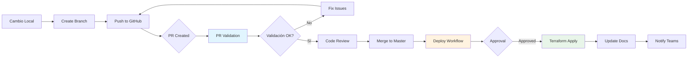

# GitHub Actions Workflows

Workflows de CI/CD para gestión automatizada de infraestructura con Terraform.

## 📋 Workflows Disponibles

### 1. 🔍 PR Validation (`pr-validation.yml`)

**Trigger**: Pull Request a `master`/`main`

**Propósito**: Validar cambios de infraestructura antes de merge

**Jobs**:
1. **Terraform Format** - Verifica formato consistente
2. **Terraform Validate** - Valida sintaxis y configuración
3. **Terraform Plan** - Genera plan de cambios
4. **Terraform Docs** - Verifica documentación actualizada
5. **Security Scan** - Escaneo con Checkov
6. **Notify Teams** - Notificación del resultado

**Tiempo estimado**: 5-8 minutos

---

### 2. 🚀 Deploy Infrastructure (`deploy.yml`)

**Trigger**: 
- Push a `master`/`main`
- Manual (`workflow_dispatch`)

**Propósito**: Desplegar cambios aprobados de infraestructura

**Jobs**:
1. **Detect Changes** - Detecta entornos modificados
2. **Deploy Hub** - Despliega entorno Hub
   - Terraform Plan
   - Manual Approval (configurable)
   - Terraform Apply
3. **Update Docs** - Actualiza documentación automáticamente
4. **Notify Teams** - Notificación del resultado

**Tiempo estimado**: 10-15 minutos (+ tiempo aprobación)

**⚠️ Requiere Aprobación Manual** por defecto

---

### 3. 🔍 Drift Detection (`drift-detection.yml`)

**Trigger**: 
- Scheduled (diario a las 2:00 AM UTC)
- Manual (`workflow_dispatch`)

**Propósito**: Detectar cambios no autorizados en infraestructura

**Jobs**:
1. **Drift Check Hub** - Verifica drift en entorno Hub
2. **Create Drift Issue** - Crea/actualiza issue si hay drift
3. **Notify Teams** - Notificación del resultado

**Tiempo estimado**: 3-5 minutos

**Salida**: 
- GitHub Issue (si drift detectado)
- Reporte en artifacts
- Notificación Teams

---

## 🔐 Secretos Requeridos

Configura estos secretos en: **Settings → Secrets and variables → Actions**

| Secret | Descripción | Ejemplo |
|--------|-------------|---------|
| `AZURE_CLIENT_ID` | Service Principal Client ID | `00000000-0000-0000-0000-000000000000` |
| `AZURE_TENANT_ID` | Azure AD Tenant ID | `00000000-0000-0000-0000-000000000000` |
| `TEAMS_WEBHOOK_URL` | Webhook de Power Automate | `https://default...powerplatform.com...` |

### Configuración de Azure Service Principal

```bash
# Crear Service Principal para GitHub Actions
az ad sp create-for-rbac \
  --name "github-actions-dxc-cloudmind" \
  --role "Contributor" \
  --scopes "/subscriptions/739aaf91-5cb2-45a6-ab4f-abf883e9d3f7" \
  --sdk-auth

# Asignar rol adicional para Storage (Terraform State)
az role assignment create \
  --assignee <CLIENT_ID> \
  --role "Storage Blob Data Contributor" \
  --scope "/subscriptions/739aaf91-5cb2-45a6-ab4f-abf883e9d3f7/resourceGroups/tfstate-rg/providers/Microsoft.Storage/storageAccounts/tfstate9a448729"
```

---

## 🚀 Uso de los Workflows

### Crear Pull Request

```bash
# 1. Crear branch para cambios
git checkout -b feature/add-monitoring

# 2. Hacer cambios en Terraform
# ...

# 3. Commit y push
git add terraform/
git commit -m "feat: Add monitoring resources"
git push origin feature/add-monitoring

# 4. Crear PR en GitHub
# El workflow pr-validation.yml se ejecutará automáticamente
```

### Deployment Manual

```bash
# Desde GitHub UI:
# 1. Actions → Deploy Infrastructure
# 2. Click "Run workflow"
# 3. Selecciona:
#    - Environment: hub
#    - Auto approve: false (recomendado)
# 4. Click "Run workflow"
```

### Verificar Drift Manualmente

```bash
# Desde GitHub UI:
# 1. Actions → Drift Detection
# 2. Click "Run workflow"
# 3. Selecciona:
#    - Environment: hub o all
# 4. Click "Run workflow"
```

---

## 📊 Ejemplo de Flujo Completo



---

## 📱 Notificaciones en Teams

Todas las notificaciones se envían como **Adaptive Cards** con:

### PR Validation
- ✅ Estado de validación
- 📊 Resumen de cambios
- 🔗 Links a PR y Workflow

### Deployment
- 🚀 Estado del deployment
- 📊 Recursos creados/modificados/destruidos
- 🔗 Links a Azure Portal

### Drift Detection
- ⚠️ Alerta de drift (si detectado)
- 📋 Resumen de cambios
- 🔗 Links a Issue y Dashboard

---

## 🛡️ Security Checks

El workflow de PR Validation incluye:

### Checkov Scan
- ✅ Best practices de seguridad
- ✅ Compliance checks
- ✅ Resultados en SARIF format

### Áreas verificadas:
- Networking (NSG, VNet, Firewall)
- IAM (Permisos, RBAC)
- Encryption (Storage, Disks, Secrets)
- Logging (Diagnostic Settings, Retention)
- Backup & Recovery

---

## 📝 Convenciones de Commit

Para mejor integración con workflows:

```bash
# Feature
git commit -m "feat: Add new monitoring module"

# Fix
git commit -m "fix: Correct ACR configuration"

# Docs (skip CI)
git commit -m "docs: Update README [skip ci]"

# Style (format)
git commit -m "style: Format Terraform files"

# Refactor
git commit -m "refactor: Simplify namespace configuration"
```

**Nota**: Commits con `[skip ci]` no ejecutarán workflows

---

## 🔧 Troubleshooting

### Workflow falla en "Azure Login"

**Causa**: Service Principal mal configurado

**Solución**:
```bash
# Verificar SP
az ad sp show --id <CLIENT_ID>

# Verificar permisos
az role assignment list --assignee <CLIENT_ID>
```

### Workflow falla en "Terraform Init"

**Causa**: Backend state no accesible

**Solución**:
```bash
# Verificar acceso a Storage Account
az storage account show \
  --name tfstate9a448729 \
  --resource-group tfstate-rg

# Verificar permisos RBAC
az role assignment list \
  --scope "/subscriptions/.../storageAccounts/tfstate9a448729"
```

### Notificaciones Teams no llegan

**Causa**: Webhook URL incorrecto o expirado

**Solución**:
1. Regenerar webhook en Power Automate
2. Actualizar secret `TEAMS_WEBHOOK_URL`
3. Probar con curl:
   ```bash
   curl -X POST \
     -H 'Content-Type: application/json' \
     -d '{"attachments": [...]}' \
     "$TEAMS_WEBHOOK_URL"
   ```

---

## 📚 Referencias

- [GitHub Actions - Documentación oficial](https://docs.github.com/en/actions)
- [Terraform GitHub Actions](https://github.com/hashicorp/setup-terraform)
- [Azure Login Action](https://github.com/Azure/login)
- [Checkov Security Scanner](https://www.checkov.io/)

---

## 📊 Métricas y Monitoreo

### Dashboards Disponibles

1. **GitHub Actions Dashboard**
   - [Workflow Runs](https://github.com/AlbertoLacambra/DXC_PoC_Nirvana/actions)
   - Success rate
   - Execution times

2. **Azure Workbooks**
   - Drift Detection Status
   - Pipeline Status
   - Infrastructure Changes

---

**Última actualización**: 15 de Octubre, 2025  
**Mantenido por**: DXC Cloud Mind Team
