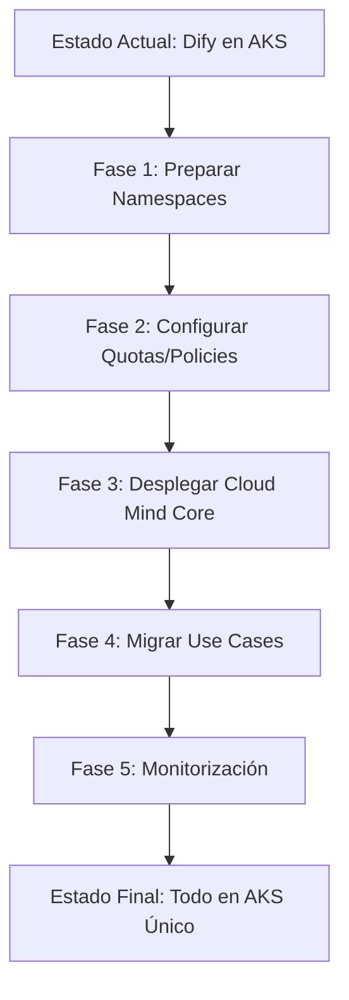

# 🎯 Propuesta de Optimización - DXC Cloud Mind PoC

**Fecha**: 15 Octubre 2025  
**Autor**: Alberto Lacambra  
**Objetivo**: Maximizar valor mientras minimizamos costes en la PoC

---

## 📋 Resumen Ejecutivo

Dos propuestas clave para optimizar la PoC sin comprometer funcionalidad:

1. **✅ CONSOLIDACIÓN AKS** - Usar único cluster existente (Dify) → **Ahorro: ~$75/mes (~58%)**
2. **✅ MONITORIZACIÓN GRATUITA** - Azure Workbooks + Grafana + Teams → **Coste: $0/mes**

**Impacto Total**: Reducción de $130/mes a ~$55/mes por suscripción ✅

---

## 1️⃣ Propuesta: AKS Único Consolidado

### 🎯 Concepto

Usar el **AKS existente de Dify** para desplegar:
- ✅ Dify (ya existente)
- ✅ Aplicaciones de casos de uso (agentes, bots, automatizaciones)
- ✅ Aplicaciones finales de prototipos

**Estrategia**: Separación por **Namespaces** + **Resource Quotas** + **Network Policies**

---

### 💰 Análisis de Costes

#### Escenario Actual (Multi-AKS)
```
Hub Subscription:
  - AKS Dify (existente)        : $73.00/mes
  - ACR Standard                : $5.00/mes
  - Storage (state)             : $0.20/mes
  TOTAL HUB                     : $78.20/mes

Spoke-Prod Subscription:
  - AKS Control Center          : $73.00/mes  ← ELIMINAR
  - VNet + Peering              : $5.00/mes   ← ELIMINAR
  TOTAL SPOKE-PROD              : $78.00/mes

Spoke-Dev Subscription:
  - AKS Dev (auto-shutdown)     : $25.00/mes  ← ELIMINAR
  - VNet + Peering              : $5.00/mes   ← ELIMINAR
  TOTAL SPOKE-DEV               : $30.00/mes

COSTE MENSUAL TOTAL             : $186.20/mes
```

#### Escenario Propuesto (AKS Único)
```
Hub Subscription (única):
  - AKS Dify (expandido)        : $73.00/mes  (sin cambio)
  - ACR Standard                : $5.00/mes
  - Storage (state)             : $0.20/mes
  - PostgreSQL Flexible         : Ya existente (Dify)
  - Storage Account             : Ya existente (Dify)
  - Key Vault                   : Ya existente (Dify)
  TOTAL MENSUAL                 : $78.20/mes

AHORRO MENSUAL                  : $108.00/mes (58%)
AHORRO ANUAL                    : $1,296.00/año
```

---

### 🏗️ Arquitectura de Namespaces

```
┌─────────────────────────────────────────────────────────┐
│                    AKS Cluster: dify-aks                │
│                  (Standard_D2s_v3 x 2 nodes)            │
├─────────────────────────────────────────────────────────┤
│                                                         │
│  ┌──────────────────────────────────────────┐          │
│  │  Namespace: dify-platform                │          │
│  │  ├─ Dify Core Services (existente)       │          │
│  │  ├─ PostgreSQL Client                    │          │
│  │  └─ Redis Cache                          │          │
│  │  Resource Quota: CPU 2, Memory 4Gi       │          │
│  └──────────────────────────────────────────┘          │
│                                                         │
│  ┌──────────────────────────────────────────┐          │
│  │  Namespace: cloud-mind-core              │          │
│  │  ├─ Control Plane Services               │          │
│  │  ├─ API Gateway (si aplica)              │          │
│  │  └─ Shared Components                    │          │
│  │  Resource Quota: CPU 1, Memory 2Gi       │          │
│  └──────────────────────────────────────────┘          │
│                                                         │
│  ┌──────────────────────────────────────────┐          │
│  │  Namespace: use-cases-dev                │          │
│  │  ├─ Agentes IA (desarrollo)              │          │
│  │  ├─ Chatbots (prototipos)                │          │
│  │  └─ Automatizaciones (testing)           │          │
│  │  Resource Quota: CPU 1, Memory 2Gi       │          │
│  └──────────────────────────────────────────┘          │
│                                                         │
│  ┌──────────────────────────────────────────┐          │
│  │  Namespace: use-cases-prod               │          │
│  │  ├─ Agentes IA (validados)               │          │
│  │  ├─ Chatbots (aprobados)                 │          │
│  │  └─ Automatizaciones (productivos)       │          │
│  │  Resource Quota: CPU 2, Memory 4Gi       │          │
│  └──────────────────────────────────────────┘          │
│                                                         │
│  ┌──────────────────────────────────────────┐          │
│  │  Namespace: apps-prototypes              │          │
│  │  ├─ Aplicación Prototipo 1               │          │
│  │  ├─ Aplicación Prototipo 2               │          │
│  │  └─ Aplicación Prototipo N               │          │
│  │  Resource Quota: CPU 1, Memory 2Gi       │          │
│  └──────────────────────────────────────────┘          │
│                                                         │
│  ┌──────────────────────────────────────────┐          │
│  │  Namespace: monitoring (OPCIONAL)        │          │
│  │  ├─ Grafana (si se despliega)            │          │
│  │  ├─ Prometheus (metrics)                 │          │
│  │  └─ Loki (logs - OPCIONAL)               │          │
│  │  Resource Quota: CPU 0.5, Memory 1Gi     │          │
│  └──────────────────────────────────────────┘          │
│                                                         │
└─────────────────────────────────────────────────────────┘

          │
          ├─► ACR: ccacr######.azurecr.io
          ├─► PostgreSQL: dify-postgres-9107e36a
          ├─► Storage: difyprivatest9107e36a
          └─► Key Vault: dify-private-kv-9107e36a
```

---

### 🔒 Estrategias de Aislamiento y Seguridad

#### 1. Resource Quotas (Hard Limits)
```yaml
# Ejemplo: use-cases-dev
apiVersion: v1
kind: ResourceQuota
metadata:
  name: compute-quota
  namespace: use-cases-dev
spec:
  hard:
    requests.cpu: "1"
    requests.memory: 2Gi
    limits.cpu: "2"
    limits.memory: 4Gi
    pods: "10"
```

#### 2. Network Policies (Aislamiento de Red)
```yaml
# Denegar tráfico entre namespaces por defecto
apiVersion: networking.k8s.io/v1
kind: NetworkPolicy
metadata:
  name: deny-cross-namespace
  namespace: use-cases-dev
spec:
  podSelector: {}
  policyTypes:
  - Ingress
  - Egress
  ingress:
  - from:
    - namespaceSelector:
        matchLabels:
          name: use-cases-dev
```

#### 3. RBAC (Control de Acceso)
```yaml
# Rol limitado por namespace
apiVersion: rbac.authorization.k8s.io/v1
kind: RoleBinding
metadata:
  name: developer-binding
  namespace: use-cases-dev
subjects:
- kind: User
  name: developer@dxc.com
roleRef:
  kind: Role
  name: developer-role
  apiGroup: rbac.authorization.k8s.io
```

#### 4. Pod Security Standards
```yaml
# Restricciones a nivel namespace
apiVersion: v1
kind: Namespace
metadata:
  name: use-cases-dev
  labels:
    pod-security.kubernetes.io/enforce: restricted
    pod-security.kubernetes.io/audit: restricted
    pod-security.kubernetes.io/warn: restricted
```

---

### ✅ Ventajas de AKS Único

| Aspecto | Beneficio |
|---------|-----------|
| **Coste** | Ahorro de $108/mes (58%) |
| **Gestión** | Un único cluster que gestionar |
| **Recursos** | Mejor aprovechamiento de CPU/RAM (sin desperdicio) |
| **Networking** | Sin necesidad de VNet Peering entre spokes |
| **Complejidad** | Infraestructura más simple |
| **Actualizaciones** | Aplicar parches/updates una sola vez |
| **Monitorización** | Vista unificada de todos los workloads |

---

### ⚠️ Consideraciones y Mitigaciones

| Riesgo | Mitigación |
|--------|------------|
| **Noisy Neighbor** | Resource Quotas estrictos + LimitRanges |
| **Fallo en Cascade** | High Availability con 2+ nodes, Pod Disruption Budgets |
| **Saturación de Recursos** | Monitorización + Alertas cuando uso > 70% |
| **Aislamiento de Seguridad** | Network Policies + RBAC + Pod Security Standards |
| **Escalabilidad Limitada** | Auto-scaling del cluster (si es necesario) |

---

### 🎯 Estrategia de Migración



**Duración estimada**: 1-2 semanas  
**Esfuerzo**: 16-24 horas  
**Riesgo**: BAJO (no toca Dify existente)

---

## 2️⃣ Propuesta: Monitorización Sin Coste

### 🎯 Concepto

Implementar **monitorización completa** sin incurrir en costes adicionales:
- ✅ Azure Workbooks (GRATIS - parte de Azure Monitor)
- ✅ Grafana en AKS (coste marginal - ya pagamos el cluster)
- ✅ Alertas a Microsoft Teams (GRATIS - webhooks)
- ✅ Drift Detection automático (GRATIS - GitHub Actions)
- ✅ Estado de Pipelines (GRATIS - GitHub API)

---

### 💰 Análisis de Costes

```
Componente                          Coste Mensual    Notas
────────────────────────────────────────────────────────────────
Azure Workbooks                     $0.00            Incluido en suscripción
Azure Monitor (básico)              $0.00            Incluido en AKS
Grafana en AKS                      ~$2.00           Recursos mínimos (0.2 CPU, 512Mi)
Prometheus en AKS                   ~$3.00           Recursos mínimos (0.5 CPU, 1Gi)
Teams Incoming Webhooks             $0.00            Parte de Teams
GitHub Actions (públicas)           $0.00            2000 min/mes gratis
Azure Storage (logs - 30 días)      ~$1.00           10GB aproximadamente
────────────────────────────────────────────────────────────────
TOTAL MONITORIZACIÓN                ~$6.00/mes
```

**Nota**: Si excluimos Prometheus/Grafana → **$0/mes** (solo Azure Workbooks + Teams)

---

### 🏗️ Arquitectura de Monitorización

```
┌─────────────────────────────────────────────────────────────┐
│                    MONITORIZACIÓN DXC CLOUD MIND            │
└─────────────────────────────────────────────────────────────┘
                           │
        ┌──────────────────┼──────────────────┐
        │                  │                  │
        ▼                  ▼                  ▼
┌───────────────┐  ┌───────────────┐  ┌───────────────┐
│ INFRAESTRUCTURA│  │   PIPELINES   │  │  APLICACIONES │
│    (Azure)     │  │  (GitHub)     │  │    (AKS)      │
└───────────────┘  └───────────────┘  └───────────────┘
        │                  │                  │
        │                  │                  │
        ▼                  ▼                  ▼
┌─────────────────────────────────────────────────────┐
│              CAPA DE RECOLECCIÓN                    │
├─────────────────────────────────────────────────────┤
│                                                     │
│  ┌─────────────────┐   ┌─────────────────┐        │
│  │ Azure Monitor   │   │ GitHub Actions  │        │
│  │ (Metrics/Logs)  │   │ API (Status)    │        │
│  └─────────────────┘   └─────────────────┘        │
│                                                     │
│  ┌─────────────────┐   ┌─────────────────┐        │
│  │ Prometheus      │   │ Terraform State │        │
│  │ (AKS Metrics)   │   │ (Drift Check)   │        │
│  └─────────────────┘   └─────────────────┘        │
│                                                     │
└─────────────────────────────────────────────────────┘
                           │
        ┌──────────────────┼──────────────────┐
        │                  │                  │
        ▼                  ▼                  ▼
┌───────────────┐  ┌───────────────┐  ┌───────────────┐
│ AZURE WORKBOOK│  │    GRAFANA    │  │  TEAMS ALERTS │
│ (Dashboards)  │  │  (Dashboards) │  │  (Webhooks)   │
└───────────────┘  └───────────────┘  └───────────────┘
        │                  │                  │
        └──────────────────┴──────────────────┘
                           │
                           ▼
                  ┌─────────────────┐
                  │   USUARIOS      │
                  │   - DevOps      │
                  │   - Developers  │
                  │   - Management  │
                  └─────────────────┘
```

---

### 📊 Dashboards Propuestos

#### 1️⃣ **Azure Workbook: Infraestructura**
```json
{
  "panels": [
    {
      "title": "AKS Health",
      "metrics": [
        "Node CPU Usage %",
        "Node Memory Usage %",
        "Pod Count",
        "Failed Pods"
      ]
    },
    {
      "title": "Cost Analysis",
      "queries": [
        "Azure Cost by Resource",
        "Daily Spend Trend",
        "Budget Alert Status"
      ]
    },
    {
      "title": "Resource Utilization",
      "metrics": [
        "ACR Storage Used",
        "PostgreSQL Connections",
        "Storage Account Usage"
      ]
    }
  ]
}
```

**Acceso**: Azure Portal → Monitor → Workbooks → Custom Workbook

---

#### 2️⃣ **Grafana Dashboard: Aplicaciones** (OPCIONAL)
```yaml
# Despliegue en namespace: monitoring
apiVersion: apps/v1
kind: Deployment
metadata:
  name: grafana
  namespace: monitoring
spec:
  replicas: 1
  template:
    spec:
      containers:
      - name: grafana
        image: grafana/grafana:latest
        resources:
          requests:
            cpu: 200m
            memory: 512Mi
          limits:
            cpu: 500m
            memory: 1Gi
        env:
        - name: GF_SECURITY_ADMIN_PASSWORD
          valueFrom:
            secretKeyRef:
              name: grafana-credentials
              key: admin-password
```

**Paneles**:
- Pod Resource Usage (por namespace)
- Request Rate & Latency
- Error Rate
- Active Users/Sessions

---

#### 3️⃣ **GitHub Actions Dashboard: CI/CD Status**
```yaml
# .github/workflows/status-report.yml
name: Pipeline Status Report
on:
  schedule:
    - cron: '0 9 * * 1'  # Lunes a las 9 AM
  workflow_run:
    workflows: ["Terraform Plan", "Terraform Apply"]
    types: [completed]

jobs:
  report:
    runs-on: ubuntu-latest
    steps:
      - name: Get Workflow Runs
        uses: actions/github-script@v7
        with:
          script: |
            const runs = await github.rest.actions.listWorkflowRunsForRepo({
              owner: context.repo.owner,
              repo: context.repo.repo,
              per_page: 20
            });
            
            const summary = runs.data.workflow_runs.reduce((acc, run) => {
              acc[run.conclusion] = (acc[run.conclusion] || 0) + 1;
              return acc;
            }, {});
            
            return summary;

      - name: Send to Teams
        uses: aliencube/microsoft-teams-actions@v0.8.0
        with:
          webhook_uri: ${{ secrets.TEAMS_WEBHOOK }}
          title: "📊 Pipeline Status - Weekly Report"
          summary: "Pipeline statistics for DXC Cloud Mind"
```

---

### 🔔 Alertas a Microsoft Teams

#### Configuración de Webhook
```bash
# 1. En Microsoft Teams
# Ir a: Canal → ... → Connectors → Incoming Webhook
# Copiar webhook URL

# 2. Guardar en GitHub Secrets
gh secret set TEAMS_WEBHOOK --body "https://outlook.office.com/webhook/..."
```

#### Tipos de Alertas

| Evento | Trigger | Severidad |
|--------|---------|-----------|
| **Drift Detectado** | Terraform plan muestra cambios no aplicados | ⚠️ WARNING |
| **Pipeline Fallido** | GitHub Actions workflow failed | 🔴 CRITICAL |
| **Budget Excedido** | Gasto mensual > 90% del budget | 🔴 CRITICAL |
| **AKS Node Down** | Node status != Ready | 🔴 CRITICAL |
| **Resource Quota Exceeded** | Namespace quota > 90% | ⚠️ WARNING |
| **PR Aprobado** | Pull Request merged | ✅ INFO |
| **Deployment Exitoso** | Terraform apply successful | ✅ INFO |

---

### 🎯 Implementación de Drift Detection

```yaml
# .github/workflows/drift-detection.yml
name: Infrastructure Drift Detection
on:
  schedule:
    - cron: '0 */6 * * *'  # Cada 6 horas
  workflow_dispatch:

jobs:
  detect-drift:
    runs-on: ubuntu-latest
    steps:
      - uses: actions/checkout@v4
      
      - name: Setup Terraform
        uses: hashicorp/setup-terraform@v3
      
      - name: Terragrunt Plan (Check Drift)
        id: plan
        run: |
          cd terraform/hub
          terragrunt plan -detailed-exitcode -out=drift.tfplan || echo "drift_detected=true" >> $GITHUB_OUTPUT
        env:
          ARM_CLIENT_ID: ${{ secrets.AZURE_CLIENT_ID }}
          ARM_CLIENT_SECRET: ${{ secrets.AZURE_CLIENT_SECRET }}
          ARM_TENANT_ID: ${{ secrets.AZURE_TENANT_ID }}
          ARM_SUBSCRIPTION_ID: ${{ secrets.AZURE_SUBSCRIPTION_ID }}
      
      - name: Parse Drift
        if: steps.plan.outputs.drift_detected == 'true'
        run: |
          terragrunt show drift.tfplan -no-color > drift_details.txt
      
      - name: Send Teams Alert
        if: steps.plan.outputs.drift_detected == 'true'
        uses: aliencube/microsoft-teams-actions@v0.8.0
        with:
          webhook_uri: ${{ secrets.TEAMS_WEBHOOK }}
          title: "⚠️ DRIFT DETECTADO en Infraestructura"
          summary: "Se detectaron cambios no aplicados en el estado de Terraform"
          sections: |
            [{
              "activityTitle": "Detalles del Drift",
              "activitySubtitle": "Recursos afectados",
              "text": "$(cat drift_details.txt)"
            }]
          theme_color: "FFA500"
```

---

### 📧 Formato de Alertas Teams

#### Ejemplo: Drift Detectado
```json
{
  "@type": "MessageCard",
  "themeColor": "FFA500",
  "title": "⚠️ DRIFT DETECTADO - DXC Cloud Mind",
  "summary": "Infraestructura tiene cambios no aplicados",
  "sections": [
    {
      "activityTitle": "Terraform State Drift",
      "activitySubtitle": "2 recursos modificados manualmente",
      "facts": [
        {
          "name": "Entorno:",
          "value": "Hub (Producción)"
        },
        {
          "name": "Recursos Afectados:",
          "value": "azurerm_container_registry.acr, azurerm_kubernetes_cluster.aks"
        },
        {
          "name": "Tipo de Cambio:",
          "value": "Configuración modificada fuera de Terraform"
        },
        {
          "name": "Detectado:",
          "value": "2025-10-15 14:30 UTC"
        }
      ]
    }
  ],
  "potentialAction": [
    {
      "@type": "OpenUri",
      "name": "Ver Detalles en GitHub",
      "targets": [
        {
          "os": "default",
          "uri": "https://github.com/AlbertoLacambra/DXC_PoC_Nirvana/actions"
        }
      ]
    }
  ]
}
```

#### Ejemplo: Pipeline Exitoso
```json
{
  "@type": "MessageCard",
  "themeColor": "00FF00",
  "title": "✅ DEPLOYMENT EXITOSO - DXC Cloud Mind",
  "summary": "Infraestructura actualizada correctamente",
  "sections": [
    {
      "activityTitle": "Terraform Apply Completado",
      "activitySubtitle": "Todos los recursos creados/actualizados",
      "facts": [
        {
          "name": "Entorno:",
          "value": "Hub"
        },
        {
          "name": "Recursos Creados:",
          "value": "3"
        },
        {
          "name": "Recursos Modificados:",
          "value": "1"
        },
        {
          "name": "Duración:",
          "value": "4m 23s"
        }
      ]
    }
  ]
}
```

---

### 🎨 Azure Workbook: Template

```json
{
  "version": "Notebook/1.0",
  "items": [
    {
      "type": 1,
      "content": {
        "json": "# DXC Cloud Mind - Infrastructure Dashboard"
      }
    },
    {
      "type": 3,
      "content": {
        "version": "KqlItem/1.0",
        "query": "AzureMetrics\n| where ResourceProvider == \"MICROSOFT.CONTAINERSERVICE\"\n| where MetricName == \"node_cpu_usage_percentage\"\n| summarize avg(Average) by bin(TimeGenerated, 5m), Resource\n| render timechart",
        "size": 0,
        "title": "AKS Node CPU Usage (%)",
        "timeContext": {
          "durationMs": 86400000
        }
      }
    },
    {
      "type": 3,
      "content": {
        "version": "KqlItem/1.0",
        "query": "AzureDiagnostics\n| where Category == \"kube-audit\"\n| where log_s contains \"Failed\"\n| summarize count() by bin(TimeGenerated, 1h)\n| render columnchart",
        "size": 0,
        "title": "Failed Operations (Last 24h)"
      }
    },
    {
      "type": 10,
      "content": {
        "chartId": "workbook-cost-analysis",
        "version": "MetricsItem/2.0",
        "size": 0,
        "chartType": 2,
        "resourceType": "microsoft.costmanagement/query",
        "metricScope": 0,
        "title": "Daily Cost Trend"
      }
    }
  ]
}
```

**Instrucciones de Importación**:
1. Azure Portal → Monitor → Workbooks → New
2. Copiar JSON template
3. Save As → "DXC Cloud Mind Dashboard"

---

### ✅ Beneficios de Monitorización Sin Coste

| Aspecto | Valor |
|---------|-------|
| **Coste** | $0-6/mes (vs $50-100/mes soluciones comerciales) |
| **Visibilidad** | Completa sobre infraestructura y aplicaciones |
| **Alertas Proactivas** | Problemas detectados antes que impacten usuarios |
| **Drift Control** | Configuración siempre alineada con código |
| **Transparencia** | Equipo informado en tiempo real vía Teams |
| **Compliance** | Logs y auditoría disponibles 30 días |

---

## 🎯 Recomendaciones

### Para PoC (Implementar AHORA)
✅ **AKS Único** - Implementar consolidación de clusters  
✅ **Azure Workbooks** - Dashboards básicos de infraestructura  
✅ **Teams Alerts** - Notificaciones de drift y pipelines  
✅ **Drift Detection** - Workflow cada 6 horas  

**Coste Total PoC**: ~$55/mes por suscripción

---

### Para Producción (Documentar como RECOMENDADO)
📋 **Multi-AKS** - Separación física Hub/Spoke para aislamiento  
📋 **Azure Monitor Premium** - Application Insights detallado  
📋 **Log Analytics Avanzado** - Retención 90 días, alertas ML  
📋 **Grafana Enterprise** - Dashboards avanzados, RBAC  
📋 **PagerDuty/OpsGenie** - Gestión de incidentes 24/7  
📋 **Backup Solutions** - Velero para AKS, Azure Backup  
📋 **HA & DR** - Multi-region, failover automático  

**Coste Total Producción**: ~$300-400/mes por suscripción

---

## 📊 Comparativa Final

| Aspecto | Escenario Original | PoC Optimizado | Diferencia |
|---------|-------------------|----------------|------------|
| **Suscripciones** | 3 | 1 | -2 |
| **Clusters AKS** | 3 | 1 | -2 |
| **Coste Mensual** | $186/mes | $55/mes | **-$131/mes (70%)** |
| **Coste Anual** | $2,232/año | $660/año | **-$1,572/año** |
| **Complejidad** | Alta (multi-sub) | Baja (single-sub) | ⬇️ |
| **Monitorización** | Básica | Completa | ⬆️ |
| **Tiempo Setup** | 8-10 semanas | 4-5 semanas | ⬇️ 50% |

---

## 🚀 Plan de Implementación

### Fase 1: Consolidación AKS (Semana 1-2)
- [ ] Crear namespaces en AKS existente
- [ ] Configurar Resource Quotas y Network Policies
- [ ] Configurar RBAC por namespace
- [ ] Desplegar Cloud Mind Core
- [ ] Validar aislamiento y seguridad

### Fase 2: Monitorización (Semana 2-3)
- [ ] Crear Azure Workbook con métricas clave
- [ ] Configurar Teams webhooks
- [ ] Implementar workflow de drift detection
- [ ] Configurar alertas críticas
- [ ] (Opcional) Desplegar Grafana en AKS

### Fase 3: Documentación (Semana 3-4)
- [ ] Documentar arquitectura de namespaces
- [ ] Crear guías de uso por namespace
- [ ] Documentar alertas y escalado
- [ ] Generar "Recomendaciones para Producción"

---

## ✅ Conclusión

**AMBAS PROPUESTAS SON VIABLES Y RECOMENDADAS** ✅

- **Consolidación AKS**: Ahorra $108/mes (58%) sin comprometer funcionalidad
- **Monitorización Gratuita**: Visibilidad completa por $0-6/mes

**Impacto Total**: De $186/mes a **$55/mes** (70% ahorro) manteniendo:
- ✅ Funcionalidad completa
- ✅ Seguridad y aislamiento
- ✅ Monitorización profesional
- ✅ Alertas en tiempo real
- ✅ Control de drift

**Recomendación**: Implementar AMBAS propuestas en la PoC.

---

**Próximo Paso**: ¿Aprobamos la implementación de estas optimizaciones?
