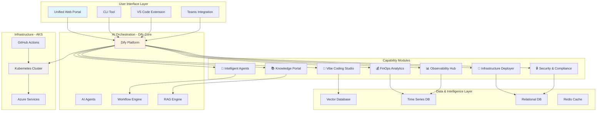
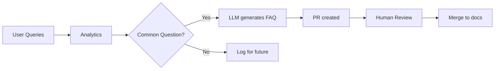
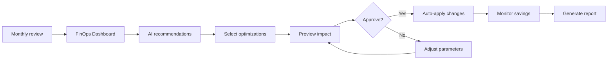
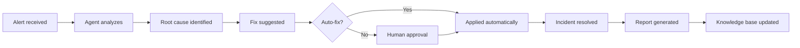

# Cloud Control Center - Visión del Producto

## 🎯 Visión Estratégica

**Cloud Control Center** es una **plataforma unificada impulsada por IA** que democratiza las operaciones Cloud, permitiendo a perfiles técnicos y no técnicos **desplegar, gobernar, optimizar y automatizar** infraestructura y aplicaciones mediante **interfaces conversacionales y guiadas por IA**.

### Propuesta de Valor

> **"From Intent to Infrastructure in Minutes, Not Weeks"**
> 
> Una única interfaz donde **describir es desplegar**, **preguntar es aprender**, y **gobernar es automatizar**.

---

## 🎭 Audiencias Objetivo

### Perfiles Técnicos

| Persona | Necesidades | Pain Points | Valor que Aporta CCC |
|---------|-------------|-------------|---------------------|
| **☁️ Cloud Engineer** | Deploy infra, troubleshoot, optimize | Terraform complejo, docs dispersas | Spec-driven infra, AI troubleshooting |
| **💻 Developer** | Deploy apps, CI/CD, scaffolding | Setup lento, boilerplate repetitivo | Vibe coding, auto-scaffolding |
| **🔒 Security Engineer** | Compliance, vulnerability scanning | Herramientas fragmentadas | Unified security dashboard |

### Perfiles de Gobierno y Negocio

| Persona | Necesidades | Pain Points | Valor que Aporta CCC |
|---------|-------------|-------------|---------------------|
| **💰 FinOps Analyst** | Cost optimization, reporting | Datos dispersos, manual analysis | AI-powered cost insights |
| **👔 IT Governance** | Compliance, policies, audit | Falta de visibilidad centralizada | Policy enforcement automation |
| **📊 Engineering Manager** | Team productivity, KPIs | Métricas manuales, no actionable | Real-time engineering metrics |

---

## 🏗️ Arquitectura de la Plataforma



---

## 🧩 Módulos de Capacidades

### 1. 🎨 **Vibe Coding Studio**

**Concepto**: Desarrollo guiado por IA donde **describes** tu app y la IA genera código, estructura, tests y docs.

**Inspiración**: [CodeVibe.ai](https://www.codevibe.ai/)

**Flujo de Usuario**:

```
👤 Usuario: "Quiero crear una API REST en Python con FastAPI para gestionar usuarios, 
            con autenticación JWT, base de datos PostgreSQL y deploy en AKS"

🤖 CCC: 
   ✅ Proyecto creado: user-management-api/
   ✅ Estructura generada: 
      - app/
        - main.py
        - models.py
        - routes/
        - auth/
      - tests/
      - Dockerfile
      - kubernetes/
      - .github/workflows/
   ✅ Código generado con best practices
   ✅ Tests unitarios incluidos
   ✅ CI/CD configurado
   ✅ README.md completo
   
   🚀 ¿Desplegar en AKS? [Sí] [No] [Preview]
```

**Tecnologías**:
- **LLM**: Azure OpenAI GPT-4 Turbo
- **Code Generation**: GitHub Copilot API
- **Templates**: Cookiecutter + Custom
- **Testing**: Automated test generation

**Características**:
- ✅ Multi-lenguaje (Python, TypeScript, Go, Rust)
- ✅ Multi-framework (FastAPI, NextJS, Spring Boot)
- ✅ Auto-scaffolding con best practices
- ✅ Tests generados automáticamente
- ✅ CI/CD pre-configurado
- ✅ Security scanning integrado
- ✅ Documentation auto-generada

### 2. 🚀 **Infrastructure Deployer (Spec-Driven)**

**Concepto**: Infraestructura como conversación. Describes **qué necesitas** y la IA genera el Terraform.

**Inspiración**: [Spec-Driven Development](https://github.blog/ai-and-ml/generative-ai/spec-driven-development-with-ai-get-started-with-a-new-open-source-toolkit/)

**Flujo de Usuario**:

```
👤 Usuario: "Necesito un cluster AKS con 3 nodes, autoscaling, 
            conectado a un ACR privado, con monitoring y backup"

🤖 CCC:
   📋 Especificación Generada:
   
   Infrastructure Spec:
   - AKS Cluster
     - Node count: 3-10 (autoscaling)
     - VM size: Standard_D4s_v3
     - Network: Private
   - Azure Container Registry
     - SKU: Premium (geo-replication)
     - Private endpoint: Yes
   - Monitoring
     - Azure Monitor: Enabled
     - Log Analytics: 90 days retention
   - Backup
     - Velero: Configured
     - Schedule: Daily 2AM
   
   💰 Coste estimado: €450/mes
   🔒 Security score: 95/100
   
   ✅ ¿Generar Terraform? [Sí] [Modificar] [Cancelar]

👤 Usuario: [Sí]

🤖 CCC:
   ✅ Terraform generado en terraform/projects/my-aks-cluster/
   ✅ Variables parametrizadas
   ✅ State backend configurado
   ✅ Security scanning: OK (tfsec, checkov)
   ✅ Plan ejecutado: +15 recursos
   
   🚀 ¿Aplicar cambios? [Sí] [Ver Plan] [Modificar]
```

**Tecnologías**:
- **Spec Parsing**: LLM + Structured Outputs
- **IaC Generation**: Terraform + Bicep
- **Validation**: tfsec, checkov, tflint
- **Cost Estimation**: Infracost API
- **Security Scoring**: Custom engine

**Características**:
- ✅ Natural language → Terraform
- ✅ Cost estimation antes de desplegar
- ✅ Security validation automática
- ✅ Multi-cloud (Azure, AWS, GCP)
- ✅ Drift detection integrada
- ✅ Rollback automático
- ✅ Change impact analysis

### 3. 🤖 **Intelligent Agents Platform**

**Concepto**: Agentes IA especializados que automatizan tareas complejas de forma autónoma.

**Inspiración**: [Context Engineering](https://github.com/coleam00/context-engineering-intro/)

**Agentes Disponibles**:

| Agente | Propósito | Autonomía | Ejemplo |
|--------|-----------|-----------|---------|
| **🔍 Troubleshooter** | Diagnostica y resuelve incidentes | Semi-autónoma | "Mi pod está crasheando" → Analiza logs, identifica causa, sugiere fix |
| **💰 Cost Optimizer** | Identifica y aplica optimizaciones | Autónoma | Detecta recursos infrautilizados, propone downgrade, ejecuta cambio |
| **🔒 Security Auditor** | Escanea y remedia vulnerabilidades | Semi-autónoma | Detecta CVE crítico, crea PR con patch, notifica a security |
| **📚 Doc Curator** | Mantiene docs actualizadas | Autónoma | Detecta doc obsoleta, genera actualización, crea PR |
| **🚀 Deployment Assistant** | Orquesta deployments complejos | Semi-autónoma | Deploy multi-región con blue-green strategy |
| **📊 Report Generator** | Genera reportes automáticos | Autónoma | Reporte semanal de costes, security, performance |

**Flujo de Ejemplo - Troubleshooter Agent**:

```
👤 Usuario: "Mi aplicación user-service en producción está dando errores 500"

🤖 Troubleshooter Agent:
   🔍 Analizando...
   
   [1/5] ✅ Checking pod status
         - 3/3 pods running
   
   [2/5] ⚠️ Analyzing logs (last 1h)
         - Found 247 errors: "Connection to PostgreSQL refused"
   
   [3/5] 🔍 Checking database
         - PostgreSQL pod: CrashLoopBackOff
         - Reason: Disk full (100%)
   
   [4/5] 💡 Root cause identified
         - PV filled with logs
         - Log rotation not configured
   
   [5/5] 🛠️ Suggested fixes:
         a) Immediate: Increase PV size (50GB → 100GB)
         b) Short-term: Clean old logs manually
         c) Long-term: Configure log rotation
   
   📋 Action Plan:
   1. [AUTO] Scale PV to 100GB (approval needed)
   2. [AUTO] Restart PostgreSQL pod
   3. [MANUAL] Configure log rotation
   
   ⚡ Execute plan? [Yes] [Modify] [Cancel]

👤 Usuario: [Yes]

🤖 Agent:
   ✅ [00:05] PV scaled to 100GB
   ✅ [00:07] PostgreSQL pod restarted
   ✅ [00:10] user-service healthy (0 errors)
   
   📝 Incident Report created: INC-2025-10-17-001
   🎫 Jira ticket created: CLOUDOPS-1234
   📢 Teams notification sent
   
   🔧 Next steps:
   - [ ] Configure log rotation (PR draft created)
   - [ ] Review PV sizing policy
   - [ ] Add alerting for disk usage >80%
```

**Tecnologías**:
- **Agent Framework**: LangGraph + LangChain
- **Orchestration**: Dify Workflow Engine
- **Tools**: kubectl, az cli, GitHub API, Jira API
- **Memory**: Vector DB para contexto histórico
- **Decision Engine**: LLM con structured outputs

### 4. 📚 **Knowledge Portal (RAG-Powered)**

**Concepto**: Documentación viva que **responde**, **evoluciona** y **se auto-mantiene**.

**Capacidades**:

#### a) **Conversational Documentation**

```
👤 Usuario: "¿Cómo configuro autenticación Azure AD en mi app?"

🤖 Knowledge Bot:
   Para configurar Azure AD en tu aplicación, sigue estos pasos:
   
   **1. Registrar aplicación en Azure AD** 🔐
   ```bash
   az ad app create --display-name "MyApp" \
     --sign-in-audience AzureADMyOrg
   ```
   
   **2. Configurar redirect URIs**
   - Development: http://localhost:3000/auth/callback
   - Production: https://myapp.dxc.com/auth/callback
   
   **3. Agregar secrets a tu app**
   ```typescript
   // .env
   AZURE_CLIENT_ID=<your-client-id>
   AZURE_TENANT_ID=<your-tenant-id>
   AZURE_CLIENT_SECRET=<your-secret>
   ```
   
   📚 **Documentación relacionada:**
   - [Azure AD Integration Guide](/guides/azure-ad)
   - [Authentication Best Practices](/security/auth-best-practices)
   - [Environment Variables Setup](/guides/env-vars)
   
   💡 **¿Quieres que genere el código de integración?** [Sí] [No]
```

#### b) **Auto-Improving Documentation**



#### c) **Multi-Format Knowledge Base**

- 📄 **Markdown**: Documentación tradicional
- 🎥 **Videos**: Tutoriales auto-transcritos
- 🎙️ **Podcasts**: Tech talks indexados
- 📊 **Runbooks**: Procedimientos operativos
- 💻 **Code Examples**: Repositorio de snippets
- 🗺️ **Architecture Diagrams**: Mermaid auto-generados

### 5. 💰 **FinOps Analytics**

**Concepto**: Visibilidad y optimización de costes con recomendaciones accionables por IA.

**Dashboard Principal**:

```
┌─────────────────────────────────────────────────────────────┐
│ 💰 FinOps Dashboard - October 2025                         │
├─────────────────────────────────────────────────────────────┤
│                                                             │
│  Current Month Spend:  €4,250  (↓ 12% vs last month)      │
│  Budget: €5,000        Projected: €4,180  ✅ Under budget  │
│  Forecast EOY:         €51,000                              │
│                                                             │
├─────────────────────────────────────────────────────────────┤
│ 🎯 AI Recommendations                                       │
├─────────────────────────────────────────────────────────────┤
│                                                             │
│ 1. ⚡ High Impact - Save €450/month                        │
│    ├─ VM "dev-bastion" running 24/7 (82% idle)            │
│    ├─ Recommendation: Auto-shutdown at 19:00               │
│    └─ [Apply] [Snooze] [Details]                           │
│                                                             │
│ 2. 💾 Medium Impact - Save €120/month                      │
│    ├─ Storage account "logs" using Premium tier            │
│    ├─ Recommendation: Downgrade to Hot tier                │
│    └─ [Apply] [Snooze] [Details]                           │
│                                                             │
│ 3. 🔄 Quick Win - Save €80/month                           │
│    ├─ 3 unused Managed Disks (orphaned)                    │
│    ├─ Recommendation: Delete unused resources              │
│    └─ [Apply] [Snooze] [Details]                           │
│                                                             │
├─────────────────────────────────────────────────────────────┤
│ 📊 Cost Breakdown by Service                                │
├─────────────────────────────────────────────────────────────┤
│                                                             │
│  AKS:         €2,100 (49%) ███████████▓░░░░░░░░░░░         │
│  Storage:     €800  (19%)  ████▓░░░░░░░░░░░░░░░░░░         │
│  Networking:  €650  (15%)  ███▓░░░░░░░░░░░░░░░░░░░         │
│  Compute VMs: €450  (11%)  ██▓░░░░░░░░░░░░░░░░░░░░         │
│  Other:       €250  (6%)   █▓░░░░░░░░░░░░░░░░░░░░░         │
│                                                             │
└─────────────────────────────────────────────────────────────┘
```

**Capacidades**:
- 📈 Real-time cost tracking
- 🔮 Predictive forecasting (ML-based)
- 💡 AI-powered recommendations
- 🎯 Anomaly detection
- 📊 Custom reports y dashboards
- 🚨 Budget alerts
- 🤖 Automated optimization (con approval)

### 6. 🔒 **Security & Compliance Hub**

**Concepto**: Seguridad proactiva con detección y remediación automática.

**Capacidades**:

#### a) **Security Score Dashboard**

```
┌─────────────────────────────────────────────────────────────┐
│ 🔒 Security Score: 87/100  (↑ 5 pts this month)           │
├─────────────────────────────────────────────────────────────┤
│                                                             │
│  ✅ Passed:  45 checks                                      │
│  ⚠️ Warnings: 8 checks                                      │
│  ❌ Failed:   2 checks  [CRITICAL]                          │
│                                                             │
├─────────────────────────────────────────────────────────────┤
│ ❌ Critical Issues                                          │
├─────────────────────────────────────────────────────────────┤
│                                                             │
│ 1. CVE-2024-12345 in "user-service" container              │
│    ├─ Severity: CRITICAL (CVSS 9.8)                        │
│    ├─ Component: openssl 1.1.1k                            │
│    ├─ Fix: Update to 3.0.0+                                │
│    └─ 🤖 [Auto-Fix Available] [Details]                    │
│                                                             │
│ 2. Exposed Redis without authentication                     │
│    ├─ Resource: redis-cache-prod                           │
│    ├─ Risk: Data breach, unauthorized access               │
│    └─ 🤖 [Enable Auth] [Network Policy] [Details]          │
│                                                             │
└─────────────────────────────────────────────────────────────┘
```

#### b) **Compliance Automation**

- ✅ **CIS Benchmarks**: Auto-check + remediation
- ✅ **GDPR**: Data inventory + compliance checks
- ✅ **ISO 27001**: Control mapping
- ✅ **SOC 2**: Audit trail automation

### 7. 📊 **Observability Hub**

**Concepto**: Telemetría unificada con insights accionables por IA.

**Capacidades**:
- 📈 Metrics (Prometheus + Grafana)
- 📝 Logs (Loki + AI-powered log analysis)
- 🔍 Traces (Tempo + distributed tracing)
- 🚨 Alerting (AI-powered alert routing)
- 📊 Dashboards (auto-generated based on workload)

---

## 🔄 User Journeys

### Journey 1: **Developer Deploying New Microservice**

```mermaid
graph LR
    A[Idea: "Need user API"] --> B[Vibe Coding Studio]
    B --> C[Describe requirements]
    C --> D[AI generates code]
    D --> E[Review & adjust]
    E --> F[Deploy to dev]
    F --> G[Automated tests]
    G --> H{Tests pass?}
    H -->|Yes| I[Deploy to prod]
    H -->|No| J[AI suggests fixes]
    J --> E
    I --> K[Observability enabled]
    K --> L[Documentation auto-updated]
```

**Time**: 30 min (vs 2-3 days traditional)

### Journey 2: **FinOps Analyst Optimizing Costs**



**Time**: 1 hour (vs full day manual analysis)

### Journey 3: **Cloud Engineer Troubleshooting Incident**



**MTTR**: 5-10 min (vs 30-60 min traditional)

---

## 🎨 User Interface Mockup

### Unified Dashboard

```
┌──────────────────────────────────────────────────────────────────────┐
│ ☁️ Cloud Control Center  👤 Alberto Lacambra  🔔 3  ⚙️            │
├──────────────────────────────────────────────────────────────────────┤
│                                                                      │
│ ┌────────────────────────────────────────────────────────────────┐  │
│ │ 🤖 Ask CloudMind Assistant...                                  │  │
│ │ ┌──────────────────────────────────────────────────────────┐   │  │
│ │ │ "Deploy a FastAPI application with PostgreSQL backend..." │   │  │
│ │ └──────────────────────────────────────────────────────────┘   │  │
│ │                                                                 │  │
│ │ 💡 Suggestions:                                                 │  │
│ │  • "Show me cost optimizations"                                │  │
│ │  • "Create a new project with NextJS"                          │  │
│ │  • "Check security score"                                      │  │
│ └────────────────────────────────────────────────────────────────┘  │
│                                                                      │
│ ┌─────────────────┐ ┌──────────────────┐ ┌──────────────────┐      │
│ │ 🎨 Vibe Coding │ │ 🚀 Deploy Infra  │ │ 📚 Documentation │      │
│ │ Create projects│ │ Spec-driven IaC  │ │ RAG-powered      │      │
│ │ with AI        │ │                  │ │ knowledge        │      │
│ └─────────────────┘ └──────────────────┘ └──────────────────┘      │
│                                                                      │
│ ┌─────────────────┐ ┌──────────────────┐ ┌──────────────────┐      │
│ │ 🤖 AI Agents   │ │ 💰 FinOps        │ │ 🔒 Security      │      │
│ │ 3 active       │ │ €4,250 / €5,000  │ │ Score: 87/100    │      │
│ │ 12 completed   │ │ ↓ 12% this month │ │ 2 critical       │      │
│ └─────────────────┘ └──────────────────┘ └──────────────────┘      │
│                                                                      │
│ ┌────────────────────────────────────────────────────────────────┐  │
│ │ 📊 Recent Activity                                             │  │
│ ├────────────────────────────────────────────────────────────────┤  │
│ │ ✅ 5 min ago  | Agent "Cost Optimizer" saved €120/month       │  │
│ │ 🚀 12 min ago | Deployed "user-service" v2.3.0 to production  │  │
│ │ 📝 1h ago     | Documentation updated: "AKS Best Practices"    │  │
│ │ ⚠️ 2h ago     | Security scan found 1 vulnerability (fixed)   │  │
│ └────────────────────────────────────────────────────────────────┘  │
│                                                                      │
└──────────────────────────────────────────────────────────────────────┘
```

---

## 🛠️ Tecnología Stack

### Frontend
- **Framework**: NextJS 14 (App Router)
- **UI**: shadcn/ui + Tailwind CSS
- **State**: Zustand + React Query
- **Charts**: Recharts + D3.js
- **Editor**: Monaco Editor (VS Code engine)

### Backend & AI
- **AI Platform**: Dify (core orchestrator)
- **LLM**: Azure OpenAI (GPT-4 Turbo)
- **Embeddings**: text-embedding-3-large
- **Vector DB**: Weaviate
- **Agent Framework**: LangGraph + LangChain
- **Workflow Engine**: Temporal.io

### Data Layer
- **Relational**: PostgreSQL
- **Time Series**: InfluxDB / Prometheus
- **Cache**: Redis
- **Object Storage**: Azure Blob Storage

### Infrastructure
- **Orchestration**: Kubernetes (AKS)
- **IaC**: Terraform + Bicep
- **CI/CD**: GitHub Actions
- **Monitoring**: Grafana Stack (Prometheus, Loki, Tempo)
- **Security**: Trivy, tfsec, checkov

---

## 📊 KPIs y Métricas de Éxito

### Adoption Metrics

| Métrica | Baseline | Target Q2 2026 | Actual |
|---------|----------|----------------|--------|
| **Daily Active Users** | 0 | 50+ | - |
| **Projects Created** | 0 | 100+ | - |
| **Deploys via Platform** | 0 | 500+/month | - |
| **Agent Tasks Completed** | 0 | 1000+/month | - |
| **Knowledge Base Queries** | 0 | 2000+/month | - |

### Efficiency Metrics

| Métrica | Before | After | Improvement |
|---------|--------|-------|-------------|
| **Time to Deploy App** | 2-3 days | 30 min | **96% faster** |
| **Time to Deploy Infra** | 1-2 weeks | 2 hours | **98% faster** |
| **MTTR (Mean Time to Resolve)** | 45 min | 8 min | **82% faster** |
| **Doc Search Time** | 15 min | 2 min | **87% faster** |
| **Cost Optimization Time** | 8 hours/month | 1 hour/month | **87% faster** |

### Business Impact

| Impacto | Valor Anual |
|---------|-------------|
| **Productivity Gains** | €180,000 |
| **Cost Savings (Cloud)** | €45,000 |
| **Reduced Incidents** | €30,000 |
| **Faster Time to Market** | €120,000 |
| **TOTAL ROI** | **€375,000/year** |

---

## 🚀 Roadmap de Implementación

### **Phase 1: Foundation** (Q4 2025 - 3 months)

**Goal**: MVP de plataforma con capacidades core

- ✅ Infraestructura base (AKS, Dify, bases de datos)
- ✅ Knowledge Portal con RAG
- 🚧 Vibe Coding Studio (MVP)
- 🚧 Infrastructure Deployer (básico)
- 📝 UI unificada (versión alpha)

**Deliverables**:
- [ ] Dify desplegado y operacional
- [ ] 50 documentos técnicos en knowledge base
- [ ] Vibe Coding: 3 templates (Python/FastAPI, TypeScript/NextJS, Go)
- [ ] Infrastructure Deployer: AKS + ACR + networking
- [ ] 10 usuarios alpha testing

### **Phase 2: AI Agents** (Q1 2026 - 3 months)

**Goal**: Automatización inteligente con agentes

- 🤖 Troubleshooter Agent
- 💰 Cost Optimizer Agent
- 🔒 Security Auditor Agent
- 📚 Doc Curator Agent
- 🎨 Vibe Coding avanzado (más templates y lenguajes)

**Deliverables**:
- [ ] 4 agentes operacionales
- [ ] 20+ templates en Vibe Coding
- [ ] 100+ proyectos creados
- [ ] 30 usuarios activos

### **Phase 3: Advanced Analytics** (Q2 2026 - 3 months)

**Goal**: Insights avanzados y optimización continua

- 📊 FinOps Analytics completo
- 🔒 Security & Compliance Hub
- 📈 Observability Hub
- 🤖 Agentes adicionales (Deployment Assistant, Report Generator)
- 🎯 Predictive analytics

**Deliverables**:
- [ ] Dashboard FinOps con AI recommendations
- [ ] Security Hub con compliance automation
- [ ] 50+ usuarios activos
- [ ] ROI documentado: €375K/year

### **Phase 4: Enterprise Scale** (Q3 2026 - Ongoing)

**Goal**: Escalado enterprise y multi-tenant

- 🏢 Multi-tenant architecture
- 🌍 Multi-cloud support (AWS, GCP)
- 🔐 Advanced RBAC y governance
- 📱 Mobile app
- 🌐 API pública para integraciones
- 🤝 Marketplace de agentes y templates

---

## 💰 Análisis de Costes

### Inversión Inicial

| Componente | Coste | Descripción |
|------------|-------|-------------|
| **Desarrollo** | €120,000 | 3 devs full-stack x 6 meses |
| **Infraestructura (setup)** | €15,000 | Azure OpenAI, Dify, configuración |
| **Contenido inicial** | €20,000 | 50 docs técnicos, templates |
| **UX/UI Design** | €15,000 | Diseño de interfaz |
| **Testing & QA** | €10,000 | Testing completo |
| **TOTAL** | **€180,000** | |

### Costes Recurrentes (Mensual)

| Componente | Coste/Mes |
|------------|-----------|
| Azure OpenAI (GPT-4) | €500 |
| Dify Infrastructure (AKS) | €300 |
| Azure Services (DB, Storage) | €200 |
| Monitoring & Observability | €100 |
| **TOTAL** | **€1,100/mes** |

### ROI Proyectado

**Año 1**:
- Inversión: €180,000 (inicial) + €13,200 (recurrente) = **€193,200**
- Ahorro/Valor generado: **€375,000**
- **ROI: 94%** (€181,800 neto)

**Año 2-3**:
- Coste anual: €13,200
- Ahorro anual: €375,000
- **ROI: 2,740%** (€361,800 neto/año)

---

## 🎯 Próximos Pasos Inmediatos

### Para Aprobar la Visión

1. **Review de este documento** con stakeholders
2. **Priorización de módulos** (¿empezamos por Vibe Coding o Infrastructure Deployer?)
3. **Definir alcance MVP** (3 meses)
4. **Asignar equipo** (devs, product owner)

### Para Empezar Desarrollo

1. **Desplegar Dify en AKS** (1 semana)
2. **Crear 10 docs técnicos iniciales** (1 semana)
3. **Desarrollar UI unificada base** (2 semanas)
4. **Implementar primer módulo** (Vibe Coding o Infra Deployer - 4 semanas)

---

## 📚 Referencias e Inspiración

### Conceptos
- [Vibe Coding - CodeVibe.ai](https://www.codevibe.ai/)
- [Spec-Driven Development - GitHub](https://github.blog/ai-and-ml/generative-ai/spec-driven-development-with-ai-get-started-with-a-new-open-source-toolkit/)
- [Context Engineering - GitHub](https://github.com/coleam00/context-engineering-intro/)
- [Markdown Prompt Engineering - Microsoft](https://learn.microsoft.com/en-us/azure/ai-foundry/openai/concepts/prompt-engineering)

### Tecnologías
- [Dify Platform](https://dify.ai/)
- [LangGraph](https://github.com/langchain-ai/langgraph)
- [Azure OpenAI](https://learn.microsoft.com/azure/ai-services/openai/)
- [Weaviate Vector DB](https://weaviate.io/)

---

**Versión**: 1.0  
**Fecha**: 2025-10-17  
**Autor**: Cloud Platform Team  
**Estado**: 🚧 Propuesta - Pendiente de Aprobación
