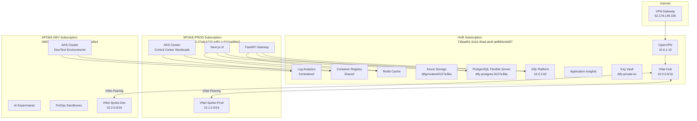

# Arquitectura Hub & Spoke - Cloud Control Center

## Tabla de Contenidos

- [Resumen Ejecutivo](#resumen-ejecutivo)
- [Topología de Red](#topología-de-red)
- [Distribución de Recursos](#distribución-de-recursos)
- [Subscripciones Azure](#subscripciones-azure)
- [Beneficios del Modelo](#beneficios-del-modelo)
- [Decisiones Arquitecturales](#decisiones-arquitecturales)
- [Gestión IaC con Terragrunt](#gestión-iac-con-terragrunt)
- [Seguridad y Compliance](#seguridad-y-compliance)
- [Gestión de Costes](#gestión-de-costes)

## Resumen Ejecutivo

El **Cloud Control Center** implementa un modelo **Hub & Spoke** multi-subscripción en Azure para maximizar la eficiencia operacional, seguridad y optimización de costes. Esta arquitectura aprovecha infraestructura existente (Dify, VPN, bases de datos compartidas) en el Hub mientras escala capacidades mediante spokes especializados.

### Principios Clave

1. **Centralización de servicios compartidos** en Hub (PostgreSQL, Redis, ACR, Monitoring)
2. **Segregación de ambientes** mediante spokes (Producción vs Dev/Test)
3. **Seguridad por diseño** con VPN centralizada y network segmentation
4. **Cost optimization** eliminando duplicación de recursos costosos
5. **Escalabilidad** permitiendo agregar spokes sin reestructuración
6. **IaC DRY** con Terragrunt para multi-subscription orchestration

## Topología de Red



### VNets y Direccionamiento IP

| VNet | Subscripción | CIDR | Subnets | Propósito |
|------|--------------|------|---------|-----------|
| **vnet-hub** | Hub (739aaf91) | `10.0.0.0/16` | AKS: `10.0.2.0/24`<br/>VPN: `10.0.1.0/24`<br/>DB: `10.0.3.0/24` | Servicios compartidos |
| **vnet-spoke-prod** | Spoke-Prod (353a6255) | `10.1.0.0/16` | AKS: `10.1.1.0/24`<br/>App: `10.1.2.0/24` | Control Center producción |
| **vnet-spoke-dev** | Spoke-Dev (0987a8ce) | `10.2.0.0/16` | AKS: `10.2.1.0/24`<br/>Sandbox: `10.2.2.0/24` | Dev/Test/Experiments |

## Distribución de Recursos

### HUB (Subscription 739aaf91-5cb2-45a6-ab4f-abf883e9d3f7)

#### Recursos Existentes

| Recurso | Nombre | Estado | Propósito |
|---------|--------|--------|-----------|
| **AKS Cluster** | dify-aks | Running 1.30.14 | Plataforma Dify |
| **PostgreSQL** | dify-postgres-9107e36a | Running | Database Dify + Control Center |
| **Storage Account** | difyprivatest9107e36a | Active | Blob storage Dify |
| **Redis** | redis-6b56696c4b-d89lp | Running (pod) | Cache Dify + Control Center |
| **VPN Gateway** | openvpn-server | Running | Acceso seguro VPN |
| **Key Vault** | dify-private-kv | Active | Secrets management |
| **LoadBalancer** | kubernetes | Active (10.0.2.62) | Ingress Dify |

#### Recursos a Agregar (Terragrunt Hub)

| Recurso | Nombre Propuesto | Justificación |
|---------|------------------|---------------|
| **Container Registry** | ccacr{random} | Shared image registry para todos los spokes |
| **Log Analytics** | cc-logs-workspace | Centralizar logs de Hub + Spokes |
| **Application Insights** | cc-app-insights | Monitoreo APM unificado |
| **GitHub Actions Runner** | cc-gh-runner (AKS) | Self-hosted CI/CD runner |
| **VNet Peering** | hub-to-spoke-prod<br/>hub-to-spoke-dev | Conectividad entre subscripciones |

### SPOKE-PROD (Subscription 353a6255-27a8-4733-adf0-1c531ba9f4e9)

#### Recursos a Crear

| Recurso | Nombre | SKU/Tier | Propósito |
|---------|--------|----------|-----------|
| **AKS Cluster** | cc-aks-prod | Standard_D4s_v3 (2-4 nodes) | Control Center workloads |
| **Service Principal** | cc-prod-sp | - | Deployment automation |
| **Managed Identity** | cc-prod-identity | - | Workload authentication |
| **NSG** | cc-prod-nsg | - | Network security rules |
| **VNet Peering** | spoke-prod-to-hub | - | Conectividad a Hub |

**Workloads en AKS:**

- Next.js Control Center UI (deployment + service)
- FastAPI API Gateway (deployment + service)
- Nginx Ingress Controller
- Cert-manager (para TLS interno)

### SPOKE-DEV (Subscription 0987a8ce-7f7d-4a28-8db2-5c2c3115dfa4)

#### Recursos a Crear

| Recurso | Nombre | SKU/Tier | Propósito |
|---------|--------|----------|-----------|
| **AKS Cluster** | cc-aks-dev | Standard_B2s (1-2 nodes) | Dev/Test cost-optimized |
| **Resource Groups** | rg-experiment-{name} | - | Sandboxes aislados |
| **Auto-shutdown Policy** | dev-shutdown | - | Apagar recursos no-prod |
| **NSG** | cc-dev-nsg | - | Network security rules |
| **VNet Peering** | spoke-dev-to-hub | - | Conectividad a Hub |

**Políticas de Ahorro:**

- Auto-shutdown de VMs fuera de horario laboral
- AKS autoscaling agresivo (min 1 node)
- Spot instances para workloads tolerantes a interrupciones

## Subscripciones Azure

### Hub: 739aaf91-5cb2-45a6-ab4f-abf883e9d3f7

- **Rol**: Servicios compartidos + Networking central
- **Recursos clave**: Dify, VPN, PostgreSQL, Redis, ACR, Monitoring
- **Acceso**: VPN requerida para todos los recursos
- **Costes**: Recursos permanentes, optimización vía shared services

### Spoke-Prod: 353a6255-27a8-4733-adf0-1c531ba9f4e9

- **Rol**: Entorno de producción Control Center
- **Recursos clave**: AKS (Next.js + FastAPI), Ingress
- **Acceso**: Via Hub peering, VPN para management
- **Costes**: Production-grade, SLAs estrictos

### Spoke-Dev: 0987a8ce-7f7d-4a28-8db2-5c2c3115dfa4

- **Rol**: Desarrollo, testing, experimentación
- **Recursos clave**: AKS dev, sandboxes temporales
- **Acceso**: Via Hub peering, VPN para desarrollo
- **Costes**: Cost-optimized, ephemeral resources

## Beneficios del Modelo

### 1. Optimización de Costes

- **Shared Services**: PostgreSQL, Redis, ACR, Monitoring compartidos → **~40% ahorro** vs duplicación
- **VPN Centralizada**: Un gateway vs 3 gateways → **~60% ahorro** en conectividad
- **Auto-scaling inteligente**: Spokes escalan independientemente según demanda
- **Dev/Test optimization**: Spoke-Dev usa SKUs menores + auto-shutdown

**Estimación mensual (EUR):**

| Componente | Hub | Spoke-Prod | Spoke-Dev | Total |
|------------|-----|------------|-----------|-------|
| AKS | 150€ (existing) | 300€ | 80€ | 530€ |
| PostgreSQL | 120€ (shared) | - | - | 120€ |
| Redis | 40€ (shared) | - | - | 40€ |
| VPN | 90€ | - | - | 90€ |
| ACR | 50€ (shared) | - | - | 50€ |
| Monitoring | 60€ (shared) | - | - | 60€ |
| Storage | 30€ | 20€ | 10€ | 60€ |
| **TOTAL** | **540€** | **320€** | **90€** | **950€/mes** |

*vs Arquitectura sin Hub & Spoke: ~1,500€/mes (58% más caro)*

### 2. Seguridad

- **Single point of entry**: VPN en Hub, no exposición pública de Spokes
- **Network segmentation**: NSGs entre Hub y Spokes con allow-list explícita
- **Secrets centralizados**: Key Vault en Hub con RBAC por spoke
- **Audit trail unificado**: Log Analytics centralizado con retention

### 3. Escalabilidad

- **Add spokes sin cambios en Hub**: Nuevas subscripciones solo requieren peering
- **Independent scaling**: Spoke-Prod puede crecer sin afectar Dev
- **Multi-region ready**: Hub replicable en otras regiones (future)

### 4. Gobernanza

- **Centralized policies**: Azure Policy en Hub propagadas a Spokes
- **Unified monitoring**: Single pane of glass en Grafana (Hub)
- **Cost tracking**: Tags consistentes + FinOps automation per-spoke

## Decisiones Arquitecturales

### ADR-001: ¿Por qué Hub & Spoke vs Multi-Region?

**Decisión**: Hub & Spoke single-region (North Europe)

**Rationale**:

- PoC/MVP no requiere multi-region HA
- Latencia North Europe aceptable para usuarios EU
- Costes de multi-region duplican infraestructura
- Simplicidad operacional en etapa inicial

**Consecuencias**:

- ✅ Menor complejidad
- ✅ Costes reducidos
- ⚠️ Single point of failure regional
- 🔮 Future: Agregar región secundaria en Phase 4+

### ADR-002: ¿Por qué reutilizar Dify existente vs nuevo despliegue?

**Decisión**: Reutilizar Dify en Hub (10.0.2.62)

**Rationale**:

- Dify ya operacional y configurado correctamente
- Ahorro de tiempo setup (PostgreSQL, Redis, Storage ya creados)
- Costes evitados de infraestructura duplicada
- Conocimiento existente del entorno

**Consecuencias**:

- ✅ Time to market acelerado
- ✅ Zero setup de Dify infrastructure
- ⚠️ Dependencia de stability de Dify existente
- 🔮 Considerar HA Dify si se vuelve crítico

### ADR-003: ¿Por qué PostgreSQL compartido vs per-spoke?

**Decisión**: PostgreSQL Flexible Server en Hub compartido

**Rationale**:

- Control Center no es data-intensive (metadata, configs)
- Databases separadas por esquema (dify_db, control_center_db)
- Backup centralizado + retention policies
- ~120€/mes ahorrados vs 3 instancias separadas

**Consecuencias**:

- ✅ Cost optimization significativa
- ✅ Backup/restore simplificado
- ⚠️ Shared resource contention (mitigado con QoS)
- 🔮 Migrar a dedicado si load > 80% sustained

### ADR-004: ¿Por qué Terragrunt vs Terraform puro?

**Decisión**: Terragrunt como wrapper de Terraform

**Rationale**:

- Multi-subscription orchestration natural con Terragrunt
- DRY principle: configuración compartida entre Hub y Spokes
- Remote state management automático por ambiente
- Dependencies entre módulos (Spoke-Prod depende de Hub outputs)
- Mantiene Terraform HCL familiar
- Curva de aprendizaje < 1 día
- Un comando (`terragrunt run-all apply`) despliega todo en orden

**Consecuencias**:

- ✅ Eliminación de código duplicado (subscription IDs, regions, etc.)
- ✅ State management simplificado
- ✅ Dependencies explícitas y automáticas
- ✅ Rollback más seguro (orden reverso automático)
- ⚠️ Capa adicional de abstracción (debugging más complejo)
- ⚠️ CI/CD debe instalar Terragrunt + Terraform

**Alternativa rechazada**: Pulumi

- Pulumi Python sería útil para lógica programática compleja
- PERO: FinOps automation puede ser Python scripts + Terraform resources (separados)
- Mantener DOS paradigmas IaC (HCL + Python) es overhead innecesario en PoC
- Pulumi puede evaluarse en Phase 3+ si surge necesidad real

### ADR-005: ¿Por qué Next.js App Router vs Pages Router?

**Decisión**: Next.js 14+ con App Router

**Rationale**:

- React Server Components reduce bundle size
- Streaming y Suspense mejoran UX
- MDX integration nativa con App Router
- Futuro de Next.js ecosystem

**Consecuencias**:

- ✅ Performance mejorado (RSC)
- ✅ SEO optimizado
- ⚠️ Learning curve App Router
- 🔮 Migración futura menos costosa

## Gestión IaC con Terragrunt

### Estructura del Proyecto

```
terraform/
├── terragrunt.hcl                 # Root config (remote state, provider)
├── _envcommon/                    # Configuración compartida
│   ├── aks.hcl                    # Config común AKS
│   ├── networking.hcl             # VNets, NSGs, peering
│   └── monitoring.hcl             # Log Analytics, App Insights
├── modules/                       # Terraform modules reutilizables
│   ├── aks/
│   │   ├── main.tf
│   │   ├── variables.tf
│   │   └── outputs.tf
│   ├── vnet-peering/
│   │   ├── main.tf
│   │   ├── variables.tf
│   │   └── outputs.tf
│   ├── postgresql/
│   │   ├── main.tf
│   │   ├── variables.tf
│   │   └── outputs.tf
│   ├── container-registry/
│   │   ├── main.tf
│   │   ├── variables.tf
│   │   └── outputs.tf
│   └── monitoring/
│       ├── main.tf
│       ├── variables.tf
│       └── outputs.tf
├── hub/
│   ├── terragrunt.hcl             # Hub-specific config
│   ├── acr/
│   │   └── terragrunt.hcl
│   ├── monitoring/
│   │   └── terragrunt.hcl
│   └── peering/
│       └── terragrunt.hcl
├── spoke-prod/
│   ├── terragrunt.hcl             # Spoke-Prod-specific config
│   ├── aks/
│   │   └── terragrunt.hcl
│   ├── networking/
│   │   └── terragrunt.hcl
│   └── peering/
│       └── terragrunt.hcl
└── spoke-dev/
    ├── terragrunt.hcl             # Spoke-Dev-specific config
    ├── aks/
    │   └── terragrunt.hcl
    ├── networking/
    │   └── terragrunt.hcl
    └── peering/
        └── terragrunt.hcl
```

### Root Terragrunt Configuration

```hcl
# terraform/terragrunt.hcl

locals {
  # Azure regions
  primary_region = "northeurope"
  
  # Common tags
  common_tags = {
    Project     = "DXC_PoC_Nirvana"
    ManagedBy   = "Terragrunt"
    Repository  = "https://github.com/AlbertoLacambra/DXC_PoC_Nirvana"
  }
}

# Remote state configuration (Azure Storage Backend)
remote_state {
  backend = "azurerm"
  
  generate = {
    path      = "backend.tf"
    if_exists = "overwrite"
  }
  
  config = {
    resource_group_name  = "tfstate-rg"
    storage_account_name = "tfstatecc${get_env("SUBSCRIPTION_SHORT", "default")}"
    container_name       = "tfstate"
    key                  = "${path_relative_to_include()}/terraform.tfstate"
    
    # Locking con Azure Blob lease
    use_azuread_auth = true
  }
}

# Provider configuration
generate "provider" {
  path      = "provider.tf"
  if_exists = "overwrite"
  
  contents = <<EOF
terraform {
  required_version = ">= 1.6"
  
  required_providers {
    azurerm = {
      source  = "hashicorp/azurerm"
      version = "~> 3.80"
    }
    azuread = {
      source  = "hashicorp/azuread"
      version = "~> 2.47"
    }
    random = {
      source  = "hashicorp/random"
      version = "~> 3.6"
    }
  }
}

provider "azurerm" {
  features {
    key_vault {
      purge_soft_delete_on_destroy = false
    }
    resource_group {
      prevent_deletion_if_contains_resources = false
    }
  }
  
  subscription_id = var.subscription_id
}

provider "azuread" {}
EOF
}
```

### Hub Terragrunt Configuration

```hcl
# terraform/hub/terragrunt.hcl

include "root" {
  path = find_in_parent_folders()
}

locals {
  subscription_id = "739aaf91-5cb2-45a6-ab4f-abf883e9d3f7"
  environment     = "hub"
}

inputs = {
  subscription_id = local.subscription_id
  environment     = local.environment
  location        = "northeurope"
  
  # Recursos existentes (data sources, no crear)
  existing_resources = {
    vnet_name              = "dify-vnet"
    vnet_resource_group    = "dify-rg"
    postgresql_server_name = "dify-postgres-9107e36a"
    storage_account_name   = "difyprivatest9107e36a"
    key_vault_name         = "dify-private-kv"
  }
  
  # Nuevos recursos a crear
  create_acr          = true
  create_log_analytics = true
  create_app_insights  = true
  
  # Tags específicos Hub
  tags = merge(
    local.common_tags,
    {
      Environment = "hub"
      CostCenter  = "shared-services"
    }
  )
}
```

### Spoke-Prod Terragrunt Configuration

```hcl
# terraform/spoke-prod/terragrunt.hcl

include "root" {
  path = find_in_parent_folders()
}

# Dependency en Hub para obtener outputs (VNet ID, ACR, etc.)
dependency "hub" {
  config_path = "../hub"
  
  mock_outputs = {
    vnet_id         = "/subscriptions/mock/resourceGroups/mock/providers/Microsoft.Network/virtualNetworks/mock"
    acr_login_server = "mockacr.azurecr.io"
    postgresql_fqdn  = "mock-postgres.postgres.database.azure.com"
    log_analytics_id = "/subscriptions/mock/resourceGroups/mock/providers/Microsoft.OperationalInsights/workspaces/mock"
  }
}

locals {
  subscription_id = "353a6255-27a8-4733-adf0-1c531ba9f4e9"
  environment     = "prod"
}

inputs = {
  subscription_id = local.subscription_id
  environment     = local.environment
  location        = "northeurope"
  
  # VNet configuration
  vnet_cidr = "10.1.0.0/16"
  subnets = {
    aks  = "10.1.1.0/24"
    apps = "10.1.2.0/24"
  }
  
  # Hub resources (from dependency)
  hub_vnet_id         = dependency.hub.outputs.vnet_id
  hub_acr_login_server = dependency.hub.outputs.acr_login_server
  hub_postgresql_fqdn  = dependency.hub.outputs.postgresql_fqdn
  hub_log_analytics_id = dependency.hub.outputs.log_analytics_id
  
  # AKS configuration
  aks = {
    node_count       = 2
    vm_size          = "Standard_D4s_v3"
    min_count        = 2
    max_count        = 4
    enable_autoscale = true
  }
  
  # Tags específicos Spoke-Prod
  tags = merge(
    local.common_tags,
    {
      Environment = "production"
      CostCenter  = "control-center-prod"
      Criticality = "high"
    }
  )
}
```

### Spoke-Dev Terragrunt Configuration

```hcl
# terraform/spoke-dev/terragrunt.hcl

include "root" {
  path = find_in_parent_folders()
}

dependency "hub" {
  config_path = "../hub"
  
  mock_outputs = {
    vnet_id         = "/subscriptions/mock/resourceGroups/mock/providers/Microsoft.Network/virtualNetworks/mock"
    acr_login_server = "mockacr.azurecr.io"
    log_analytics_id = "/subscriptions/mock/resourceGroups/mock/providers/Microsoft.OperationalInsights/workspaces/mock"
  }
}

locals {
  subscription_id = "0987a8ce-7f7d-4a28-8db2-5c2c3115dfa4"
  environment     = "dev"
}

inputs = {
  subscription_id = local.subscription_id
  environment     = local.environment
  location        = "northeurope"
  
  # VNet configuration
  vnet_cidr = "10.2.0.0/16"
  subnets = {
    aks     = "10.2.1.0/24"
    sandbox = "10.2.2.0/24"
  }
  
  # Hub resources
  hub_vnet_id         = dependency.hub.outputs.vnet_id
  hub_acr_login_server = dependency.hub.outputs.acr_login_server
  hub_log_analytics_id = dependency.hub.outputs.log_analytics_id
  
  # AKS configuration (cost-optimized)
  aks = {
    node_count       = 1
    vm_size          = "Standard_B2s"
    min_count        = 1
    max_count        = 2
    enable_autoscale = true
  }
  
  # Auto-shutdown policy
  auto_shutdown = {
    enabled   = true
    time      = "19:00"
    timezone  = "W. Europe Standard Time"
    weekends  = true
  }
  
  # Tags específicos Spoke-Dev
  tags = merge(
    local.common_tags,
    {
      Environment = "development"
      CostCenter  = "control-center-dev"
      Criticality = "low"
      AutoShutdown = "enabled"
    }
  )
}
```

### Ejemplo de Módulo Reutilizable: AKS

```hcl
# terraform/modules/aks/main.tf

resource "azurerm_kubernetes_cluster" "this" {
  name                = var.cluster_name
  location            = var.location
  resource_group_name = var.resource_group_name
  dns_prefix          = var.dns_prefix
  
  kubernetes_version = var.kubernetes_version
  
  default_node_pool {
    name                = "default"
    node_count          = var.node_count
    vm_size             = var.vm_size
    vnet_subnet_id      = var.subnet_id
    enable_auto_scaling = var.enable_autoscale
    min_count           = var.enable_autoscale ? var.min_count : null
    max_count           = var.enable_autoscale ? var.max_count : null
    
    upgrade_settings {
      max_surge = "10%"
    }
  }
  
  identity {
    type = "SystemAssigned"
  }
  
  network_profile {
    network_plugin    = "azure"
    network_policy    = "calico"
    load_balancer_sku = "standard"
  }
  
  oms_agent {
    log_analytics_workspace_id = var.log_analytics_workspace_id
  }
  
  azure_policy_enabled = true
  
  tags = var.tags
}

# Grant AKS pull access to ACR
resource "azurerm_role_assignment" "acr_pull" {
  count                = var.acr_id != null ? 1 : 0
  scope                = var.acr_id
  role_definition_name = "AcrPull"
  principal_id         = azurerm_kubernetes_cluster.this.kubelet_identity[0].object_id
}
```

```hcl
# terraform/modules/aks/variables.tf

variable "cluster_name" {
  type        = string
  description = "Name of the AKS cluster"
}

variable "location" {
  type        = string
  description = "Azure region"
}

variable "resource_group_name" {
  type        = string
  description = "Resource group name"
}

variable "dns_prefix" {
  type        = string
  description = "DNS prefix for the cluster"
}

variable "kubernetes_version" {
  type        = string
  description = "Kubernetes version"
  default     = "1.30"
}

variable "node_count" {
  type        = number
  description = "Initial node count"
  default     = 2
}

variable "vm_size" {
  type        = string
  description = "VM size for nodes"
  default     = "Standard_D2s_v3"
}

variable "subnet_id" {
  type        = string
  description = "Subnet ID for AKS"
}

variable "enable_autoscale" {
  type        = bool
  description = "Enable autoscaling"
  default     = true
}

variable "min_count" {
  type        = number
  description = "Minimum node count for autoscaling"
  default     = 1
}

variable "max_count" {
  type        = number
  description = "Maximum node count for autoscaling"
  default     = 3
}

variable "log_analytics_workspace_id" {
  type        = string
  description = "Log Analytics Workspace ID for monitoring"
}

variable "acr_id" {
  type        = string
  description = "Azure Container Registry ID for pull access"
  default     = null
}

variable "tags" {
  type        = map(string)
  description = "Tags to apply to resources"
  default     = {}
}
```

```hcl
# terraform/modules/aks/outputs.tf

output "id" {
  value       = azurerm_kubernetes_cluster.this.id
  description = "AKS cluster ID"
}

output "name" {
  value       = azurerm_kubernetes_cluster.this.name
  description = "AKS cluster name"
}

output "kube_config" {
  value       = azurerm_kubernetes_cluster.this.kube_config_raw
  sensitive   = true
  description = "Kubernetes config"
}

output "identity_principal_id" {
  value       = azurerm_kubernetes_cluster.this.identity[0].principal_id
  description = "System assigned identity principal ID"
}

output "kubelet_identity_object_id" {
  value       = azurerm_kubernetes_cluster.this.kubelet_identity[0].object_id
  description = "Kubelet identity object ID"
}
```

### Comandos Terragrunt

```bash
# Desplegar todo (Hub + Spokes) en orden correcto
cd terraform/
terragrunt run-all plan
terragrunt run-all apply

# Desplegar solo Hub
cd terraform/hub/
terragrunt plan
terragrunt apply

# Desplegar solo Spoke-Prod (automáticamente lee outputs de Hub)
cd terraform/spoke-prod/
terragrunt plan
terragrunt apply

# Destruir todo en orden reverso
cd terraform/
terragrunt run-all destroy

# Ver dependency graph
terragrunt graph-dependencies | dot -Tpng > dependencies.png

# Validate configuración
terragrunt run-all validate

# Format código
terragrunt run-all fmt
```

## Seguridad y Compliance

### Modelo de Acceso

```
┌─────────────┐
│   Usuario   │
└──────┬──────┘
       │ VPN Connection (OpenVPN)
       ▼
┌─────────────────────────────────────┐
│  VPN Gateway (Hub)                  │
│  52.178.149.106 → 10.0.1.10         │
└──────┬──────────────────────────────┘
       │
       ├──► Dify (10.0.2.62) ✓
       │
       ├──► Hub Resources (PostgreSQL, Redis) ✓
       │
       ├──► Spoke-Prod (via peering) ✓
       │
       └──► Spoke-Dev (via peering) ✓

Internet → Spokes = ❌ DENIED (no public IPs)
```

### Network Security Groups (NSGs)

#### Hub NSG Rules

| Priority | Direction | Source | Destination | Port | Action | Justification |
|----------|-----------|--------|-------------|------|--------|---------------|
| 100 | Inbound | VPN Subnet | Hub VNet | * | Allow | VPN access |
| 200 | Inbound | Spoke-Prod VNet | PostgreSQL | 5432 | Allow | DB access |
| 210 | Inbound | Spoke-Prod VNet | Redis | 6379 | Allow | Cache access |
| 220 | Inbound | Spoke-Dev VNet | PostgreSQL | 5432 | Allow | Dev DB access |
| 1000 | Inbound | Internet | * | * | Deny | Default deny |

#### Spoke-Prod NSG Rules

| Priority | Direction | Source | Destination | Port | Action | Justification |
|----------|-----------|--------|-------------|------|--------|---------------|
| 100 | Inbound | Hub VNet | AKS | 443 | Allow | Management |
| 200 | Outbound | AKS | Hub PostgreSQL | 5432 | Allow | DB queries |
| 210 | Outbound | AKS | Hub Redis | 6379 | Allow | Caching |
| 220 | Outbound | AKS | Hub Dify | 80,443 | Allow | AI orchestration |
| 1000 | Inbound | Internet | * | * | Deny | No public access |

### RBAC y Identidades

| Subscripción | Identidad | Role | Scope | Propósito |
|--------------|-----------|------|-------|-----------|
| Hub | `cc-admin-group` | Owner | Subscription | Administración completa |
| Hub | `cc-deploy-sp` | Contributor | RG | CI/CD deployments |
| Spoke-Prod | `cc-prod-identity` | Reader | Hub PostgreSQL | Read-only DB access |
| Spoke-Prod | `cc-prod-sp` | Contributor | Spoke-Prod RG | Prod deployments |
| Spoke-Dev | `cc-dev-identity` | Contributor | Spoke-Dev RG | Dev experimentation |

### Secrets Management

```
Azure Key Vault (Hub): dify-private-kv
├── dify-db-password
├── azure-storage-key
├── openai-api-key
├── cc-prod-db-connection-string
├── cc-api-jwt-secret
└── github-actions-token

Kubernetes Secrets (per cluster):
├── Hub AKS: azure-storage-credentials, dify-secrets
├── Spoke-Prod AKS: cc-api-secrets (from Key Vault via CSI driver)
└── Spoke-Dev AKS: cc-dev-secrets (from Key Vault via CSI driver)
```

**Best Practices:**

- Secrets rotación automática cada 90 días (Azure Key Vault rotation policy)
- Kubernetes CSI driver para inyectar secrets desde Key Vault
- No secrets hardcoded en código o IaC (valores vía variables/outputs)
- Audit logging de accesos a Key Vault (Log Analytics)

## Gestión de Costes

### FinOps Automation (Phase 3)

El Control Center implementará análisis automático de costes mediante **Python scripts + Terraform resources** (NO Pulumi):

1. **Daily Cost Analysis**
   - Script Python en `scripts/finops/daily_cost_check.py`
   - Azure Cost Management API queries
   - Detección de anomalías (>20% vs baseline)
   - Slack/Teams notifications

2. **Underutilization Detection**
   - AKS node utilization < 40% sustained 7 days → recommendation resize
   - Storage accounts sin accesos 30 días → move to cool tier
   - PostgreSQL connections < 10% capacity → downgrade SKU

3. **Automated Recommendations**
   - Python script analiza patrones de uso
   - Genera PRs con Terragrunt changes (resize, delete, archive)
   - Dify agent valida impacto antes de PR
   - Requiere approval humano antes de merge

4. **Cost Attribution**
   - Tags por proyecto/equipo/ambiente (gestionados vía Terragrunt)
   - Dashboards Grafana con breakdown per tag
   - Chargebacks automatizados mensuales

**Ejemplo workflow FinOps:**

```python
# scripts/finops/underutilization_detector.py

from azure.mgmt.monitor import MonitorManagementClient
from azure.mgmt.costmanagement import CostManagementClient
import requests  # Para Dify API

def analyze_aks_nodes(subscription_id, resource_group, cluster_name):
    """Analiza utilización de nodos AKS"""
    # Query Azure Monitor por CPU/Memory últimos 7 días
    metrics = monitor_client.metrics.list(...)
    
    avg_cpu = calculate_average(metrics, 'cpu')
    avg_memory = calculate_average(metrics, 'memory')
    
    if avg_cpu < 40 and avg_memory < 40:
        return {
            'action': 'downsize',
            'current_node_count': 4,
            'recommended_node_count': 2,
            'savings_eur_month': 150
        }

def generate_terragrunt_pr(recommendation):
    """Genera PR con cambio en Terragrunt config"""
    # Modifica terraform/spoke-prod/aks/terragrunt.hcl
    # node_count = 4 → node_count = 2
    
    # Consulta Dify para validar impacto
    dify_response = requests.post('http://10.0.2.62/api/workflows/run', json={
        'workflow_id': 'finops-impact-analysis',
        'inputs': recommendation
    })
    
    if dify_response.json()['risk_level'] == 'low':
        # Crear PR automático en GitHub
        create_github_pr(
            title=f"FinOps: Reduce AKS nodes {recommendation['current_node_count']} → {recommendation['recommended_node_count']}",
            body=f"Savings: {recommendation['savings_eur_month']}€/month\nDify Risk: Low",
            files={'terraform/spoke-prod/aks/terragrunt.hcl': modified_content}
        )
```

### Presupuesto y Alertas

| Subscripción | Presupuesto Mensual | Alert Threshold | Action |
|--------------|---------------------|-----------------|--------|
| Hub | 600€ | 80% (480€) | Email + Slack |
| Spoke-Prod | 400€ | 80% (320€) | Email + Slack |
| Spoke-Dev | 150€ | 90% (135€) | Email + auto-shutdown |

**Auto-remediation Spoke-Dev:**

- Budget > 90% → Script detiene AKS dev cluster fuera de horario laboral
- Budget > 100% → Requiere approval manual para restart

---

## Referencias

- [Azure Hub-Spoke Topology](https://docs.microsoft.com/en-us/azure/architecture/reference-architectures/hybrid-networking/hub-spoke)
- [VNet Peering Best Practices](https://docs.microsoft.com/en-us/azure/virtual-network/virtual-network-peering-overview)
- [Terragrunt Documentation](https://terragrunt.gruntwork.io/docs/)
- [Azure Cost Management API](https://docs.microsoft.com/en-us/rest/api/cost-management/)
- [Terraform Azure Provider](https://registry.terraform.io/providers/hashicorp/azurerm/latest/docs)

**Última actualización**: 12 Octubre 2025  
**Versión**: 1.0  
**Autor**: Alberto Lacambra
