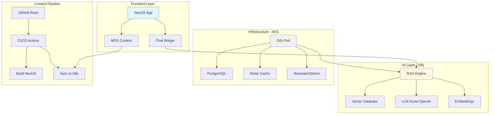
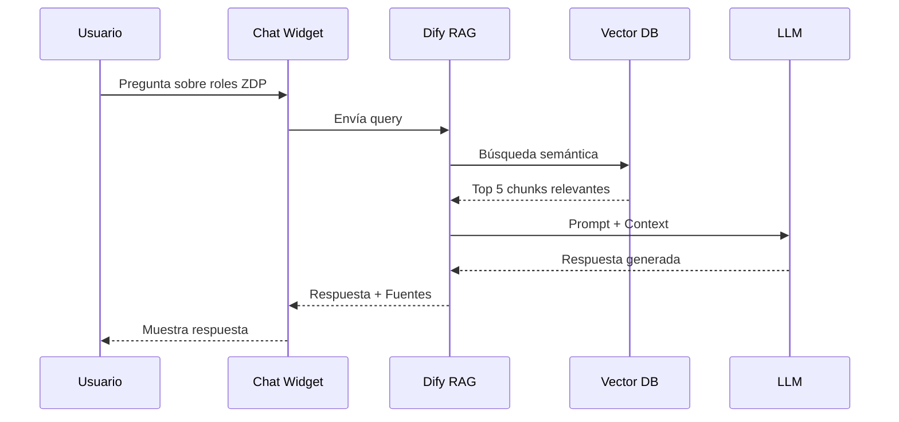

# Sistema de Documentación Inteligente con IA (RAG)

## 📋 Resumen Ejecutivo

Sistema de documentación técnica inteligente que combina **NextJS + MDX** para la presentación de contenido con **Dify** como plataforma RAG (Retrieval-Augmented Generation), permitiendo a los ingenieros Cloud interactuar con la documentación mediante un bot conversacional.

## 🎯 Objetivos

1. **Centralizar documentación técnica** de Cloud, AI y Developers en un único punto
2. **Automatizar respuestas** mediante IA entrenada con documentación técnica real
3. **Mejorar la experiencia del usuario** con búsqueda semántica y conversacional
4. **Reducir tiempo de consulta** de documentación técnica de ~15 min a ~2 min
5. **Mantener documentación viva** mediante LLM que sugiere mejoras

## 🏗️ Arquitectura del Sistema



## 🧩 Componentes del Sistema

### 1. **NextJS Documentation Site**

**Tecnologías:**
- NextJS 14+ (App Router)
- MDX para contenido enriquecido
- Tailwind CSS para diseño
- TypeScript para type safety

**Estructura de Contenido:**
```
docs-site/
├── app/
│   ├── cloud/           # Cloud Engineering docs
│   ├── ai/              # AI & ML docs
│   ├── developers/      # Developer guides
│   └── api/             # API routes para Dify
├── content/
│   ├── cloud/
│   │   ├── azure/
│   │   ├── aws/
│   │   └── gcp/
│   ├── ai/
│   │   ├── rag/
│   │   ├── llm/
│   │   └── mlops/
│   └── developers/
│       ├── apis/
│       ├── ci-cd/
│       └── best-practices/
└── components/
    ├── ChatWidget/      # Dify integration
    ├── Search/          # Enhanced search
    └── Navigation/
```

**Características:**
- ✅ Server-side rendering para SEO
- ✅ Búsqueda full-text + semántica
- ✅ Versionado de documentación
- ✅ Dark/Light mode
- ✅ Navegación intuitiva
- ✅ Widget de chat integrado

### 2. **Dify RAG Platform**

**Componentes Dify:**
- **Knowledge Base**: Documentación indexada
- **Workflow**: Orquestación de prompts
- **LLM**: Azure OpenAI GPT-4
- **Embeddings**: text-embedding-3-large
- **Vector DB**: Weaviate o Qdrant

**Configuración Recomendada:**

```yaml
# dify-config.yaml
knowledge_base:
  name: "Cloud Control Center Docs"
  chunk_size: 800
  chunk_overlap: 100
  embedding_model: "text-embedding-3-large"
  
retrieval:
  top_k: 5
  score_threshold: 0.7
  rerank: true
  
llm:
  provider: "azure_openai"
  model: "gpt-4-turbo"
  temperature: 0.3
  max_tokens: 2000
  
system_prompt: |
    Eres un experto asistente técnico del Cloud Control Center de DXC.
    
    CONTEXTO:
    - Ayudas a ingenieros Cloud, AI y Developers
    - Respondes basándote ÚNICAMENTE en la documentación proporcionada
    - Si no encuentras información, lo indicas claramente
    
    FORMATO DE RESPUESTA:
    - Sé conciso pero completo
    - Usa ejemplos de código cuando sea apropiado
    - Cita las secciones de documentación relevantes
    - Sugiere documentación relacionada
    
    TONO:
    - Profesional pero amigable
    - Técnico pero accesible
    - Proactivo en sugerir soluciones
```

### 3. **Infraestructura en AKS**

**Deployment de Dify:**

```yaml
# kubernetes/dify/deployment.yaml
apiVersion: apps/v1
kind: Deployment
metadata:
  name: dify-api
  namespace: ai-platform
spec:
  replicas: 2
  selector:
    matchLabels:
      app: dify-api
  template:
    metadata:
      labels:
        app: dify-api
    spec:
      containers:
      - name: dify
        image: langgenius/dify-api:latest
        ports:
        - containerPort: 5001
        env:
        - name: MODE
          value: "api"
        - name: DB_HOST
          value: "postgresql.ai-platform.svc.cluster.local"
        - name: REDIS_HOST
          value: "redis.ai-platform.svc.cluster.local"
        - name: VECTOR_STORE
          value: "weaviate"
        - name: WEAVIATE_ENDPOINT
          value: "http://weaviate.ai-platform.svc.cluster.local:8080"
        resources:
          requests:
            memory: "2Gi"
            cpu: "1000m"
          limits:
            memory: "4Gi"
            cpu: "2000m"
```

**Recursos Necesarios:**

| Componente | CPU | RAM | Storage | Estimación Costo/Mes |
|------------|-----|-----|---------|---------------------|
| Dify API (2 pods) | 2 cores | 8 GB | - | €60 |
| PostgreSQL | 1 core | 2 GB | 50 GB | €25 |
| Redis | 0.5 core | 1 GB | 10 GB | €15 |
| Weaviate | 2 cores | 4 GB | 100 GB | €50 |
| **TOTAL** | **5.5 cores** | **15 GB** | **160 GB** | **€150/mes** |

### 4. **Pipeline de Contenido**

**GitHub Actions Workflow:**

```yaml
# .github/workflows/sync-docs-to-dify.yml
name: 📚 Sync Documentation to Dify

on:
  push:
    branches: [main]
    paths:
      - 'docs-site/content/**'
  workflow_dispatch:

jobs:
  sync-to-dify:
    runs-on: ubuntu-latest
    steps:
      - uses: actions/checkout@v4
      
      - name: 📦 Prepare Content
        run: |
          # Convert MDX to plain text for RAG
          node scripts/prepare-rag-content.js
      
      - name: 🚀 Upload to Dify Knowledge Base
        env:
          DIFY_API_KEY: ${{ secrets.DIFY_API_KEY }}
        run: |
          # Sync via Dify API
          node scripts/sync-to-dify.js
      
      - name: 🔄 Trigger Reindexing
        run: |
          curl -X POST "https://dify.cloudcontrolcenter.dxc.com/api/datasets/reindex" \
            -H "Authorization: Bearer ${{ secrets.DIFY_API_KEY }}"
      
      - name: 📢 Notify Teams
        if: success()
        run: |
          # Send notification
          ./scripts/notify-teams.sh "✅ Documentación sincronizada con RAG"
```

## 📊 Casos de Uso

### Caso de Uso 1: Consultar Roles en ZDP

**Usuario pregunta:**
> "¿Qué roles hay en ZDP y cuáles son sus permisos?"

**Flujo del Sistema:**



**Respuesta Esperada:**
```
En ZDP (Zero Data Platform) existen 3 roles principales:

1. **ZDP Admin**
   - Gestión completa de la plataforma
   - Configuración de conectores
   - Gestión de usuarios y permisos
   - Acceso a logs y auditoría

2. **ZDP Developer**
   - Creación y edición de pipelines
   - Acceso a datos según permisos asignados
   - Ejecución de transformaciones
   - Visualización de resultados

3. **ZDP Viewer**
   - Solo lectura de datos
   - Visualización de dashboards
   - Descarga de reportes permitidos

📚 **Fuentes:**
- [Roles y Permisos en ZDP](/cloud/zero-data-platform/roles)
- [Guía de Administración ZDP](/cloud/zero-data-platform/admin-guide)

¿Necesitas más detalles sobre algún rol específico?
```

### Caso de Uso 2: Mejora Automática de Documentación

**Workflow con LLM:**

```javascript
// scripts/enhance-documentation.js
const { OpenAI } = require('openai');

async function enhanceDocumentation(docPath) {
  const content = fs.readFileSync(docPath, 'utf8');
  
  const prompt = `
    Analiza esta documentación técnica y sugiere mejoras:
    
    CRITERIOS:
    1. Identifica secciones confusas o incompletas
    2. Sugiere ejemplos prácticos que falten
    3. Recomienda preguntas frecuentes (FAQ) a añadir
    4. Detecta enlaces rotos o referencias faltantes
    
    DOCUMENTACIÓN:
    ${content}
    
    FORMATO DE SALIDA:
    - Lista de mejoras sugeridas
    - Preguntas FAQ recomendadas
    - Ejemplos de código a añadir
  `;
  
  const response = await openai.chat.completions.create({
    model: 'gpt-4-turbo',
    messages: [{ role: 'user', content: prompt }],
    temperature: 0.5
  });
  
  return response.choices[0].message.content;
}
```

### Caso de Uso 3: Búsqueda Híbrida

**Combinación Full-Text + Semántica:**

```typescript
// components/Search/HybridSearch.tsx
export async function hybridSearch(query: string) {
  // 1. Full-text search (rápido pero literal)
  const fullTextResults = await searchIndex.search(query);
  
  // 2. Semantic search via Dify (más inteligente)
  const semanticResults = await dify.search({
    query,
    top_k: 10,
    filter: { category: ['cloud', 'ai', 'developers'] }
  });
  
  // 3. Merge y rerank
  const mergedResults = mergeAndRank(
    fullTextResults,
    semanticResults,
    { fullTextWeight: 0.3, semanticWeight: 0.7 }
  );
  
  return mergedResults.slice(0, 5);
}
```

## 🔐 Seguridad y Compliance

### Autenticación y Autorización

```typescript
// middleware/auth.ts
export async function authenticateUser(req: Request) {
  // Azure AD SSO integration
  const token = await validateAzureADToken(req.headers.authorization);
  
  // Check user permissions
  const userPermissions = await getUserPermissions(token.userId);
  
  // Filter Dify responses based on permissions
  return {
    userId: token.userId,
    allowedCategories: userPermissions.categories,
    canAccessSensitiveData: userPermissions.roles.includes('admin')
  };
}
```

### Data Privacy

- ✅ **PII Detection**: Detectar y redactar información personal
- ✅ **Content Filtering**: Filtrar contenido sensible según roles
- ✅ **Audit Logging**: Registrar todas las consultas al bot
- ✅ **Data Retention**: Política de retención de conversaciones

## 📈 Métricas de Éxito

### KPIs Principales

| Métrica | Objetivo | Medición |
|---------|----------|----------|
| **Tiempo promedio de consulta** | < 2 min | Analytics del bot |
| **Tasa de respuesta correcta** | > 85% | Feedback de usuarios |
| **Reducción en tickets de soporte** | -30% | Comparativa mensual |
| **Adopción del bot** | > 70% ingenieros | Active users |
| **Satisfacción del usuario** | > 4/5 | Encuestas |

### Dashboard de Monitoreo

```typescript
// dashboard/metrics.ts
export interface BotMetrics {
  totalQueries: number;
  averageResponseTime: number;
  topQueries: Array<{ query: string; count: number }>;
  satisfactionScore: number;
  feedbackPositive: number;
  feedbackNegative: number;
  documentsAccessed: number;
  peakUsageHours: number[];
}
```

## 🚀 Roadmap de Implementación

### Fase 1: MVP (4 semanas)

**Semana 1-2: Infraestructura**
- [ ] Desplegar Dify en AKS
- [ ] Configurar PostgreSQL, Redis, Weaviate
- [ ] Integrar Azure OpenAI
- [ ] Testing de conectividad

**Semana 3: Contenido Inicial**
- [ ] Crear 20-30 documentos MDX de ejemplo
- [ ] Cubrir categorías: Cloud, AI, Developers
- [ ] Incluir casos de uso reales (ZDP, AKS, CI/CD)
- [ ] Cargar en Dify Knowledge Base

**Semana 4: Frontend + Bot**
- [ ] Setup NextJS 14 con App Router
- [ ] Integrar MDX
- [ ] Desarrollar Chat Widget
- [ ] Conectar con Dify API
- [ ] Testing end-to-end

### Fase 2: Mejoras (4 semanas)

**Semana 5-6: Optimización RAG**
- [ ] Fine-tuning de system prompt
- [ ] Ajuste de chunk size/overlap
- [ ] Implementar reranking
- [ ] Testing de calidad de respuestas

**Semana 7: Automatización**
- [ ] CI/CD para sync de documentación
- [ ] LLM para sugerencias de mejoras
- [ ] Generación automática de FAQs
- [ ] Notificaciones en Teams

**Semana 8: Analytics**
- [ ] Dashboard de métricas
- [ ] Feedback loop de usuarios
- [ ] A/B testing de prompts
- [ ] Reportes semanales

### Fase 3: Expansión (Ongoing)

- [ ] Integración con Microsoft Teams (bot nativo)
- [ ] Soporte multiidioma (ES/EN)
- [ ] Voz a texto para consultas
- [ ] Generación de diagramas automáticos
- [ ] Plugin para VS Code

## 💡 Mejores Prácticas

### Creación de Contenido MDX

```mdx
---
title: "Roles en Zero Data Platform"
category: "Cloud"
tags: ["ZDP", "Seguridad", "Permisos"]
lastUpdated: "2025-10-16"
author: "Cloud Team"
reviewedBy: "Security Team"
---

# Roles y Permisos en ZDP

## Introducción

Zero Data Platform (ZDP) implementa un sistema de **control de acceso basado en roles** (RBAC)...

## Roles Disponibles

### 1. ZDP Admin

<Callout type="info">
  El rol de Admin tiene permisos completos sobre la plataforma.
</Callout>

**Permisos incluidos:**
- ✅ Gestión de usuarios
- ✅ Configuración de conectores
- ✅ Acceso a auditoría

<CodeBlock language="bash" title="Asignar rol Admin">
zdp users add-role --user john.doe@dxc.com --role admin
</CodeBlock>

### 2. ZDP Developer

...

## Preguntas Frecuentes

<Accordion title="¿Puede un Developer eliminar datos?">
  No, los Developers solo pueden transformar datos. La eliminación requiere rol Admin.
</Accordion>

## Recursos Relacionados

- [Guía de Seguridad en ZDP](/cloud/zdp/security)
- [API de Gestión de Usuarios](/developers/apis/zdp-users)
```

### Optimización de RAG

**System Prompt Engineering:**

```python
SYSTEM_PROMPT_V2 = """
Eres el asistente técnico del Cloud Control Center de DXC.

IDENTIDAD:
- Nombre: CloudMind Assistant
- Especialidad: Cloud Engineering, AI/ML, DevOps
- Audiencia: Ingenieros de Plataforma DXC

CONOCIMIENTO BASE:
{context}

INSTRUCCIONES:
1. SIEMPRE prioriza información de la documentación
2. Si no sabes algo, di "No encuentro esta información en la documentación"
3. Cita las fuentes con formato: [Nombre del Doc](/ruta)
4. Usa ejemplos de código cuando sea relevante
5. Sugiere documentación relacionada al final

FORMATO:
- Respuestas concisas (max 300 palabras)
- Usa emojis para categorías: 🔧 Cloud, 🤖 AI, 💻 Dev
- Code blocks con syntax highlighting
- Listas numeradas para pasos

TONO:
Profesional, técnico, amigable, proactivo

PREGUNTA DEL USUARIO:
{query}
"""
```

## 🔧 Troubleshooting

### Problema: Respuestas genéricas (no usa documentación)

**Solución:**
```python
# Aumentar score_threshold para mejor relevancia
retrieval_config = {
    'score_threshold': 0.75,  # Era 0.7
    'top_k': 8,               # Era 5
    'enable_rerank': True
}

# Mejorar system prompt
system_prompt += """
IMPORTANTE: DEBES usar ÚNICAMENTE la información de {context}.
Si la respuesta no está en el contexto, di explícitamente que no la encontraste.
"""
```

### Problema: Tiempo de respuesta lento (>5s)

**Solución:**
```yaml
# Optimizar Weaviate
weaviate:
  cache:
    enabled: true
    size: 2GB
  quantization:
    enabled: true
    type: "pq"  # Product Quantization

# Usar modelo más rápido
llm:
  model: "gpt-4o-mini"  # Más rápido que gpt-4-turbo
  streaming: true       # Respuesta progresiva
```

## 📚 Referencias

- [Dify Documentation](https://docs.dify.ai/)
- [NextJS 14 Docs](https://nextjs.org/docs)
- [MDX Documentation](https://mdxjs.com/)
- [Azure OpenAI Service](https://learn.microsoft.com/azure/ai-services/openai/)
- [Weaviate Vector DB](https://weaviate.io/developers/weaviate)

---

**Última actualización**: 2025-10-16  
**Owner**: Cloud Platform Team  
**Contacto**: cloudmind@dxc.com
