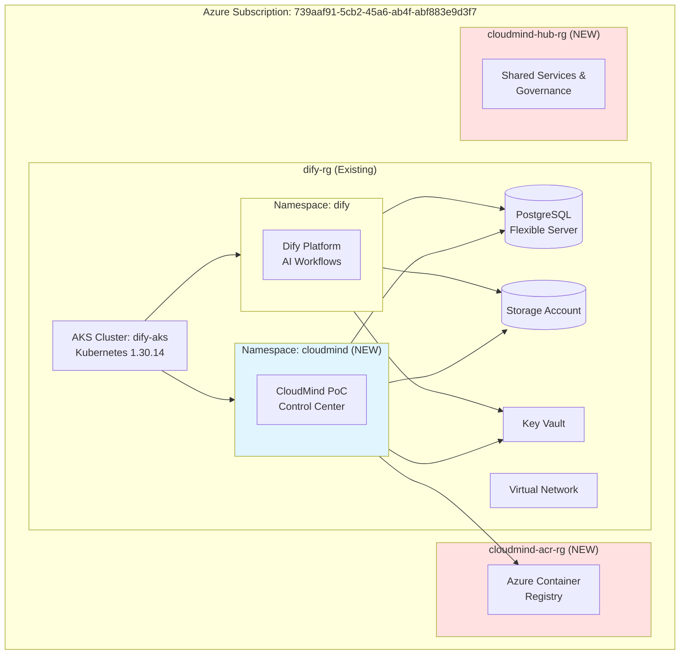

# Visión General de la Arquitectura

## Introducción

El proyecto **DXC Cloud Mind - Nirvana PoC** implementa una plataforma AI-driven CloudOps que aprovecha la infraestructura existente de Dify mediante una **estrategia Single-AKS** con aislamiento por namespaces.

## Objetivos Arquitecturales

### 🎯 Principios de Diseño

1. **Cost Optimization**: Minimizar costes reutilizando infraestructura existente
2. **Namespace Isolation**: Segregar workloads mediante namespaces de Kubernetes
3. **Non-invasive Approach**: No modificar recursos existentes de Dify
4. **Shared Services**: Aprovechar recursos compartidos (ACR, PostgreSQL, Storage)
5. **GitOps Automation**: CI/CD completo con GitHub Actions

### 📊 Arquitectura de Alto Nivel



## Componentes Principales

### 1. Infraestructura Existente (Dify)

| Componente | Recurso | Estado | Uso |
|------------|---------|--------|-----|
| **AKS Cluster** | `dify-aks` | ✅ Running | Plataforma compartida |
| **PostgreSQL** | `dify-postgres` | ✅ Running | Base de datos compartida |
| **Storage** | `difyprivatest9107e36a` | ✅ Active | Almacenamiento compartido |
| **Key Vault** | `dify-private-kv` | ✅ Active | Secretos compartidos |
| **Virtual Network** | `dify-private-vnet` | ✅ Active | Red compartida |

**Estrategia**: Usar como **data sources** solamente, sin modificaciones.

### 2. Recursos Nuevos (CloudMind)

| Componente | Recurso | Estado | Propósito |
|------------|---------|--------|-----------|
| **Resource Group** | `cloudmind-acr-rg` | ✅ Deployed | Registro de contenedores |
| **ACR** | `cloudmind<suffix>` | ✅ Deployed | Imágenes de contenedores |
| **Resource Group** | `cloudmind-hub-rg` | ✅ Deployed | Servicios compartidos |
| **Namespace** | `cloudmind` | ✅ Deployed | Workloads CloudMind |
| **ResourceQuota** | `cloudmind-quota` | ✅ Deployed | Límites de recursos |

**Estrategia**: Gestionados 100% con **Terraform**.

## Decisiones Arquitecturales Clave

### ✅ Single-AKS Strategy

**Decisión**: Usar el cluster AKS existente (`dify-aks`) en lugar de crear nuevos clusters.

**Rationale**:
- **Ahorro de costes**: ~€200/mes por cluster evitado
- **Simplicidad operacional**: Un solo cluster que mantener
- **Shared resources**: Container Insights gratuito (free tier)

**Implementación**:
```yaml
Namespace Isolation:
  - dify: 8 CPU / 16Gi Memory / 50 pods (existing)
  - cloudmind: 4 CPU / 8Gi Memory / 30 pods (NEW)
  - future-use-cases: Expandible según necesidad
```

**Trade-offs**:
- ✅ Pros: Coste mínimo, rápida implementación
- ⚠️ Contras: Dependencia en cluster existente, límites de escalabilidad

### ✅ Hybrid Resource Management

**Decisión**: Gestión híbrida de recursos (existentes + nuevos).

**Enfoque**:
```terraform
# Existing resources (data sources only)
data "azurerm_kubernetes_cluster" "dify" {
  name                = "dify-aks"
  resource_group_name = "dify-rg"
}

data "azurerm_postgresql_flexible_server" "dify" {
  name                = "dify-postgres-9107e36a"
  resource_group_name = "dify-rg"
}

# New resources (managed by Terraform)
resource "azurerm_container_registry" "cloudmind" {
  name                = "cloudmind${random_string.suffix.result}"
  resource_group_name = azurerm_resource_group.acr.name
  location            = var.location
  sku                 = "Basic"
}
```

**Beneficios**:
- No invasivo: Dify continúa funcionando sin cambios
- Rollback seguro: Eliminar CloudMind no afecta a Dify
- Evolución independiente: Cada sistema puede evolucionar

### ✅ GitOps with GitHub Actions

**Decisión**: CI/CD completo con GitHub Actions + OIDC.

**Workflows Implementados**:
1. **deploy.yml**: Despliegue a producción (manual approval)
2. **pr-validation.yml**: Validación de PRs (7 security gates)
3. **drift-detection.yml**: Detección diaria de drift

**Security Gates**:


## Costes y ROI

### 💰 Análisis de Costes

| Concepto | Multi-AKS (Descartado) | Single-AKS (Implementado) | Ahorro |
|----------|------------------------|---------------------------|--------|
| Hub AKS | €200/mes | €0 (usa dify-aks) | **€200/mes** |
| Spoke AKS | €200/mes | €0 (namespace isolation) | **€200/mes** |
| Container Insights | €50/mes | €0 (free tier) | **€50/mes** |
| ACR Basic | €5/mes | €5/mes | €0 |
| **TOTAL** | **€455/mes** | **€5/mes** | **€450/mes** |

**ROI Anual**: **€5,400 ahorrados**

### 📈 Escalabilidad

**Modelo de Crecimiento**:
```
Phase 0 (Actual): 1 namespace (cloudmind)
├── 4 CPU / 8Gi Memory / 30 pods
└── Coste: €5/mes

Phase 1 (Future): 3 namespaces
├── cloudmind: 4 CPU / 8Gi / 30 pods
├── use-case-1: 2 CPU / 4Gi / 20 pods
└── use-case-2: 2 CPU / 4Gi / 20 pods
└── Coste: €5/mes (sin cambios en AKS)

Phase 2 (Scale-out): Nuevo AKS si necesario
├── Trigger: >80% utilización cluster
└── Coste incremental: €200/mes
```

## Próximos Pasos

### 🚀 Roadmap Técnico

1. **Phase 1**: Deployment de aplicaciones CloudMind
   - Next.js UI
   - FastAPI Gateway
   - Integración con Dify

2. **Phase 2**: Casos de uso iniciales
   - FinOps Automation
   - Governance Policies
   - Incident Response

3. **Phase 3**: Expansión
   - Nuevos namespaces según demanda
   - Evaluación de multi-cluster si necesario
   - Integración con servicios Azure adicionales

## Referencias

- [Single-AKS Strategy](single-aks.md)
- [Recursos Desplegados](deployed-resources.md)
- [Decisiones Técnicas (ADR)](adr.md)
- [Workflows CI/CD](../cicd/workflows.md)
