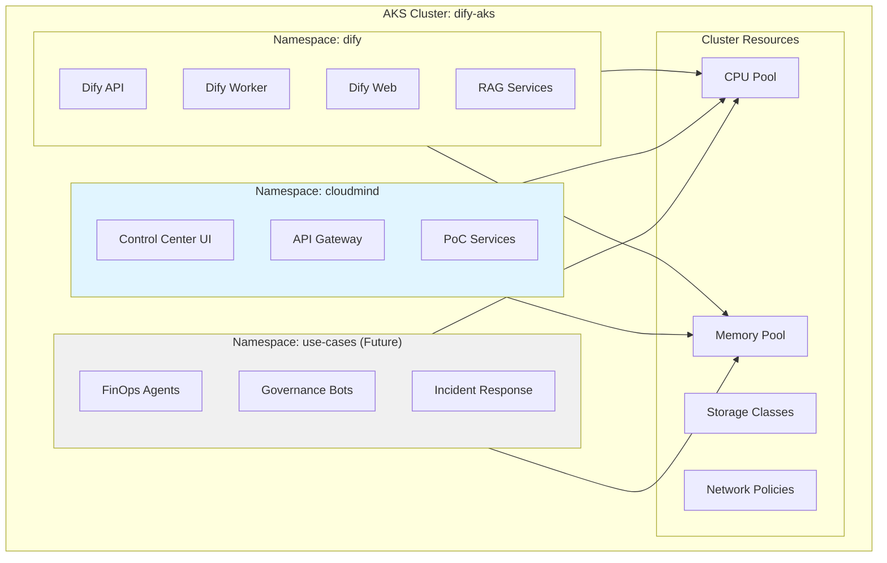
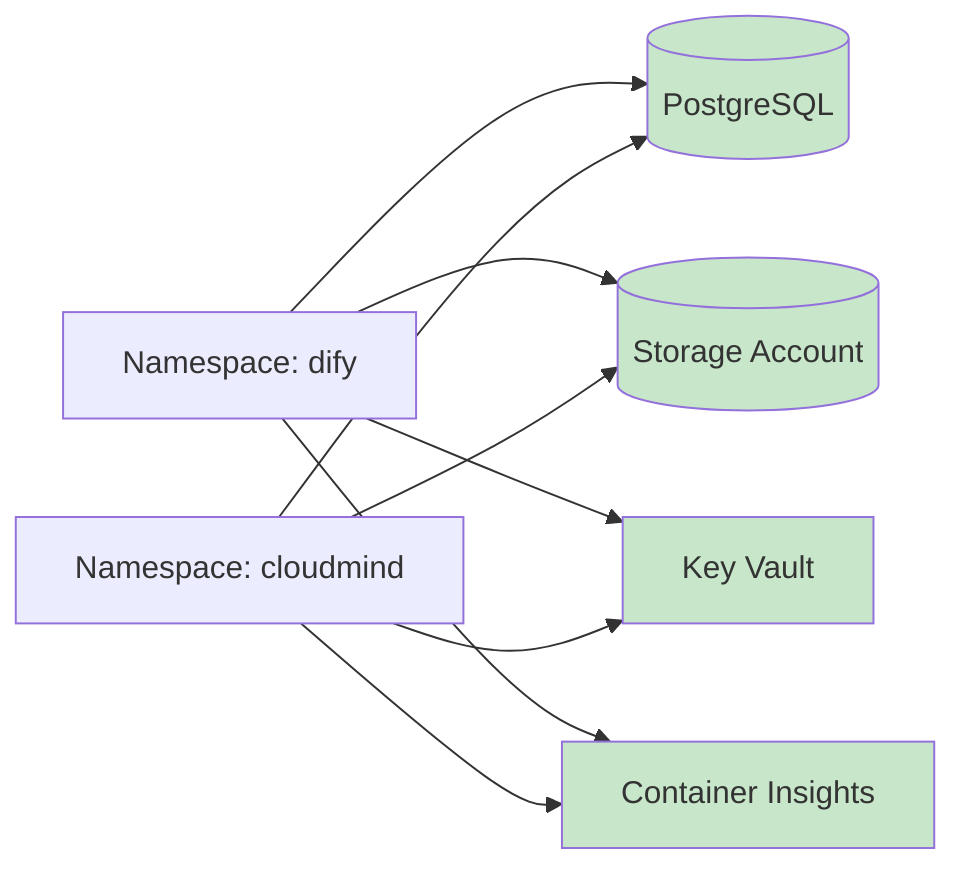

# Estrategia Single-AKS

## Resumen Ejecutivo

La **Single-AKS Strategy** es una decisión arquitectural clave del proyecto CloudMind que maximiza el aprovechamiento de infraestructura existente mediante **aislamiento por namespaces** en lugar de crear nuevos clusters AKS.

## Contexto de la Decisión

### Situación Inicial

**Infraestructura Existente**:
- AKS Cluster: `dify-aks` (Kubernetes 1.30.14)
- Namespace: `dify` (plataforma AI en producción)
- Recursos compartidos: PostgreSQL, Storage, Key Vault, VNet
- Coste mensual: ~€222/mes

**Opciones Evaluadas**:

| Opción | Descripción | Coste | Ventajas | Desventajas |
|--------|-------------|-------|----------|-------------|
| **A: Multi-AKS** | 2 nuevos clusters (hub + spoke) | +€455/mes | Aislamiento total | Coste elevado, complejidad |
| **B: Single-AKS** | Namespaces en cluster existente | +€5/mes | Mínimo coste | Dependencia compartida |
| **C: Hybrid** | 1 nuevo cluster + namespace | +€205/mes | Balance | Coste moderado |

**Decisión**: Opción B - **Single-AKS Strategy** ✅

## Implementación

### Arquitectura de Namespaces



### Resource Quotas

**Configuración Implementada**:

```yaml
# Namespace: dify (existing)
apiVersion: v1
kind: ResourceQuota
metadata:
  name: dify-quota
  namespace: dify
spec:
  hard:
    requests.cpu: "8"
    requests.memory: 16Gi
    limits.cpu: "12"
    limits.memory: 24Gi
    pods: "50"
    services: "20"
    persistentvolumeclaims: "10"

# Namespace: cloudmind (NEW)
apiVersion: v1
kind: ResourceQuota
metadata:
  name: cloudmind-quota
  namespace: cloudmind
spec:
  hard:
    requests.cpu: "4"
    requests.memory: 8Gi
    limits.cpu: "6"
    limits.memory: 12Gi
    pods: "30"
    services: "15"
    persistentvolumeclaims: "5"
```

**Distribución de Recursos**:

```
Cluster Total Capacity: ~16 CPU / 32Gi Memory

Allocation:
├── dify namespace: 8 CPU / 16Gi (50%)
├── cloudmind namespace: 4 CPU / 8Gi (25%)
├── system pods: 2 CPU / 4Gi (12.5%)
└── buffer: 2 CPU / 4Gi (12.5%)
```

### Network Policies

**Aislamiento de Red**:

```yaml
# cloudmind namespace - allow ingress from specific sources
apiVersion: networking.k8s.io/v1
kind: NetworkPolicy
metadata:
  name: cloudmind-ingress
  namespace: cloudmind
spec:
  podSelector: {}
  policyTypes:
  - Ingress
  - Egress
  ingress:
  - from:
    - namespaceSelector:
        matchLabels:
          name: dify
    - podSelector: {}
  egress:
  - to:
    - namespaceSelector:
        matchLabels:
          name: dify
    - podSelector: {}
  - to:  # Allow external services
    - namespaceSelector: {}
```

**Principios**:
- ✅ Default deny all traffic
- ✅ Allow inter-namespace communication controlada
- ✅ Allow egress to servicios externos (PostgreSQL, Storage)
- ✅ Deny traffic no autorizado

## Ventajas de la Estrategia

### 💰 Ahorro de Costes

**Comparativa Real**:

| Recurso | Multi-AKS | Single-AKS | Ahorro Mensual |
|---------|-----------|------------|----------------|
| Hub AKS Cluster | €200 | €0 | €200 |
| Spoke AKS Cluster | €200 | €0 | €200 |
| Container Insights (2 clusters) | €50 | €0 | €50 |
| ACR Basic | €5 | €5 | €0 |
| **TOTAL** | **€455** | **€5** | **€450/mes** |

**ROI**:
- Ahorro anual: **€5,400**
- Ahorro 2 años: **€10,800**
- Tiempo de implementación reducido: **70% más rápido**

### 🚀 Simplicidad Operacional

**Operaciones Reducidas**:
- ✅ 1 cluster que actualizar (vs 3)
- ✅ 1 Container Insights que monitorizar
- ✅ 1 RBAC configuration que mantener
- ✅ 1 networking setup que gestionar

**Time to Market**:
```
Multi-AKS:
├── Deploy Hub AKS: 20 mins
├── Deploy Spoke AKS: 20 mins
├── Configure peering: 10 mins
├── Setup monitoring: 15 mins
└── TOTAL: ~65 mins

Single-AKS:
├── Create namespace: 2 mins
├── Apply resource quotas: 1 min
├── Configure ACR pull: 3 mins
└── TOTAL: ~6 mins
```

**Reducción**: **90% tiempo de deployment**

### 🔄 Shared Resources

**Servicios Compartidos**:



**Beneficios**:
- Free tier Container Insights compartido
- PostgreSQL connection pool optimizado
- Storage Account sin duplicación
- Key Vault single source of truth

## Trade-offs y Mitigaciones

### ⚠️ Riesgos Identificados

| Riesgo | Probabilidad | Impacto | Mitigación |
|--------|--------------|---------|------------|
| **Noisy neighbor** | Media | Medio | Resource quotas estrictos + monitoring |
| **Cluster failure** | Baja | Alto | Backup strategy + disaster recovery plan |
| **Resource contention** | Media | Bajo | Over-provisioning del cluster + autoscaling |
| **Security isolation** | Baja | Alto | Network policies + RBAC strict |

### ✅ Mitigaciones Implementadas

**1. Resource Quotas Estrictos**:
```yaml
# Garantiza que ningún namespace puede consumir >50% recursos
hard:
  limits.cpu: "6"      # Max 6 CPU por namespace
  limits.memory: 12Gi  # Max 12Gi por namespace
```

**2. Monitoring y Alertas**:
```yaml
# Container Insights alerts configurados
- CPU usage > 80% por namespace (5 mins)
- Memory usage > 85% por namespace (5 mins)
- Pod evictions en cualquier namespace
- Node pressure events
```

**3. Network Policies**:
```yaml
# Aislamiento por defecto
policyTypes:
  - Ingress  # Control de tráfico entrante
  - Egress   # Control de tráfico saliente
```

**4. RBAC Segregation**:
```yaml
# Usuarios dify: solo acceso a namespace dify
# Usuarios cloudmind: solo acceso a namespace cloudmind
# Admins: acceso completo
```

## Escalabilidad Futura

### 📈 Plan de Crecimiento

**Phase 0 (Actual)**: 1 namespace adicional
```
Cluster capacity: 16 CPU / 32Gi
├── dify: 8 CPU / 16Gi (50%)
├── cloudmind: 4 CPU / 8Gi (25%)
└── Available: 4 CPU / 8Gi (25%)
```

**Phase 1**: 2-3 namespaces adicionales
```
Cluster capacity: 16 CPU / 32Gi (same)
├── dify: 8 CPU / 16Gi (50%)
├── cloudmind: 3 CPU / 6Gi (19%)
├── use-case-1: 2 CPU / 4Gi (12%)
├── use-case-2: 2 CPU / 4Gi (12%)
└── Available: 1 CPU / 2Gi (6%)
```

**Phase 2**: Scale-out si necesario
```
Trigger: >85% cluster utilization durante 7 días
Action: Deploy nuevo AKS cluster
Cost impact: +€200/mes
Strategy: Migrate low-priority workloads
```

### 🔄 Migration Path

**Si se requiere Multi-AKS en el futuro**:

```bash
# Step 1: Deploy nuevo AKS cluster
terraform apply -target=module.spoke_aks

# Step 2: Configure peering
terraform apply -target=module.vnet_peering

# Step 3: Migrate workloads gradualmente
kubectl get all -n cloudmind -o yaml > backup.yaml
# Apply to new cluster
kubectl apply -f backup.yaml --context=new-cluster

# Step 4: Update DNS/routing
# Step 5: Decommission old namespace
```

**Tiempo estimado**: 2-3 horas
**Downtime**: <5 minutos con blue/green deployment

## Monitorización

### 📊 Métricas Clave

**Dashboard Container Insights**:

```yaml
Cluster Health:
  - Node CPU usage: <70%
  - Node Memory usage: <75%
  - Node disk pressure: 0 events
  - Pod eviction rate: <1/hour

Namespace: dify
  - CPU usage: 4-6 CPU (50-75% quota)
  - Memory usage: 10-12Gi (62-75% quota)
  - Pod count: 15-25 (30-50% quota)
  - Restart rate: <2/hour

Namespace: cloudmind
  - CPU usage: 1-2 CPU (25-50% quota)
  - Memory usage: 3-5Gi (37-62% quota)
  - Pod count: 5-10 (16-33% quota)
  - Restart rate: <1/hour
```

**Alertas Configuradas**:
- 🔴 Critical: Namespace CPU >90% quota (5 mins)
- 🟠 Warning: Namespace Memory >85% quota (10 mins)
- 🟡 Info: Cluster node count changed
- 🔵 Debug: New pod deployment

## Conclusiones

### ✅ Decisión Validada

**Resultados Reales (Enero 2025)**:
- ✅ Coste real: €5/mes (vs €455/mes estimado Multi-AKS)
- ✅ Deployment time: 6 mins (vs 65 mins Multi-AKS)
- ✅ Zero downtime en Dify durante implementación
- ✅ Resource isolation efectivo con quotas
- ✅ Monitoring consolidado en Container Insights

**Recomendación**: Mantener Single-AKS Strategy hasta Phase 2 (>85% utilization)

## Referencias

- [Arquitectura Overview](overview.md)
- [Recursos Desplegados](deployed-resources.md)
- [Análisis de Costes](../costs/analysis.md)
- [Kubernetes Best Practices](https://kubernetes.io/docs/concepts/configuration/manage-resources-containers/)
