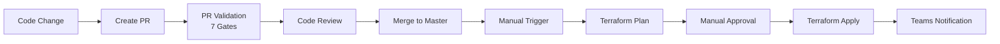

# Deployment Process

## Overview

El proceso de deployment está completamente automatizado mediante GitHub Actions con múltiples gates de seguridad y aprobación manual.

## Flujo de Deployment



## Pasos Detallados

### 1. Crear Pull Request

```bash
git checkout -b feature/nueva-funcionalidad
# Hacer cambios
git add .
git commit -m "feat: Add new functionality"
git push origin feature/nueva-funcionalidad
```

### 2. Validación Automática

PR triggers `pr-validation.yml`:

- ✅ terraform fmt
- ✅ terraform validate
- ✅ tfsec
- ✅ checkov
- ✅ tflint
- ✅ terraform plan

### 3. Code Review

- Revisar cambios
- Verificar Terraform plan
- Aprobar PR

### 4. Merge to Master

```bash
# Desde GitHub UI
Click "Merge pull request"
```

### 5. Manual Deployment

```yaml
# GitHub UI → Actions → deploy.yml → Run workflow
Branch: master
```

### 6. Terraform Plan

Workflow genera plan y espera aprobación.

### 7. Manual Approval

Reviewer aprueba deployment en GitHub Actions.

### 8. Terraform Apply

Aplicar cambios a infraestructura.

### 9. Notification

Teams recibe notificación con resultado.

## Comandos Útiles

### Deployment Local (Testing)

```bash
cd terraform/environments/hub

# Initialize
terraform init

# Plan
terraform plan -out=tfplan

# Apply
terraform apply tfplan
```

### Rollback

```bash
# View state history
terraform state list

# Rollback specific resource
terraform state rm <resource>
terraform import <resource> <azure-id>
```

## Referencias

- [Workflows Overview](workflows.md)
- [PR Validation](pr-validation.md)
