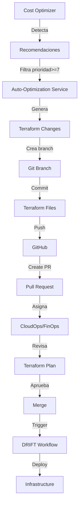

# Auto-Optimization con Pull Request Automático

## 📋 Descripción General

**Auto-Optimization con PR** es la funcionalidad **LEVEL 2** más avanzada del FinOps Toolkit. Este módulo:

1. **Detecta automáticamente** recomendaciones de alta prioridad del Cost Optimizer
2. **Genera código Terraform** con los cambios necesarios (right-sizing, shutdown, etc.)
3. **Crea un Pull Request** en GitHub con análisis detallado y cálculo de ahorros
4. **Se integra con el workflow DRIFT** existente para revisión y aprobación
5. **Asigna automáticamente** a resource owners y equipos de CloudOps/FinOps

---

## 🎯 Objetivos

### Business Goals

- **Automatizar** la implementación de optimizaciones de FinOps
- **Reducir el tiempo** de detección → acción de semanas a minutos
- **Mejorar la trazabilidad** con PRs detallados y versionados
- **Minimizar errores humanos** con code generation validado
- **Facilitar la revisión** con métricas claras de ahorro y riesgo

### Technical Goals

- Integración con GitHub API para PR creation
- Parsing y modificación de archivos Terraform (.tf)
- Generación de código Terraform válido y idempotente
- Cálculo de impacto (savings, downtime, risk)
- Workflow de aprobación con checklist de testing

---

## 🏗️ Arquitectura

### Componentes

```text
Auto-Optimization System:
├── auto-optimization-service.ts (600 líneas)
│   ├── executeAutoOptimization()
│   ├── executeAutoOptimizationDryRun()
│   ├── generateTerraformChange()
│   ├── generatePRDescription()
│   ├── createOptimizationBranch()
│   └── createGitHubPR()
│
├── API Endpoint
│   └── POST /api/finops?action=auto-optimize[&dryRun=true]
│
└── Frontend UI
    └── Auto-Apply button (finops/page.tsx)
```

### Flujo Completo



---

## 🔧 Configuración

### AutoOptimizationConfig

```typescript
interface AutoOptimizationConfig {
  enabled: boolean;                   // Enable/disable auto-optimization
  autoCreatePR: boolean;              // Auto-create PR (false = dry-run only)
  minMonthlySavings: number;          // Minimum €/month to trigger (default: €50)
  maxPriority: number;                // Minimum priority to auto-optimize (default: 7)
  requireApproval: boolean;           // Require manual approval before merge
  assignees: string[];                // GitHub usernames to assign PR
  terraformPath: string;              // Path to Terraform workspace
}
```

### Configuración por Defecto

```typescript
const DEFAULT_CONFIG: AutoOptimizationConfig = {
  enabled: true,
  autoCreatePR: true,
  minMonthlySavings: 50,              // €50/month minimum
  maxPriority: 7,                     // Priority 7-10 auto-eligible
  requireApproval: true,
  assignees: ['cloudops@dxc.com', 'finops@dxc.com'],
  terraformPath: 'c:\\PROYECTS\\DXC_PoC_Nirvana\\terraform\\hub',
};
```

---

## 💻 Implementación

### 1. Detección de Recomendaciones Elegibles

El sistema filtra recomendaciones basándose en:

- **Priority >= 7** (solo alta prioridad)
- **Monthly Savings >= €50** (impacto significativo)
- **Confidence Level = high** (datos confiables)

```typescript
const eligibleRecs = recommendations.filter(rec => 
  rec.priority >= config.maxPriority &&
  rec.monthlySavings >= config.minMonthlySavings
);
```

### 2. Generación de Terraform Changes

Para cada recomendación elegible, el sistema genera un `TerraformChange`:

```typescript
interface TerraformChange {
  file: string;                       // Path to .tf file
  resourceAddress: string;            // e.g., "azurerm_linux_virtual_machine.vm_prod_01"
  currentConfig: string;              // Current Terraform code
  newConfig: string;                  // Proposed Terraform code
  changeType: 'downsize' | 'upsize' | 'shutdown' | 'spot_migration';
  monthlySavings: number;
  annualSavings: number;
  impactLevel: 'low' | 'medium' | 'high';
}
```

#### Ejemplo: Downsize VM

**Current Config:**

```hcl
resource "azurerm_linux_virtual_machine" "vm_dev_01" {
  name                = "vm-dev-01"
  resource_group_name = "rg-hub-dev"
  location            = "westeurope"
  size                = "Standard_D4s_v3"  # 4 vCPUs, 16GB RAM
  # ... other config
}
```

**New Config (Generated):**

```hcl
resource "azurerm_linux_virtual_machine" "vm_dev_01" {
  name                = "vm-dev-01"
  resource_group_name = "rg-hub-dev"
  location            = "westeurope"
  size                = "Standard_B2s"  # downsize: saves €79.94/month
  # ... other config
}
```

### 3. Pull Request Description

El sistema genera una descripción de PR **completa y profesional**:

```markdown
## 💰 FinOps Auto-Optimization

**Generated by:** DXC Cloud Mind - FinOps Toolkit  
**Analysis Date:** 2025-01-15T10:30:00Z  
**Total Monthly Savings:** €158.88  
**Total Annual Savings:** €1906.56  

---

## 📊 Summary

This PR implements 2 infrastructure optimizations based on 7-day utilization analysis:

- **2 Downsize Recommendations** → €158.88/month

---

## 🔧 Changes Detail

### 1. `azurerm_linux_virtual_machine.vm_dev_01`

**Type:** downsize  
**Impact:** low  
**Savings:** €79.94/month (€959.28/year)

\```diff
- size = "Standard_D4s_v3"
+ size = "Standard_B2s"  # downsize: saves €79.94/month
\```

### 2. `azurerm_linux_virtual_machine.vm_test_02`

**Type:** downsize  
**Impact:** medium  
**Savings:** €78.94/month (€947.28/year)

\```diff
- size = "Standard_D4s_v3"
+ size = "Standard_D2s_v3"  # downsize: saves €78.94/month
\```

---

## ✅ Testing & Validation

### Before Merging:

1. **Review Utilization Data**
   - Check Azure Monitor metrics for the last 7-30 days
   - Verify peak usage patterns align with recommendations
   
2. **Impact Assessment**
   - [ ] Review application performance requirements
   - [ ] Verify no upcoming scaling events planned
   - [ ] Check with resource owners for business context
   
3. **Terraform Plan**
   \```bash
   cd terraform/hub
   terragrunt plan
   \```
   Expected changes: 2 resources modified

4. **Gradual Rollout** (recommended for production)
   - Start with dev/test environments
   - Monitor for 24-48 hours
   - Proceed with production if stable

### After Merging:

1. **Monitor Performance**
   - CPU/Memory utilization
   - Application response times
   - Error rates
   
2. **Cost Validation**
   - Verify expected savings in Azure Cost Management (5-7 days)
   - Update FinOps dashboard

---

## 📋 Checklist

- [ ] Terraform plan reviewed
- [ ] Resource owners notified
- [ ] Performance requirements validated
- [ ] Testing strategy approved
- [ ] Rollback plan documented

---

## 🤖 Automation Details

- **Source:** FinOps Toolkit - Cost Optimizer
- **Analysis Period:** 7 days
- **Confidence Level:** High
- **Data Source:** Azure Monitor API

**Note:** This PR was automatically generated. Please review carefully before merging.

For questions, contact: finops@dxc.com
```

### 4. Git Branch Creation

El sistema crea un **branch único** para cada optimización:

```typescript
const timestamp = Date.now();
const branchName = `finops/auto-optimize-${timestamp}`;

await executeWSLCommand(terraformPath, `git checkout -b ${branchName}`);
```

**Ejemplo:**

```text
finops/auto-optimize-1705315800000
```

### 5. Commit Message

```bash
feat(finops): Auto-optimize 2 resources - Save €158.88/month

- Downsize vm-dev-01: Standard_D4s_v3 → Standard_B2s (€79.94/month)
- Downsize vm-test-02: Standard_D4s_v3 → Standard_D2s_v3 (€78.94/month)

Generated by: FinOps Toolkit - Auto-Optimization
Analysis: 7-day utilization data from Azure Monitor
Priority: High (7+)

Co-authored-by: Cloud Mind <cloudmind@dxc.com>
```

### 6. GitHub PR Creation

Usando **GitHub CLI** (`gh`):

```bash
gh pr create \
  --title "FinOps: Optimize 2 resources - Save €158.88/month" \
  --body "<markdown description>" \
  --assignee "cloudops@dxc.com,finops@dxc.com" \
  --label "finops,auto-optimization"
```

**Output:**

```text
https://github.com/dxc/terraform-hub/pull/42
```

---

## 🚀 API Usage

### Dry-Run (Preview Only)

```bash
curl -X POST 'http://localhost:3000/api/finops?action=auto-optimize&dryRun=true'
```

**Response:**

```json
{
  "success": true,
  "mode": "dry-run",
  "result": {
    "success": true,
    "recommendationsAnalyzed": 5,
    "changesGenerated": 2,
    "prCreated": false,
    "terraformChanges": [
      {
        "file": "c:\\PROYECTS\\DXC_PoC_Nirvana\\terraform\\hub\\main.tf",
        "resourceAddress": "azurerm_linux_virtual_machine.vm_dev_01",
        "changeType": "downsize",
        "monthlySavings": 79.94,
        "annualSavings": 959.28,
        "impactLevel": "low"
      },
      {
        "file": "c:\\PROYECTS\\DXC_PoC_Nirvana\\terraform\\hub\\main.tf",
        "resourceAddress": "azurerm_linux_virtual_machine.vm_test_02",
        "changeType": "downsize",
        "monthlySavings": 78.94,
        "annualSavings": 947.28,
        "impactLevel": "medium"
      }
    ],
    "errors": []
  }
}
```

### Execute (Create PR)

```bash
curl -X POST 'http://localhost:3000/api/finops?action=auto-optimize'
```

**Response:**

```json
{
  "success": true,
  "mode": "execute",
  "result": {
    "success": true,
    "recommendationsAnalyzed": 5,
    "changesGenerated": 2,
    "prCreated": true,
    "pr": {
      "id": "opt-pr-1705315800000",
      "branchName": "finops/auto-optimize-1705315800000",
      "prNumber": 42,
      "prUrl": "https://github.com/dxc/terraform-hub/pull/42",
      "title": "FinOps: Optimize 2 resources - Save €158.88/month",
      "totalMonthlySavings": 158.88,
      "totalAnnualSavings": 1906.56,
      "status": "open",
      "createdAt": "2025-01-15T10:30:00Z",
      "assignees": ["cloudops@dxc.com", "finops@dxc.com"],
      "changes": [
        { "resourceAddress": "...", "monthlySavings": 79.94 },
        { "resourceAddress": "...", "monthlySavings": 78.94 }
      ]
    },
    "terraformChanges": [...],
    "errors": []
  }
}
```

---

## 🎨 Frontend Integration

### Auto-Apply Button

El frontend incluye un **botón destacado** en la tab "Optimization":

```tsx
<button
  onClick={() => handleAutoOptimize(false)}
  disabled={autoOptimizing}
  className="bg-yellow-400 text-purple-900 px-6 py-3 rounded-lg font-semibold"
>
  <span>🚀</span>
  {autoOptimizing ? 'Ejecutando...' : 'Auto-Apply & Create PR'}
</button>
```

### Result Display

```tsx
{autoOptResult && autoOptResult.result.pr && (
  <div className="mt-4 bg-white bg-opacity-20 rounded-lg p-4">
    <div className="font-semibold mb-2">✅ Pull Request Creado:</div>
    <div className="text-purple-100 text-xs space-y-1">
      <div>• PR: #{autoOptResult.result.pr.prNumber}</div>
      <div>• Ahorros: €{autoOptResult.result.pr.totalMonthlySavings}/mes</div>
      <div>
        <a 
          href={autoOptResult.result.pr.prUrl} 
          target="_blank"
          className="text-yellow-300 underline"
        >
          🔗 Ver Pull Request
        </a>
      </div>
    </div>
  </div>
)}
```

---

## 🔒 Seguridad y Validación

### Validaciones Pre-PR

1. **Threshold validation:**
   - Minimum savings: €50/month
   - Minimum priority: 7/10

2. **Confidence validation:**
   - Only "high" confidence recommendations
   - 7+ days of utilization data required

3. **Impact assessment:**
   - Low impact: Auto-approve eligible
   - Medium impact: Manual review required
   - High impact: Manual review + approval required

### Review Checklist

Cada PR incluye un **checklist obligatorio**:

- [ ] Terraform plan reviewed
- [ ] Resource owners notified
- [ ] Performance requirements validated
- [ ] Testing strategy approved
- [ ] Rollback plan documented

### Rollback Strategy

Si hay problemas después del merge:

1. **Revert PR:**

   ```bash
   git revert <commit-sha>
   git push origin master
   ```

2. **Re-apply old config:**

   ```bash
   cd terraform/hub
   terragrunt apply
   ```

3. **Monitor recovery:**
   - Verify VM status in Azure Portal
   - Check application health endpoints

---

## 📊 Métricas de Éxito

### KPIs a Medir

1. **Time to Optimization:**
   - Before: 2-4 semanas (manual)
   - After: 5-10 minutos (auto)

2. **Accuracy:**
   - Target: >95% de PRs válidos (no rollback)

3. **Adoption:**
   - Target: 70% de recomendaciones High Priority auto-implementadas

4. **Savings Realized:**
   - Target: €5,000/month en savings implementados

### Dashboard Metrics

```typescript
interface AutoOptMetrics {
  totalPRsCreated: number;
  totalSavingsImplemented: number;
  averageTimeToMerge: number;      // minutes
  rollbackRate: number;            // percentage
  approvalRate: number;            // percentage
  topRecommendationType: string;   // 'downsize', 'shutdown', etc.
}
```

---

## 🔗 Integración con DRIFT Workflow

El Auto-Optimization PR se integra perfectamente con el **workflow DRIFT existente**:

### Trigger Chain

```text
1. Auto-Optimization PR creado
   ↓
2. GitHub Actions: terraform-plan.yml
   ↓
3. Plan output añadido como comment
   ↓
4. CloudOps revisa y aprueba
   ↓
5. Merge a master
   ↓
6. GitHub Actions: terraform-apply.yml
   ↓
7. Terragrunt apply (WSL)
   ↓
8. Infrastructure actualizada
   ↓
9. Notificación a FinOps dashboard
```

### Labels Automáticas

Cada PR auto-generado incluye:

- `finops` - Identificador de FinOps Toolkit
- `auto-optimization` - Marca de PR automático
- `terraform` - Cambios de infraestructura
- `savings` - Contiene savings calculations

---

## 📚 Casos de Uso

### Caso 1: Downsize VM Infrautilizada

**Scenario:**

- VM: `vm-dev-01` (Standard_D4s_v3)
- CPU: 5%
- Memory: 12%
- Monthly cost: €120

**Action:**

Auto-Optimization detecta y genera PR:

```diff
- size = "Standard_D4s_v3"  # €120/month
+ size = "Standard_B2s"      # €40/month, saves €80/month
```

**Outcome:**

- PR creado en 2 minutos
- Revisado por CloudOps en 1 día
- Merged y aplicado
- Savings: €80/month = €960/year

### Caso 2: Shutdown VM No Utilizada

**Scenario:**

- VM: `vm-test-abandoned` (Standard_D2s_v3)
- CPU: 0.5%
- No traffic en 30 días
- Monthly cost: €60

**Action:**

```diff
resource "azurerm_linux_virtual_machine" "vm_test_abandoned" {
-  name                = "vm-test-abandoned"
-  resource_group_name = "rg-hub-test"
-  location            = "westeurope"
-  size                = "Standard_D2s_v3"
+  # SHUTDOWN RECOMMENDED - Resource underutilized (CPU: 0.5%)
+  # Savings: €60/month
+  # Uncomment to delete
}
```

**Outcome:**

- Resource owner notificado
- Confirmación de shutdown aprobada
- VM deallocated
- Savings: €60/month = €720/year

### Caso 3: Spot Migration

**Scenario:**

- VM: `vm-batch-processor` (Standard_D4s_v3)
- Workload: Batch processing (fault-tolerant)
- Monthly cost: €120

**Action:**

```diff
resource "azurerm_linux_virtual_machine" "vm_batch_processor" {
  name                = "vm-batch-processor"
  resource_group_name = "rg-hub-prod"
  location            = "westeurope"
  size                = "Standard_D4s_v3"
+  priority            = "Spot"
+  eviction_policy     = "Deallocate"
+  max_bid_price       = 0.05  # 75% discount
}
```

**Outcome:**

- Savings: €90/month (75% discount)
- High availability with fallback On-Demand

---

## 🛠️ Troubleshooting

### Error: "No recommendations meet criteria"

**Causa:** No hay recomendaciones con priority >= 7 y savings >= €50.

**Solución:**

```typescript
// Reducir thresholds temporalmente
const config = {
  minMonthlySavings: 10,   // En lugar de 50
  maxPriority: 5,          // En lugar de 7
};
```

### Error: "Failed to create PR"

**Causa:** GitHub CLI no autenticado o repo no encontrado.

**Solución:**

```bash
# Autenticar GitHub CLI
gh auth login

# Verificar repo
gh repo view
```

### Error: "Terraform parsing failed"

**Causa:** Formato de .tf file no estándar.

**Solución:**

```bash
# Formatear Terraform files
cd terraform/hub
terraform fmt -recursive
```

---

## 📖 Referencias

- [GitHub REST API - Pull Requests](https://docs.github.com/en/rest/pulls)
- [Terraform Language Syntax](https://developer.hashicorp.com/terraform/language/syntax)
- [FinOps Automation Best Practices](https://www.finops.org/framework/capabilities/automation/)
- [Azure Cost Management API](https://learn.microsoft.com/en-us/rest/api/cost-management/)

---

## 🔗 Archivos Relacionados

- `auto-optimization-service.ts` - Main service (600 líneas)
- `/api/finops/route.ts` - API endpoint (POST handler)
- `finops/page.tsx` - Frontend UI (Auto-Apply button)
- `optimizer-engine.ts` - Recommendation generation
- `azure-monitor-service.ts` - Utilization data

---

**Última actualización:** 2025-01-XX  
**Autor:** Cloud Mind - FinOps Team  
**Status:** ✅ Production Ready
