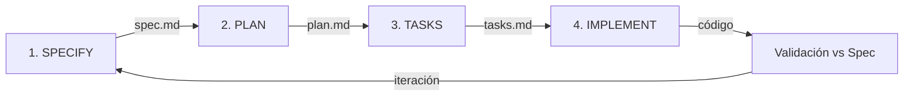

# Spec-Driven Development Platform

**Status:** Propuesta  
**Versión:** 1.0  
**Fecha:** 2025-10-27  
**Autor:** Alberto Lacambra

---

## Tabla de Contenidos

- [Visión General](#visión-general)
- [¿Qué es Spec-Driven Development?](#qué-es-spec-driven-development)
- [Componentes del Sistema](#componentes-del-sistema)
- [Beneficios Esperados](#beneficios-esperados)
- [Plan de Implementación](#plan-de-implementación)
- [Arquitectura Técnica](#arquitectura-técnica)
- [Métricas de Éxito](#métricas-de-éxito)
- [Referencias](#referencias)

---

## Visión General

**DXC Cloud Mind - Nirvana Spec-Driven Development Platform** es una iniciativa para habilitar la metodología Spec-Driven Development (SDD) en todos los proyectos de la organización, proporcionando:

1. **Biblioteca de Especificaciones**: Specs predefinidas para dominios clave (Git Flow, Security, FinOps, IaC, Architecture)
2. **Bot Generador de Specs**: Chatbot en Dify que ayuda a crear nuevas specs siguiendo templates estandarizados
3. **UI de Gestión de Proyectos**: Interfaz en Control Center para iniciar proyectos con metodología spec-driven

### Problema que Resuelve

**Situación actual:**
- Los proyectos inician con "vibe coding" - código primero, documentación después
- Decisiones técnicas se repiten en cada proyecto (Git workflow, security patterns, IaC structure)
- Requisitos ambiguos generan código que no cumple expectativas
- AI agents generan código inconsistente por falta de contexto claro
- Onboarding de nuevos desarrolladores lento (1-2 semanas leyendo código)
- Compliance (Security/FinOps) se aplica manualmente después del desarrollo

**Solución propuesta:**
- Especificaciones primero, código después ("Spec-first")
- Reutilización de specs validadas para decisiones comunes
- Instrucciones claras para AI agents → código predecible
- Onboarding acelerado (2-3 días leyendo specs estructuradas)
- Compliance embebido desde el inicio del proyecto

---

## ¿Qué es Spec-Driven Development?

Spec-Driven Development es una metodología donde **la especificación es el contrato** entre negocio y desarrollo, no el código. Se basa en el toolkit open source [GitHub Spec-Kit](https://github.com/github/spec-kit).

### Principios Fundamentales

1. **Spec es la fuente de verdad**: No el código, sino la especificación documentada
2. **QUÉ antes que CÓMO**: Primero defines requisitos y valor de usuario, luego arquitectura técnica
3. **Documentos vivos**: Las specs evolucionan con el proyecto, no son artefactos estáticos
4. **AI-friendly**: Especificaciones no ambiguas permiten a AI agents generar código correcto

### Proceso en 4 Fases



#### **Fase 1: SPECIFY** (`/specify`)
- **Input**: Descripción de alto nivel del feature
- **Output**: `spec.md` con user stories, requisitos funcionales, criterios de aceptación
- **Enfoque**: QUÉ y POR QUÉ (sin detalles técnicos)
- **Ejemplo**: "Sistema de autenticación que permita login con email/password y OAuth2"

**Template `spec.md`:**
```markdown
# Feature Specification: User Authentication

## User Scenarios & Testing
### User Story 1 - Email/Password Login (Priority: P1)
**Given** user has valid credentials
**When** they submit login form
**Then** they are redirected to dashboard with session cookie

## Requirements
- **FR-001**: System MUST validate email format before authentication
- **FR-002**: System MUST hash passwords with bcrypt (cost factor 12)
- **FR-003**: System MUST implement rate limiting (5 attempts/15min)

## Success Criteria
- **SC-001**: Users can complete login in under 10 seconds
- **SC-002**: 99.9% of authentication attempts processed without errors
```

#### **Fase 2: PLAN** (`/plan`)
- **Input**: `spec.md` + instrucciones técnicas (stack, arquitectura, constraints)
- **Output**: `plan.md` con decisiones técnicas, estructura de proyecto, APIs, data models
- **Enfoque**: CÓMO técnico (frameworks, libraries, patrones)
- **Ejemplo**: "Usar Next.js 14, PostgreSQL, next-auth para OAuth2, bcrypt para passwords"

**Template `plan.md`:**
```markdown
# Implementation Plan: User Authentication

## Technical Stack
- **Backend**: Next.js 14 API routes
- **Database**: PostgreSQL 15 with pgcrypto extension
- **Auth Library**: next-auth v4
- **Session**: JWT with httpOnly cookies

## Project Structure
backend/
├── src/
│   ├── auth/
│   │   ├── login.ts
│   │   ├── oauth.ts
│   │   └── session.ts
│   └── middleware/
│       └── rate-limiter.ts
└── tests/
    └── auth/

## API Contracts
POST /api/auth/login
Request: { "email": "user@example.com", "password": "..." }
Response: { "success": true, "sessionId": "..." }
```

#### **Fase 3: TASKS** (`/tasks`)
- **Input**: `spec.md` + `plan.md`
- **Output**: `tasks.md` con lista de tareas implementables, ordenadas por prioridad
- **Enfoque**: Tareas pequeñas, testeables, independientes
- **Organización**: Agrupadas por user story (P1, P2, P3)

**Template `tasks.md`:**
```markdown
# Tasks: User Authentication

## Phase 1: Setup
- [ ] TASK-001 [P1] Setup PostgreSQL schema with users table
- [ ] TASK-002 [P1] Install next-auth and configure providers

## Phase 2: User Story 1 - Email/Password Login (P1) 🎯 MVP
- [ ] TASK-003 [P1] Implement POST /api/auth/login endpoint
- [ ] TASK-004 [P1] Add bcrypt password hashing
- [ ] TASK-005 [P1] Create session management with JWT
- [ ] TASK-006 [P1] Add rate limiting middleware
- [ ] TASK-007 [P1] Write integration tests for login flow

## Phase 3: User Story 2 - OAuth2 Login (P2)
- [ ] TASK-008 [P2] Configure Google OAuth provider
- [ ] TASK-009 [P2] Implement OAuth callback handler
```

#### **Fase 4: IMPLEMENT**
- **Input**: `tasks.md`
- **Acción**: AI coding agent (GitHub Copilot, Claude, etc.) implementa tasks uno por uno
- **Validación**: Cada task se valida contra criterios de aceptación en `spec.md`
- **Iteración**: Si falla validación, se actualiza spec/plan y se regeneran tasks

---

## Componentes del Sistema

### 1. Biblioteca de Especificaciones Predefinidas

Specs reutilizables para dominios comunes, almacenadas en `/specs-library/`:

#### **Specs Iniciales (Fase 1)**

##### **Git Flow Best Practices** (`git-flow.md`)
```markdown
# Feature Specification: Git Flow Best Practices

## User Scenarios
### US-1: Developer creates a new feature (P1)
**Given** developer starts new work
**When** they create a branch
**Then** branch follows naming convention `feature/ISSUE-ID-short-description`

## Requirements
- **FR-001**: Branch names MUST follow pattern: `{type}/{issue-id}-{description}`
  - Types: feature, bugfix, hotfix, release
  - Example: `feature/JIRA-123-add-user-auth`
- **FR-002**: Commits MUST follow Conventional Commits format
  - Pattern: `{type}({scope}): {description}`
  - Types: feat, fix, docs, style, refactor, test, chore
  - Example: `feat(auth): add OAuth2 login endpoint`
- **FR-003**: Pull Requests MUST include:
  - Description of changes
  - Link to related issue
  - Screenshots (if UI changes)
  - Breaking changes section (if applicable)
- **FR-004**: Main/master branches MUST be protected:
  - Require PR review (min 1 approver)
  - Require CI/CD checks to pass
  - Block force pushes
  - Block deletions
- **FR-005**: Merge strategy MUST be "Squash and Merge" for feature branches

## Success Criteria
- **SC-001**: 100% of branches follow naming convention
- **SC-002**: 95%+ of commits follow Conventional Commits
- **SC-003**: Zero force pushes to protected branches
```

##### **Security Best Practices** (`security.md`)
```markdown
# Feature Specification: Security Best Practices

## User Scenarios
### US-1: Developer prevents secrets in code (P1)
**Given** developer writes code
**When** they attempt to commit
**Then** pre-commit hooks scan for secrets and block commit if found

### US-2: Security team audits dependencies (P1)
**Given** project has dependencies
**When** new dependency is added
**Then** automated scan checks for known vulnerabilities

## Requirements
- **FR-001**: Pre-commit hooks MUST scan for:
  - API keys, tokens, passwords in code
  - AWS access keys, Azure connection strings
  - Private SSH keys
  - Database credentials
  - Tool: gitleaks or trufflehog
- **FR-002**: Dependency scanning MUST run on:
  - Every PR
  - Daily scheduled scans
  - Tools: npm audit, Snyk, or GitHub Dependabot
- **FR-003**: SAST (Static Application Security Testing) MUST run on every PR
  - Tools: SonarQube, Checkmarx, or Semgrep
  - Block merge if critical vulnerabilities found
- **FR-004**: Security headers MUST be configured:
  - Content-Security-Policy
  - X-Frame-Options: DENY
  - X-Content-Type-Options: nosniff
  - Strict-Transport-Security
- **FR-005**: OWASP Top 10 mitigations MUST be implemented:
  - Input validation and sanitization
  - Parameterized queries (prevent SQL injection)
  - Authentication and session management
  - Access control checks
  - Error handling without sensitive info leakage

## Success Criteria
- **SC-001**: Zero secrets committed to repository
- **SC-002**: 100% of dependencies scanned within 24h of release
- **SC-003**: All critical/high vulnerabilities resolved within 7 days
- **SC-004**: Security headers present in 100% of HTTP responses
```

##### **IaC Best Practices - Terraform** (`iac-terraform.md`)
```markdown
# Feature Specification: Infrastructure as Code (Terraform) Best Practices

## User Scenarios
### US-1: Developer creates reusable Terraform module (P1)
**Given** developer needs to provision infrastructure
**When** they create Terraform code
**Then** code follows module structure and naming conventions

### US-2: Team manages state safely (P1)
**Given** multiple developers work on same infrastructure
**When** they run terraform apply
**Then** state is stored remotely with locking enabled

## Requirements
- **FR-001**: Module structure MUST follow pattern:
  ```
  modules/
  └── {module-name}/
      ├── main.tf          # Resources
      ├── variables.tf     # Input variables
      ├── outputs.tf       # Output values
      ├── versions.tf      # Provider versions
      ├── README.md        # Documentation
      └── examples/
          └── basic/       # Usage example
  ```
- **FR-002**: Naming conventions MUST be:
  - Resources: `{resource-type}_{environment}_{purpose}`
  - Example: `azurerm_storage_account_prod_logs`
  - Variables: snake_case
  - Modules: kebab-case
- **FR-003**: State management MUST use:
  - Remote backend: Azure Storage Account with blob container
  - State locking: enabled via lease mechanism
  - Encryption: enabled at rest
  - Example backend config:
    ```hcl
    terraform {
      backend "azurerm" {
        resource_group_name  = "terraform-state-rg"
        storage_account_name = "tfstateaccount"
        container_name       = "tfstate"
        key                  = "project.terraform.tfstate"
      }
    }
    ```
- **FR-004**: Variable validation MUST include:
  - Type constraints
  - Validation rules for critical vars
  - Example:
    ```hcl
    variable "environment" {
      type = string
      validation {
        condition     = contains(["dev", "staging", "prod"], var.environment)
        error_message = "Environment must be dev, staging, or prod"
      }
    }
    ```
- **FR-005**: Tagging strategy MUST include:
  - Environment (dev/staging/prod)
  - Project name
  - Cost center
  - Owner/team
  - Created date
- **FR-006**: Drift detection MUST run:
  - Daily via scheduled pipeline
  - Alert on detected drift
  - Tool: terraform plan -detailed-exitcode or Terraform Cloud

## Success Criteria
- **SC-001**: 100% of modules include README with usage examples
- **SC-002**: Zero state conflicts in 6 months
- **SC-003**: 100% of resources have required tags
- **SC-004**: Drift detected and resolved within 48 hours
```

---

### 2. Bot Generador de Specs en Dify

Chatbot que asiste en la creación de nuevas specs siguiendo la metodología Spec-Kit.

#### **Capabilities:**

1. **Entender el dominio**: User describe el ámbito (ej: "CI/CD Pipeline Best Practices")
2. **Generar estructura**: Bot crea spec.md siguiendo template de Spec-Kit
3. **Rellenar contenido**: 
   - User stories priorizadas (P1, P2, P3)
   - Requisitos funcionales específicos
   - Criterios de aceptación medibles
4. **Integración con Knowledge Portal**: Consulta documentación existente para contexto
5. **Validación**: Checklist de calidad de spec (completitud, claridad, testeabilidad)

#### **Ejemplo de Conversación:**

```
User: Quiero crear una spec para "API Design Best Practices"

Bot: Perfecto! Voy a ayudarte a crear la spec. Primero, algunas preguntas de clarificación:

1. ¿Qué tipo de APIs? (REST, GraphQL, gRPC)
2. ¿Público o interno?
3. ¿Prioridad en versioning, seguridad, o performance?

User: REST APIs públicas, prioridad en versioning y documentación

Bot: Generando spec...

[Genera spec.md con secciones:]
- User Story 1: Developer integrates with API (P1)
- User Story 2: API evolves without breaking clients (P1)
- User Story 3: Developer discovers API capabilities (P2)

Requirements:
- FR-001: API MUST use semantic versioning (v1, v2, etc.)
- FR-002: Breaking changes MUST increment major version
- FR-003: OpenAPI 3.0 spec MUST be auto-generated from code
- FR-004: Each endpoint MUST have example requests/responses

Success Criteria:
- SC-001: 100% of endpoints documented in OpenAPI spec
- SC-002: Zero breaking changes in minor/patch versions
- SC-003: Integration time for new consumers <2 hours

¿Quieres que añada más user stories o ajuste algún requisito?
```

#### **Arquitectura del Bot:**

```yaml
# Dify Workflow Configuration
name: spec-generator-bot
type: chatbot

workflow:
  - step: understand-domain
    action: extract-domain-info
    llm: azure-openai-gpt4
    
  - step: search-knowledge
    action: query-knowledge-portal
    query: "Best practices for {domain}"
    
  - step: generate-user-stories
    action: llm-generate
    prompt: |
      Based on domain "{domain}" and context from knowledge portal,
      generate 3-5 user stories following pattern:
      
      ### User Story {N} - {Title} (Priority: P{1-3})
      **Given** {initial state}
      **When** {action}
      **Then** {expected outcome}
      
      **Why this priority**: {value explanation}
      
  - step: generate-requirements
    action: llm-generate
    prompt: |
      For each user story, generate functional requirements:
      - FR-XXX: System MUST {specific capability}
      Include technical constraints and validation rules
      
  - step: generate-success-criteria
    action: llm-generate
    prompt: |
      Generate measurable success criteria:
      - SC-XXX: {metric} achieves {threshold}
      Must be technology-agnostic and verifiable
      
  - step: format-output
    action: template-fill
    template: /templates/spec-template.md
    
  - step: validate-quality
    action: checklist-evaluation
    checklist:
      - No implementation details in spec
      - All requirements testable
      - Success criteria measurable
      - User stories have priorities
```

---

### 3. UI de Spec-Development Projects

Nueva sección en **DXC Cloud Mind Control Center** para gestionar proyectos spec-driven.

#### **Flujo de Usuario:**

**Pantalla 1: Dashboard**
```
┌─────────────────────────────────────────────────────────────┐
│  Spec-Development Projects                    [+ New Project]│
├─────────────────────────────────────────────────────────────┤
│  Active Projects (3)                                        │
│                                                             │
│  ┌────────────────────────────────────────────────┐        │
│  │ 🚀 Payment Gateway Integration                 │        │
│  │ Branch: 001-payment-gateway                    │        │
│  │ Status: [▓▓▓▓░░] 4/6 - Tasks phase           │        │
│  │ Specs: Security, API Design, Testing          │        │
│  │ [View] [GitHub] [Continue]                     │        │
│  └────────────────────────────────────────────────┘        │
│                                                             │
│  ┌────────────────────────────────────────────────┐        │
│  │ 📊 FinOps Dashboard                            │        │
│  │ Branch: 002-finops-dashboard                   │        │
│  │ Status: [▓▓░░░░] 2/6 - Plan phase            │        │
│  │ Specs: FinOps, IaC, Architecture              │        │
│  │ [View] [GitHub] [Continue]                     │        │
│  └────────────────────────────────────────────────┘        │
│                                                             │
│  Templates (8)                                              │
│  [Git Flow] [Security] [IaC] [FinOps] [API Design]...     │
└─────────────────────────────────────────────────────────────┘
```

**Pantalla 2: Wizard - New Project (Step 1/4)**
```
┌─────────────────────────────────────────────────────────────┐
│  Create New Spec-Driven Project                  [1] 2 3 4  │
├─────────────────────────────────────────────────────────────┤
│  Project Information                                        │
│                                                             │
│  Project Name:                                              │
│  ┌──────────────────────────────────────────────┐          │
│  │ User Authentication System                    │          │
│  └──────────────────────────────────────────────┘          │
│                                                             │
│  Description (what you want to build and why):              │
│  ┌──────────────────────────────────────────────┐          │
│  │ System to authenticate users via email/      │          │
│  │ password and OAuth2 (Google, GitHub).        │          │
│  │ Needed to secure API endpoints and enable    │          │
│  │ personalized user experiences.               │          │
│  │                                              │          │
│  └──────────────────────────────────────────────┘          │
│                                                             │
│  Repository:                                                │
│  ○ Create new repository                                    │
│  ● Use existing: [github.com/org/my-app ▼]                │
│                                                             │
│                                [Cancel] [Next: Select Specs]│
└─────────────────────────────────────────────────────────────┘
```

**Pantalla 3: Wizard - Select Specs (Step 2/4)**
```
┌─────────────────────────────────────────────────────────────┐
│  Create New Spec-Driven Project                   1 [2] 3 4 │
├─────────────────────────────────────────────────────────────┤
│  Select Applicable Specs                                    │
│                                                             │
│  Recommended (based on your description):                   │
│  ☑ Security Best Practices                                 │
│  ☑ API Design Best Practices                               │
│  ☑ Git Flow Best Practices                                 │
│                                                             │
│  Additional Specs:                                          │
│  ☐ IaC Best Practices (Terraform)                          │
│  ☐ FinOps Best Practices                                   │
│  ☐ Architecture Framework                                  │
│  ☐ CI/CD Pipeline Best Practices                           │
│  ☐ Testing Best Practices                                  │
│  ☐ Observability Best Practices                            │
│                                                             │
│  [+ Create Custom Spec with AI]                             │
│                                                             │
│                          [Back] [Next: Tech Stack]          │
└─────────────────────────────────────────────────────────────┘
```

**Pantalla 4: Wizard - Technical Plan (Step 3/4)**
```
┌─────────────────────────────────────────────────────────────┐
│  Create New Spec-Driven Project                   1 2 [3] 4 │
├─────────────────────────────────────────────────────────────┤
│  Define Technical Approach (optional)                       │
│                                                             │
│  Tech Stack:                                                │
│  ┌──────────────────────────────────────────────┐          │
│  │ Next.js 14, PostgreSQL, next-auth, bcrypt    │          │
│  └──────────────────────────────────────────────┘          │
│                                                             │
│  Architecture Constraints:                                  │
│  ┌──────────────────────────────────────────────┐          │
│  │ - Must integrate with existing user DB       │          │
│  │ - Session expiry: 24 hours                   │          │
│  │ - Support 10,000 concurrent users            │          │
│  └──────────────────────────────────────────────┘          │
│                                                             │
│  ○ Generate plan now (uses Dify bot)                       │
│  ● Generate plan later (manual)                             │
│                                                             │
│  Note: You can refine the plan after project creation      │
│                                                             │
│                          [Back] [Next: Review]              │
└─────────────────────────────────────────────────────────────┘
```

**Pantalla 5: Wizard - Review & Create (Step 4/4)**
```
┌─────────────────────────────────────────────────────────────┐
│  Create New Spec-Driven Project                   1 2 3 [4] │
├─────────────────────────────────────────────────────────────┤
│  Review & Confirm                                           │
│                                                             │
│  Project: User Authentication System                        │
│  Repository: github.com/org/my-app                         │
│  Branch: 003-user-auth-system (will be created)           │
│                                                             │
│  Selected Specs (3):                                        │
│  • Security Best Practices                                 │
│  • API Design Best Practices                               │
│  • Git Flow Best Practices                                 │
│                                                             │
│  Files to be created:                                       │
│  /specs/003-user-auth-system/                              │
│    ├── spec.md          (generated from description)       │
│    ├── plan.md          (to be generated)                  │
│    ├── tasks.md         (to be generated)                  │
│    └── constitution.md  (combined from selected specs)     │
│                                                             │
│  Next Steps:                                                │
│  1. ✓ Create branch "003-user-auth-system"                │
│  2. ✓ Generate spec.md with AI                            │
│  3. ⏭ Review spec, add clarifications                     │
│  4. ⏭ Generate plan.md (use /plan in Dify)               │
│  5. ⏭ Generate tasks.md (use /tasks in Dify)             │
│  6. ⏭ Implement with coding agent                         │
│                                                             │
│                          [Back] [Create Project]            │
└─────────────────────────────────────────────────────────────┘
```

**Pantalla 6: Project Dashboard (Post-Creation)**
```
┌─────────────────────────────────────────────────────────────┐
│  User Authentication System                   [⚙ Settings]  │
│  Branch: 003-user-auth-system                               │
├─────────────────────────────────────────────────────────────┤
│  Progress                                                   │
│  ┌────────────────────────────────────────────────┐        │
│  │ [✓] Specify  [⏳] Plan  [ ] Tasks  [ ] Implement│        │
│  │ ▓▓▓░░░░░░░░░░░░░ 25% Complete                  │        │
│  └────────────────────────────────────────────────┘        │
│                                                             │
│  Files                                                      │
│  ┌────────────────────────────────────────────────┐        │
│  │ 📄 spec.md              [View] [Edit] [GitHub] │        │
│  │ 📄 plan.md              [Generate with AI]     │        │
│  │ 📄 tasks.md             [Not ready yet]        │        │
│  │ 📄 constitution.md      [View] [Edit]          │        │
│  └────────────────────────────────────────────────┘        │
│                                                             │
│  Applied Specs (3)                                          │
│  🔒 Security   🌐 API Design   🌿 Git Flow                 │
│                                                             │
│  Quick Actions                                              │
│  [💬 Generate Plan with AI] [📝 Edit Spec Manually]       │
│  [🔗 Open in VS Code] [📊 View GitHub Branch]             │
│                                                             │
│  Checklist (Auto-generated from specs)                     │
│  ☐ Pre-commit hooks configured (Security spec)            │
│  ☐ API versioning strategy defined (API Design spec)      │
│  ☐ Branch protection rules set (Git Flow spec)            │
│  ☐ OAuth2 providers configured                            │
│  ☐ Rate limiting implemented                              │
└─────────────────────────────────────────────────────────────┘
```

#### **Funcionalidades Clave de la UI:**

1. **Gestión de estado del proyecto**: Tracking de fase actual (Specify → Plan → Tasks → Implement)
2. **Integración con GitHub**: 
   - Crear branches automáticamente
   - Commits iniciales con estructura
   - Links directos a archivos
   - Open in VS Code / Codespaces
3. **AI-assisted generation**:
   - Botón "Generate with AI" para spec/plan/tasks
   - Usa Dify bot en background
   - Streaming de resultados
4. **Checklists dinámicos**: Generados a partir de specs seleccionadas
5. **Templates**: Galería de proyectos ejemplo (ej: "Microservice template" con Security + CI/CD + Observability)

---

## Beneficios Esperados

### Para Desarrolladores

| Beneficio | Métrica | Impacto |
|-----------|---------|---------|
| **Menos decisiones repetitivas** | 50%+ reducción en tiempo de setup técnico | Specs de Git Flow/IaC reutilizables eliminan re-inventing the wheel |
| **Onboarding acelerado** | De 1-2 semanas a 2-3 días | Nuevos miembros leen specs estructuradas vs código |
| **Código más predecible con AI** | 80%+ código generado cumple specs | Instrucciones claras → AI produce código correcto |
| **Menos refactoring** | 30% reducción en cambios por requisitos mal entendidos | Spec validada antes de codificar |

### Para la Organización

| Beneficio | Métrica | Impacto |
|-----------|---------|---------|
| **Gobernanza integrada** | 100% proyectos con Security/FinOps desde día 1 | Specs embebidas, no post-facto |
| **Consistencia cross-equipo** | Reducción 60%+ en variaciones de arquitectura | Todos siguen mismas specs |
| **Auditoría simplificada** | Trazabilidad completa de decisiones | `spec.md` versionada en Git |
| **Escalabilidad** | Nuevos equipos productivos en semanas, no meses | Templates y specs aceleran setup |

### Para Compliance y Seguridad

| Beneficio | Métrica | Impacto |
|-----------|---------|---------|
| **Security by design** | Reducción 30%+ en vulnerabilidades detectadas | Security spec aplicada desde inicio |
| **FinOps desde inicio** | Reducción 20%+ en costos no planificados | Tagging y cost controls embebidos |
| **Auditoría automatizada** | 100% proyectos con checklists de compliance | Validación continua vs specs |

### ROI Estimado (Primer Año)

**Inversión:**
- Desarrollo Fase 1-4: ~12-16 semanas engineering
- Mantenimiento ongoing: 1-2 personas parte del tiempo

**Retorno esperado:**
- **Tiempo ahorrado por proyecto**: 2-4 días (setup + decisiones técnicas)
- **Proyectos por año en org**: ~50
- **Total tiempo ahorrado**: 100-200 días/año
- **Reducción bugs por specs mal entendidas**: 20-30% → menos tiempo en fixes
- **Reducción incidentes de seguridad**: 30%+ → menos impacto negativo

**Payback period estimado: 6-9 meses**

---

## Plan de Implementación

### FASE 1: Prototipo y Validación (2-3 semanas)

**Objetivo**: Validar concepto con 3 specs clave

**Tareas:**
1. Descargar y adaptar templates de GitHub Spec-Kit
2. Crear specs:
   - **Git Flow Best Practices**: Branch naming, commit conventions, PR templates
   - **Security Best Practices**: Secrets scanning, SAST/DAST, OWASP mitigations
   - **IaC Best Practices (Terraform)**: Module structure, state management, drift detection
3. Diseñar prompt system para bot generador de specs
4. Prototipar bot en Dify con workflow: specify → plan → tasks
5. Validar specs con 3-5 desarrolladores (feedback round 1)

**Entregables:**
- ✅ 3 specs validadas en formato Spec-Kit
- ✅ Bot Dify funcional para generar specs
- ✅ Documentación de uso (esta guía)
- ✅ Feedback report con iteraciones aplicadas

**Criterios de éxito:**
- [ ] Bot genera spec completa en <5 minutos
- [ ] 80%+ satisfacción en feedback round
- [ ] Specs cubren todos los casos de uso comunes del dominio

---

### FASE 2: Integración en UI (3-4 semanas)

**Objetivo**: Habilitar workflow spec-driven en Control Center

**Tareas:**
1. **Nueva sección "Spec-Development Projects"** en homepage
2. **Wizard multi-step** para crear proyectos:
   - Step 1: Info básica (nombre, descripción, repo)
   - Step 2: Selección de specs aplicables
   - Step 3: Configuración técnica (stack, constraints)
   - Step 4: Review y creación
3. **Integración con GitHub**:
   - API para crear branches
   - Commit inicial con estructura `/specs/XXX-project/`
   - Links a archivos en GitHub
4. **Dashboard de seguimiento**:
   - Estado: Specify → Plan → Tasks → Implement
   - Progress bars
   - Checklists dinámicos

**Stack técnico:**
- Frontend: Next.js + React + Material UI Stepper
- Backend: API routes en Next.js
- Database: PostgreSQL tabla `spec_projects`
- GitHub integration: Octokit.js

**Entregables:**
- ✅ Wizard funcional en UI
- ✅ Integración GitHub completa
- ✅ Dashboard de proyectos
- ✅ 5+ proyectos de prueba creados

**Criterios de éxito:**
- [ ] Tiempo para setup proyecto: <30 min
- [ ] 90%+ proyectos usan ≥1 spec
- [ ] Zero errores en creación de branches

---

### FASE 3: Biblioteca Completa de Specs (4-6 semanas)

**Objetivo**: Expandir a 10+ specs cobriendo todos los dominios

**Specs adicionales:**
1. **FinOps Best Practices**: Tagging, cost alerts, rightsizing
2. **Architecture Framework**: Well-Architected pillars, ADRs
3. **Testing Best Practices**: Test pyramid, coverage requirements
4. **CI/CD Pipeline**: GitHub Actions patterns, deployment strategies
5. **Observability**: Logging, metrics, tracing, alerting
6. **API Design**: RESTful conventions, OpenAPI, versioning
7. **Database Design**: Migrations, indexing, performance
8. **Container Best Practices**: Dockerfile optimization, security scanning

**Proceso de creación por spec:**
1. Research: Recopilar best practices de industria + DXC
2. Draft: Generar con bot + revisión manual
3. Review: Validar con expertos del dominio
4. Pilot: Aplicar en 1-2 proyectos reales
5. Release: Publicar en biblioteca con versión v1.0

**Entregables:**
- ✅ 10 specs en `/specs-library/`
- ✅ Cada spec con:
  - User stories priorizadas
  - Requisitos funcionales específicos
  - Criterios de aceptación medibles
  - Ejemplos de código/configuración
- ✅ Changelog y versionado

**Criterios de éxito:**
- [ ] Cada spec validada por ≥2 expertos del dominio
- [ ] 20+ proyectos activos usando specs
- [ ] Reducción 50%+ en decisiones técnicas repetitivas (medido vía encuesta)

---

### FASE 4: Automatización Avanzada (6-8 semanas)

**Objetivo**: AI agents aplican specs automáticamente

**Features:**
1. **Code generation guiada por specs**:
   - Comando `/generate` en UI
   - AI lee `plan.md` y genera código base
   - Aplica patterns de specs seleccionadas
   - Ejemplo: Si Security spec seleccionada, genera pre-commit hooks automáticamente
2. **Validation automática**:
   - Checka código vs criterios en spec
   - Security scans (si Security spec aplicada)
   - Cost estimation (si FinOps spec aplicada)
3. **Template projects**:
   - "Terraform Module Starter" (IaC spec pre-aplicada)
   - "Microservice Template" (Security + CI/CD + Observability)
   - "Frontend App Template" (Testing + API Design)
4. **Continuous compliance monitoring**:
   - Dashboard de compliance por proyecto
   - Alertas si código diverge de spec
   - Sugerencias de remediation

**Arquitectura:**
```
User → UI "/generate" button
    → API /api/spec-projects/{id}/generate
        → Dify bot con context:
            - spec.md (QUÉ)
            - plan.md (CÓMO)
            - Selected specs (CONSTRAINTS)
        → AI coding agent (GitHub Copilot / Claude)
            → Generated code
        → Validation pipeline:
            - Lint checks
            - Security scans
            - Spec compliance checks
        → Commit to branch
    → UI shows results + next steps
```

**Entregables:**
- ✅ Generación de código automática funcional
- ✅ 3 templates de proyectos listos para usar
- ✅ Validation pipeline integrado
- ✅ Dashboard de compliance

**Criterios de éxito:**
- [ ] 80%+ código generado cumple specs
- [ ] Reducción 30%+ en security findings
- [ ] Templates usados en 10+ proyectos
- [ ] Time-to-first-commit reducido 25%+

---

## Arquitectura Técnica

### Diagrama de Componentes

```mermaid
graph TB
    subgraph "Control Center UI"
        A[Spec Projects Dashboard]
        B[Wizard Component]
        C[Project Detail View]
    end
    
    subgraph "API Layer"
        D[/api/spec-projects/create]
        E[/api/spec-projects/list]
        F[/api/specs/library]
        G[/api/spec-projects/{id}/generate]
    end
    
    subgraph "Data Layer"
        H[(PostgreSQL)]
        I[spec_projects table]
        J[spec_templates table]
        K[project_status table]
    end
    
    subgraph "External Services"
        L[Dify Chatbot]
        M[Spec Generator Bot]
        N[Code Generator Bot]
    end
    
    subgraph "Spec Library"
        O[/specs-library/git-flow.md]
        P[/specs-library/security.md]
        Q[/specs-library/iac-terraform.md]
        R[/specs-library/...]
    end
    
    subgraph "GitHub Integration"
        S[GitHub API]
        T[Create Branch]
        U[Commit Files]
        V[Create PR]
    end
    
    A --> D
    B --> D
    C --> E
    C --> G
    
    D --> I
    E --> I
    F --> J
    G --> N
    
    I --> H
    J --> H
    K --> H
    
    D --> M
    G --> N
    
    M --> O
    M --> P
    M --> Q
    
    D --> T
    G --> U
```

### Modelo de Datos

```sql
-- Tabla principal de proyectos spec-driven
CREATE TABLE spec_projects (
    id UUID PRIMARY KEY DEFAULT gen_random_uuid(),
    name VARCHAR(255) NOT NULL,
    description TEXT,
    repository_url VARCHAR(512) NOT NULL,
    branch_name VARCHAR(255) NOT NULL,
    feature_number INT NOT NULL,  -- 001, 002, 003...
    current_phase VARCHAR(50) DEFAULT 'specify',  -- specify, plan, tasks, implement
    created_at TIMESTAMP DEFAULT NOW(),
    updated_at TIMESTAMP DEFAULT NOW(),
    created_by VARCHAR(255),
    
    -- Archivos generados
    spec_file_path VARCHAR(512),
    plan_file_path VARCHAR(512),
    tasks_file_path VARCHAR(512),
    constitution_file_path VARCHAR(512),
    
    -- Metadata
    tech_stack JSONB,  -- { "backend": "Next.js", "database": "PostgreSQL" }
    constraints TEXT,
    
    UNIQUE(repository_url, feature_number)
);

-- Tabla de specs aplicadas a cada proyecto
CREATE TABLE project_specs (
    id UUID PRIMARY KEY DEFAULT gen_random_uuid(),
    project_id UUID REFERENCES spec_projects(id) ON DELETE CASCADE,
    spec_name VARCHAR(255) NOT NULL,  -- "git-flow", "security", etc.
    spec_version VARCHAR(50) DEFAULT '1.0',
    applied_at TIMESTAMP DEFAULT NOW(),
    
    UNIQUE(project_id, spec_name)
);

-- Tabla de templates de specs (biblioteca)
CREATE TABLE spec_templates (
    id UUID PRIMARY KEY DEFAULT gen_random_uuid(),
    name VARCHAR(255) NOT NULL UNIQUE,  -- "git-flow", "security", etc.
    display_name VARCHAR(255),  -- "Git Flow Best Practices"
    description TEXT,
    domain VARCHAR(100),  -- "development", "security", "infrastructure", etc.
    version VARCHAR(50) DEFAULT '1.0',
    content TEXT NOT NULL,  -- Markdown content
    created_at TIMESTAMP DEFAULT NOW(),
    updated_at TIMESTAMP DEFAULT NOW(),
    
    -- Metadata
    tags TEXT[],  -- ["git", "workflow", "branching"]
    difficulty VARCHAR(50),  -- "beginner", "intermediate", "advanced"
    estimated_time_savings_hours INT  -- Tiempo estimado que ahorra usar esta spec
);

-- Tabla de tracking de estado del proyecto
CREATE TABLE project_status_history (
    id UUID PRIMARY KEY DEFAULT gen_random_uuid(),
    project_id UUID REFERENCES spec_projects(id) ON DELETE CASCADE,
    phase VARCHAR(50) NOT NULL,  -- specify, plan, tasks, implement
    status VARCHAR(50),  -- started, in_progress, completed
    started_at TIMESTAMP,
    completed_at TIMESTAMP,
    notes TEXT
);

-- Tabla de checklists generados para cada proyecto
CREATE TABLE project_checklists (
    id UUID PRIMARY KEY DEFAULT gen_random_uuid(),
    project_id UUID REFERENCES spec_projects(id) ON DELETE CASCADE,
    checklist_type VARCHAR(100),  -- "security", "api-design", etc.
    item_text TEXT NOT NULL,
    is_completed BOOLEAN DEFAULT FALSE,
    completed_at TIMESTAMP,
    completed_by VARCHAR(255),
    source_spec VARCHAR(255),  -- Spec que generó este item
    priority VARCHAR(50)  -- "critical", "high", "medium", "low"
);

-- Índices para performance
CREATE INDEX idx_spec_projects_phase ON spec_projects(current_phase);
CREATE INDEX idx_spec_projects_created_by ON spec_projects(created_by);
CREATE INDEX idx_project_specs_project ON project_specs(project_id);
CREATE INDEX idx_spec_templates_domain ON spec_templates(domain);
CREATE INDEX idx_project_checklists_project ON project_checklists(project_id);
CREATE INDEX idx_project_checklists_completed ON project_checklists(is_completed);
```

### API Endpoints

#### **POST /api/spec-projects/create**
Crea nuevo proyecto spec-driven

**Request:**
```json
{
  "name": "User Authentication System",
  "description": "System to authenticate users via email/password and OAuth2...",
  "repository_url": "https://github.com/org/my-app",
  "selected_specs": ["git-flow", "security", "api-design"],
  "tech_stack": {
    "backend": "Next.js 14",
    "database": "PostgreSQL",
    "auth": "next-auth"
  },
  "constraints": "Must support 10,000 concurrent users"
}
```

**Response:**
```json
{
  "project_id": "uuid-here",
  "branch_name": "003-user-auth-system",
  "feature_number": 3,
  "files_created": [
    "/specs/003-user-auth-system/spec.md",
    "/specs/003-user-auth-system/constitution.md"
  ],
  "github_branch_url": "https://github.com/org/my-app/tree/003-user-auth-system",
  "next_steps": [
    "Review generated spec.md",
    "Generate plan.md with /plan command",
    "Generate tasks.md with /tasks command"
  ]
}
```

**Workflow interno:**
1. Obtener siguiente feature number (query max + 1)
2. Generar branch name from project name
3. Llamar Dify bot para generar `spec.md`
4. Combinar specs seleccionadas en `constitution.md`
5. Crear branch en GitHub vía API
6. Commit archivos iniciales
7. Registrar proyecto en DB
8. Generar checklists desde specs

---

#### **GET /api/spec-projects/list**
Lista proyectos del usuario

**Query params:**
- `phase`: filtrar por fase (specify, plan, tasks, implement)
- `created_by`: filtrar por creator
- `limit`: número de resultados
- `offset`: paginación

**Response:**
```json
{
  "projects": [
    {
      "id": "uuid",
      "name": "User Authentication System",
      "branch_name": "003-user-auth-system",
      "current_phase": "plan",
      "progress_percentage": 50,
      "applied_specs": ["git-flow", "security", "api-design"],
      "created_at": "2025-10-27T10:00:00Z",
      "github_url": "https://github.com/org/my-app/tree/003-user-auth-system"
    }
  ],
  "total": 10,
  "page": 1
}
```

---

#### **GET /api/specs/library**
Obtiene biblioteca de specs disponibles

**Response:**
```json
{
  "specs": [
    {
      "name": "git-flow",
      "display_name": "Git Flow Best Practices",
      "description": "Branch naming, commit conventions, PR templates",
      "domain": "development",
      "version": "1.0",
      "tags": ["git", "workflow", "branching"],
      "estimated_time_savings_hours": 4
    },
    {
      "name": "security",
      "display_name": "Security Best Practices",
      "description": "Secrets scanning, SAST/DAST, OWASP mitigations",
      "domain": "security",
      "version": "1.2",
      "tags": ["security", "owasp", "scanning"],
      "estimated_time_savings_hours": 8
    }
  ]
}
```

---

#### **POST /api/spec-projects/{id}/generate**
Genera código basado en plan.md

**Request:**
```json
{
  "target": "plan" | "tasks" | "code",
  "options": {
    "auto_commit": true,
    "run_validations": true
  }
}
```

**Response (streaming):**
```json
// Stream de eventos Server-Sent Events (SSE)
data: {"event": "started", "message": "Reading spec.md and plan.md..."}
data: {"event": "progress", "message": "Generating code for authentication module...", "percentage": 30}
data: {"event": "progress", "message": "Running security scans...", "percentage": 60}
data: {"event": "validation", "results": {"security": "passed", "lint": "passed"}}
data: {"event": "completed", "files_created": ["src/auth/login.ts", "src/auth/session.ts"], "commit_sha": "abc123"}
```

---

### Integración con Dify

#### **Bot 1: Spec Generator**

**Propósito**: Generar `spec.md` a partir de descripción de usuario

**Inputs:**
- Descripción del proyecto
- Dominio (opcional)
- Specs a combinar (opcional)

**Workflow:**
1. **Extract domain**: Analiza descripción y categoriza (auth, payments, dashboard, etc.)
2. **Search knowledge**: Query Knowledge Portal para contexto
3. **Generate user stories**: Usa LLM para crear 3-5 user stories priorizadas
4. **Generate requirements**: FR-001, FR-002... específicos y testeables
5. **Generate success criteria**: SC-001, SC-002... medibles y tech-agnostic
6. **Format output**: Rellena template `spec-template.md`
7. **Validate quality**: Checklist de completitud, claridad, testeabilidad

**Dify configuration:**
```yaml
name: spec-generator
model: gpt-4o
temperature: 0.3  # Más determinista para specs
max_tokens: 4000

system_prompt: |
  You are an expert technical writer specializing in Specification-Driven Development.
  Your role is to transform user descriptions into clear, testable specifications
  following the GitHub Spec-Kit methodology.
  
  Guidelines:
  - Focus on WHAT and WHY, not HOW (no tech stack in specs)
  - User stories must be independent and testable
  - Requirements must be specific and measurable
  - Success criteria must be technology-agnostic
  - Use [NEEDS CLARIFICATION] for ambiguities (max 3)

inputs:
  - name: project_description
    type: text
    required: true
  - name: domain
    type: select
    options: [auth, api, infrastructure, frontend, data, ml]
  - name: knowledge_context
    type: text
    from: knowledge_portal_query

output_format: markdown
template: /templates/spec-template.md
```

---

#### **Bot 2: Plan Generator**

**Propósito**: Generar `plan.md` con decisiones técnicas

**Inputs:**
- `spec.md` (generada previamente)
- Tech stack preferido
- Constraints arquitectónicos
- Constitution.md (specs aplicadas)

**Workflow:**
1. **Load spec**: Parse user stories y requisitos
2. **Load constitution**: Requisitos de specs aplicadas (Security, Git Flow, etc.)
3. **Generate technical decisions**: Stack, arquitectura, patrones
4. **Generate project structure**: Directorios, archivos clave
5. **Generate API contracts**: Endpoints, schemas
6. **Generate data models**: Entidades, relaciones
7. **Validate against constitution**: Checka compliance con specs
8. **Format output**: Rellena template `plan-template.md`

**Constitution check example:**
Si "security" spec aplicada, plan MUST incluir:
- Pre-commit hooks setup
- SAST tool configuration
- Secrets management strategy
- Security headers configuration

---

#### **Bot 3: Code Generator**

**Propósito**: Generar código base a partir de `plan.md`

**Inputs:**
- `spec.md`
- `plan.md`
- `tasks.md`
- Applied specs

**Workflow:**
1. **Load all specs**: Spec, plan, tasks, constitution
2. **Generate scaffolding**: Crear estructura de directorios
3. **Generate config files**: package.json, tsconfig, etc.
4. **Generate code by task**: Para cada task en P1 (MVP):
   - Leer descripción de task
   - Generar código que cumple criterios
   - Aplicar patterns de constitution
5. **Validate**: Lint, type checks, security scans
6. **Commit**: Push a branch

---

## Métricas de Éxito

### Métricas de Adopción

| Métrica | Target Fase 1 | Target Fase 2 | Target Fase 3 | Measurement Method |
|---------|---------------|---------------|---------------|-------------------|
| **Proyectos creados con wizard** | 5+ | 15+ | 30+ | DB query `COUNT(*)` |
| **Specs aplicadas por proyecto** | 1.5 avg | 2.0 avg | 2.5 avg | DB query `AVG(specs_count)` |
| **Usuarios activos** | 5-10 | 20-30 | 50+ | Unique creators in last 30 days |
| **Specs en biblioteca** | 3 | 6 | 10+ | `COUNT(spec_templates)` |

### Métricas de Eficiencia

| Métrica | Baseline (sin specs) | Target (con specs) | Measurement Method |
|---------|---------------------|-------------------|-------------------|
| **Tiempo setup proyecto** | 2-3 días | <30 min | Time from wizard start to first commit |
| **Decisiones técnicas** | 20-30 decisiones/proyecto | <10 decisiones/proyecto | Survey: "¿Cuántas decisiones técnicas tuviste que tomar?" |
| **Onboarding time** | 1-2 semanas | 2-3 días | Survey to new team members |
| **Time to first commit** | 3-5 días | 1 día | Git history analysis |

### Métricas de Calidad

| Métrica | Baseline | Target | Measurement Method |
|---------|----------|--------|-------------------|
| **Security findings** | Baseline en Sprint N | -30% en Sprint N+3 | SAST tool reports |
| **Bugs por requisitos mal entendidos** | Baseline en Q1 | -20% en Q2 | Jira analysis: bugs tagged "requirements" |
| **Code consistency violations** | Baseline lint errors | -40% | ESLint/SonarQube reports |
| **Compliance adherence** | Manual audit score | 95%+ automated score | Checklist completion rate |

### Métricas de Satisfacción

| Métrica | Target | Measurement Method |
|---------|--------|-------------------|
| **Developer satisfaction** | 4.0/5.0+ | Quarterly survey: "How helpful are specs?" |
| **Spec quality rating** | 4.2/5.0+ | Per-spec rating in UI |
| **Recommendation score (NPS)** | 40+ | Survey: "Would you recommend spec-driven to others?" |

### Dashboard de Métricas (Propuesto)

```
┌─────────────────────────────────────────────────────────────┐
│  Spec-Driven Development - Analytics                       │
├─────────────────────────────────────────────────────────────┤
│  Overview (Last 30 Days)                                    │
│                                                             │
│  📊 Projects Created: 23  (+12 vs last month)              │
│  📚 Specs Applied: 47  (2.04 avg per project)              │
│  👥 Active Users: 18                                       │
│  ⏱️ Avg Setup Time: 28 min  (-65% vs baseline)           │
│                                                             │
│  Most Used Specs                                            │
│  1. 🔒 Security (18 projects)                              │
│  2. 🌿 Git Flow (15 projects)                              │
│  3. 🏗️ IaC Terraform (12 projects)                        │
│                                                             │
│  Quality Metrics                                            │
│  Security Findings: -28% ↓                                 │
│  Compliance Score: 94% ✓                                   │
│  Code Consistency: -35% violations ↓                       │
│                                                             │
│  Time Savings                                               │
│  Total Hours Saved: 156h (23 projects × 6.8h avg)         │
│  Est. Cost Savings: $18,720 (@$120/hr)                     │
└─────────────────────────────────────────────────────────────┘
```

---

## Referencias

### Documentación Externa

- **GitHub Spec-Kit**: https://github.com/github/spec-kit
- **Spec-Driven Development Blog (Microsoft)**: https://developer.microsoft.com/blog/spec-driven-development-spec-kit
- **Spec-Driven Development Blog (GitHub)**: https://github.blog/ai-and-ml/generative-ai/spec-driven-development-with-ai-get-started-with-a-new-open-source-toolkit/

### Documentación Interna

- [ADR-009: Spec-Driven Development Platform](../architecture/adr/ADR-009-spec-driven-development-platform.md)
- [Knowledge Portal User Guide](./knowledge-portal/USER_GUIDE.md)
- [Getting Started with Spec-Driven](./GETTING_STARTED.md)

### Templates

- [Spec Template](../../../specs-library/templates/spec-template.md)
- [Plan Template](../../../specs-library/templates/plan-template.md)
- [Tasks Template](../../../specs-library/templates/tasks-template.md)
- [Constitution Template](../../../specs-library/templates/constitution-template.md)

---

## Próximos Pasos

**Para empezar:**

1. **Revisar esta propuesta** con stakeholders clave
2. **Aprobar Fase 1** (prototipo y validación)
3. **Asignar equipo**: 1-2 developers + 1 technical writer
4. **Kickoff Fase 1**: Sprint de 2-3 semanas

**Contacto:**

- **Product Owner**: Alberto Lacambra
- **Repositorio**: https://github.com/AlbertoLacambra/DXC_PoC_Nirvana
- **Documentación**: `/docs/features/spec-driven-development/`

---

**Última actualización**: 2025-10-27  
**Versión**: 1.0
