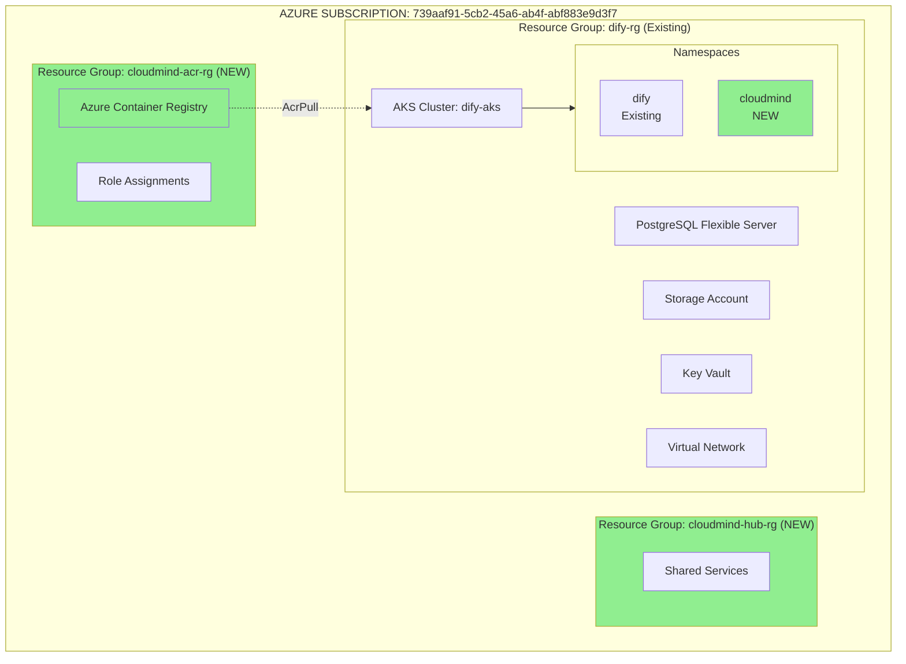

# 🚀 Bienvenido a DXC Cloud Mind - Nirvana PoC

!!! success "Estado del Proyecto"
    **Phase**: Infrastructure Deployed ✅  
    **Última Actualización**: Enero 2025  
    **Recursos Desplegados**: 7  
    **Workflows Operacionales**: 5

## 🎯 Visión

Transform cloud operations through **AI-driven automation**, proactive governance, and cost optimization. This PoC implements a **Cloud Mind Control Center** that enables:

<div class="grid cards" markdown>

-   :material-eye-check:{ .lg .middle } **Visibilidad Total**

    ---

    Real-time monitoring de operaciones, incidentes y alertas con dashboards unificados

-   :material-lightning-bolt:{ .lg .middle } **Velocidad de Acción**

    ---

    Planes de acción generados por IA con comparación histórica y automated remediation

-   :material-brain:{ .lg .middle } **Proactividad**

    ---

    Insights continuos que previenen incidentes recurrentes antes de que ocurran

-   :material-shield-check:{ .lg .middle } **Cero Riesgo**

    ---

    Enfoque en zero operational risk con automated compliance y security scanning

-   :material-robot:{ .lg .middle } **Hiper-automatización**

    ---

    Ciclo de vida completo de soluciones Cloud con GitOps y CI/CD

-   :material-cash:{ .lg .middle } **Optimización de Costes**

    ---

    ~€250/mes ahorrados con Single-AKS strategy y FinOps automation

</div>

---

## 🏗️ Arquitectura Actual

### Single-AKS Shared Services



!!! tip "Single-AKS Strategy"
    Leveraging existing Dify AKS cluster with namespace isolation:
    
    - **Dify namespace**: Existing workloads (data source, read-only)
    - **CloudMind namespace**: New PoC workloads (Terraform-managed)
    - **Ahorro**: ~€250/mes vs multi-AKS approach

---

## 📊 Métricas del Proyecto

| Métrica | Valor | Estado |
|---------|-------|--------|
| **Recursos Desplegados** | 7 | ✅ |
| **Workflows CI/CD** | 5 | ✅ |
| **Security Gates** | 6 | ✅ |
| **Coste Mensual Incremental** | ~€5/mes | ✅ |
| **Ahorro vs Multi-AKS** | ~€250/mes | ✅ |
| **Time-to-Deploy** | ~10 min | ✅ |

---

## 🚀 Quick Start

### 1. Clonar Repositorio

```bash
git clone https://github.com/DXC-Technology-Spain/DXC_PoC_Nirvana.git
cd DXC_PoC_Nirvana
```

### 2. Configurar Credenciales

Ver [Guía de Configuración de Secretos](guides/secrets-setup.md)

### 3. Desplegar Infraestructura

```bash
# Opción 1: GitHub Actions (Recomendado)
# Ir a Actions → "🚀 Deploy Infrastructure" → Run workflow

# Opción 2: Local (Testing)
cd terraform/environments/hub
terraform init
terraform plan
terraform apply
```

---

## 🎯 Use Cases (Roadmap)

### Phase 1: Foundation ✅

- [x] Infrastructure as Code (Terraform)
- [x] CI/CD Pipelines (GitHub Actions)
- [x] Security & Compliance Gates
- [x] Cost Optimization (Single-AKS)

### Phase 2: Documentation System 📝

- [ ] Next.js Control Center UI with MDX
- [ ] FastAPI API Gateway
- [ ] Dify RAG integration
- [ ] Conversational Q&A bot

### Phase 3: IaC Automation 🤖

- [ ] Drift detection pipeline
- [ ] AI risk analysis (Dify workflows)
- [ ] Infrastructure state dashboard
- [ ] Auto-remediation workflows

### Phase 4: FinOps Optimization 💰

- [ ] Azure Cost Management API integration
- [ ] Underutilization detection
- [ ] Automated PR generation (optimizations)
- [ ] Predictive cost dashboards

---

## 🔗 Enlaces Rápidos

<div class="grid cards" markdown>

-   :material-github:{ .lg .middle } **GitHub Repository**

    ---

    [Ver código fuente](https://github.com/DXC-Technology-Spain/DXC_PoC_Nirvana){ .md-button .md-button--primary }

-   :material-microsoft-azure:{ .lg .middle } **Azure Portal**

    ---

    [Ver recursos](https://portal.azure.com/#@93f33571-550f-43cf-b09f-cd331338d086/resource/subscriptions/739aaf91-5cb2-45a6-ab4f-abf883e9d3f7){ .md-button }

-   :octicons-workflow-24:{ .lg .middle } **GitHub Actions**

    ---

    [Ver workflows](https://github.com/DXC-Technology-Spain/DXC_PoC_Nirvana/actions){ .md-button }

-   :material-file-document-outline:{ .lg .middle } **Documentación**

    ---

    [Explorar guías](guides/quick-start.md){ .md-button }

</div>

---

## 📞 Soporte

**CloudOps Team**: Alberto Lacambra  
**GitHub Issues**: [Reportar aquí](https://github.com/DXC-Technology-Spain/DXC_PoC_Nirvana/issues)

---

!!! quote "Misión"
    Transformar CloudOps mediante IA, automatización end-to-end y gobernanza proactiva, depreciando ClickOps y modernizando operaciones legacy.
