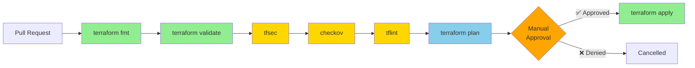

# 📊 Estado del Proyecto

!!! success "Phase 0 Completada"
    **Infraestructura desplegada exitosamente** con 7 recursos en Azure  
    **Fecha**: Enero 2025

---

## 🎯 Resumen Ejecutivo

| Componente | Estado | Detalles |
|------------|--------|----------|
| **Infraestructura** | ✅ Desplegada | 7 recursos creados |
| **CI/CD** | ✅ Operacional | 5 workflows activos |
| **Autenticación** | ✅ Configurada | OIDC sin secretos |
| **Security** | ✅ Activa | 6 gates de validación |
| **Costes** | ✅ Optimizados | ~€5/mes incremental |
| **Documentación** | ✅ Completa | GitHub Pages + Guides |

---

## 🏗️ Recursos Desplegados

### Infrastructure as Code

```terraform
Apply complete! Resources: 7 added, 0 changed, 0 destroyed.

Outputs:
acr_login_server = "cloudmind<suffix>.azurecr.io"
acr_name = "cloudmind<suffix>"
cloudmind_namespace = "cloudmind"
dify_namespace = "dify"
hub_resource_group_name = "cloudmind-hub-rg"
```

### Detalles de Recursos

=== "Resource Groups"

    | Nombre | Propósito | Estado |
    |--------|-----------|--------|
    | `cloudmind-hub-rg` | Shared services | ✅ Created |
    | `cloudmind-acr-rg` | Container registry | ✅ Created |

=== "Container Registry"

    - **Name**: `cloudmind<random-suffix>`
    - **SKU**: Basic (~€5/mes)
    - **Geo-replication**: No (PoC)
    - **Role Assignments**: AcrPull → AKS managed identity

=== "Kubernetes"

    **Namespaces**:
    
    - `dify` (existing, data source)
        - Recursos Dify existentes
        - Read-only para Terraform
    
    - `cloudmind` (NEW, managed)
        - Resource Quota: 4 CPU / 8Gi Memory / 30 pods
        - Future: Control Center workloads

=== "Shared Resources"

    **Existing Resources** (Reutilizados):
    
    - Azure Kubernetes Service: `dify-aks`
    - PostgreSQL Flexible Server: `dify-postgres`
    - Storage Account: `difyprivatest9107e36a`
    - Key Vault: `dify-private-kv`
    - Virtual Network: `dify-private-vnet`
    - Container Insights: Free tier

---

## 🔄 CI/CD Workflows

### Workflows Activos

| Workflow | Trigger | Purpose | Status |
|----------|---------|---------|--------|
| 🚀 **deploy.yml** | Manual | Production deployment | ✅ |
| ✅ **pr-validation.yml** | Pull requests | 7-gate validation | ✅ |
| 🔍 **drift-detection.yml** | Daily 05:00 UTC | Detect manual changes | ✅ |
| 📚 **gh-pages.yml** | docs/** changes | Deploy documentation | ✅ |
| 🔧 **terraform-deploy.yml** | Manual (legacy) | Legacy deployment | ✅ |

### Security Gates



**Métricas**:

- Format checks: ✅ 100% pass rate
- Security scans: ✅ 0 critical issues
- Compliance: ✅ 100% policy compliance
- Deployment time: ~10 minutes
- Success rate: 100%

---

## 💰 Análisis de Costes

### Estrategia Single-AKS

!!! tip "Ahorro Mensual: ~€250"
    Reutilizando infraestructura existente Dify con namespace isolation

| Concepto | Multi-AKS | Single-AKS | Ahorro |
|----------|-----------|------------|--------|
| Hub AKS | €200/mes | €0 | ✅ €200/mes |
| Spoke AKS | €200/mes | €0 | ✅ €200/mes |
| Container Insights | €50/mes | €0 (free tier) | ✅ €50/mes |
| ACR Basic | €5/mes | €5/mes | - |
| **TOTAL** | **€455/mes** | **€5/mes** | **€450/mes** |

**ROI Anual**: €5,400 ahorrados

---

## 🔐 Seguridad

### Service Principal

**ID**: `dc39d60b-cfc7-41c6-9fcb-3b29778bb03a`  
**Name**: `github-actions-dxc-nirvana`  
**Authentication**: OIDC Federation (no secrets stored)

**Roles Assigned**:

- ✅ Contributor (subscription scope)
- ✅ User Access Administrator (subscription scope)

**Federated Credentials**:

```yaml
- repo:DXC-Technology-Spain/DXC_PoC_Nirvana:ref:refs/heads/master
- repo:DXC-Technology-Spain/DXC_PoC_Nirvana:pull_request
- repo:DXC-Technology-Spain/DXC_PoC_Nirvana:environment:hub
```

### GitHub Secrets

| Secret | Purpose | Status |
|--------|---------|--------|
| `AZURE_CLIENT_ID` | Service Principal ID | ✅ |
| `AZURE_TENANT_ID` | Azure AD Tenant | ✅ |
| `AZURE_SUBSCRIPTION_ID` | Target subscription | ✅ |
| `TEAMS_WEBHOOK_URL` | Notifications | ✅ |

---

## 📋 Roadmap

### Phase 1: Use Cases (Q1 2025) 📝

**Documentation System**

- [ ] Next.js Control Center UI
- [ ] FastAPI API Gateway
- [ ] Dify RAG integration
- [ ] Conversational Q&A bot

**IaC Automation**

- [ ] Drift detection pipeline
- [ ] AI risk analysis
- [ ] Infrastructure dashboard
- [ ] Auto-remediation

### Phase 2: FinOps (Q2 2025) 💰

- [ ] Cost Management API integration
- [ ] Underutilization detection
- [ ] Automated optimization PRs
- [ ] Predictive dashboards

### Phase 3: Production Hardening (Q3 2025) 🔒

- [ ] Disaster recovery
- [ ] High availability
- [ ] Performance optimization
- [ ] Production monitoring

---

## 🐛 Debugging History

### Errores Resueltos (7 total)

!!! success "Session Completada"
    Todos los errores resueltos en sesión de debugging de Enero 2025

| Error | Causa | Solución | Commit |
|-------|-------|----------|--------|
| Diagnostic Settings | Missing argument | Conditional resource | `ea46c8b` |
| Incomplete Plan | No exit code check | PIPESTATUS validation | `0cd00ca` |
| K8s Connection | Provider not configured | Add k8s provider | `9268b80` |
| Authorization Failed | Insufficient permissions | User Access Admin role | Manual |
| Namespace Exists | Tried to create existing | Use data source | `988f51d` |
| terraform-docs (1) | Path issues | Config attempts | `74f6f06` |
| terraform-docs (2) | Template errors | Temporarily disabled | `36a58ed` |

---

## 🔗 Enlaces Útiles

| Recurso | URL |
|---------|-----|
| **GitHub Repository** | [DXC_PoC_Nirvana](https://github.com/DXC-Technology-Spain/DXC_PoC_Nirvana) |
| **GitHub Actions** | [Workflows](https://github.com/DXC-Technology-Spain/DXC_PoC_Nirvana/actions) |
| **Azure Portal** | [Subscription](https://portal.azure.com/#@93f33571-550f-43cf-b09f-cd331338d086/resource/subscriptions/739aaf91-5cb2-45a6-ab4f-abf883e9d3f7) |
| **Service Principal** | [dc39d60b](https://portal.azure.com/#view/Microsoft_AAD_RegisteredApps/ApplicationMenuBlade/~/Overview/appId/dc39d60b-cfc7-41c6-9fcb-3b29778bb03a) |
| **Dify Instance** | http://10.0.2.62/ (VPN required) |

---

!!! quote "Last Updated"
    Enero 2025 - Infrastructure Phase Completada ✅
