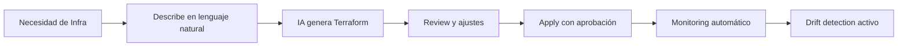
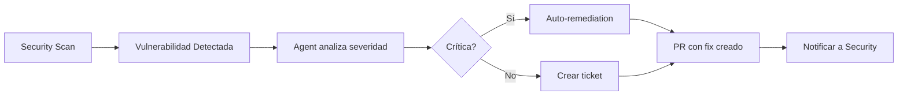
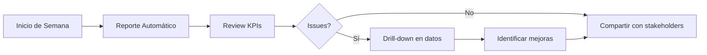

# Casos de Uso - Cloud Control Center

## 🎯 Introducción

Bienvenido a la documentación de **casos de uso** del **Cloud Control Center** - una plataforma unificada impulsada por IA que democratiza las operaciones Cloud para múltiples perfiles: técnicos, desarrolladores, FinOps, seguridad y governance.

> **Visión**: "From Intent to Infrastructure in Minutes, Not Weeks"

Para entender la visión completa del producto, consulta [Product Vision](../PRODUCT_VISION.md).

---

## 📋 Casos de Uso por Módulo

### 🎨 Vibe Coding Studio

| # | Caso de Uso | Descripción | Usuario | Prioridad |
|---|-------------|-------------|---------|-----------|
| [UC-101](vibe-coding/UC-101-create-fastapi-project.md) | Crear proyecto FastAPI con IA | Generación completa de API REST con best practices | 💻 Developer | ⭐⭐⭐ Alta |
| [UC-102](vibe-coding/UC-102-create-nextjs-app.md) | Crear aplicación NextJS | Frontend moderno con TypeScript y Tailwind | 💻 Developer | ⭐⭐⭐ Alta |
| [UC-103](vibe-coding/UC-103-add-feature-to-project.md) | Agregar feature a proyecto existente | IA modifica código existente para nueva funcionalidad | 💻 Developer | ⭐⭐ Media |
| [UC-104](vibe-coding/UC-104-generate-tests.md) | Generar tests automáticamente | Tests unitarios y de integración generados por IA | 💻 Developer | ⭐⭐ Media |

### 🚀 Infrastructure Deployer

| # | Caso de Uso | Descripción | Usuario | Prioridad |
|---|-------------|-------------|---------|-----------|
| [UC-201](infrastructure/UC-201-deploy-aks-cluster.md) | Desplegar cluster AKS con lenguaje natural | Spec-driven: describe necesidad → Terraform generado | ☁️ Cloud Engineer | ⭐⭐⭐ Alta |
| [UC-202](infrastructure/UC-202-add-acr-to-existing.md) | Agregar ACR a infraestructura existente | Modifica Terraform existente integrando ACR | ☁️ Cloud Engineer | ⭐⭐ Media |
| [UC-203](infrastructure/UC-203-multi-region-deployment.md) | Deployment multi-región | Replicar infra en múltiples regiones con HA | ☁️ Cloud Engineer | ⭐ Baja |
| [UC-204](infrastructure/UC-204-disaster-recovery-setup.md) | Configurar disaster recovery | Backup, replicación y plan de DR automático | ☁️ Cloud Engineer | ⭐⭐ Media |

### 🤖 Intelligent Agents

| # | Caso de Uso | Descripción | Usuario | Prioridad |
|---|-------------|-------------|---------|-----------|
| [UC-301](agents/UC-301-troubleshoot-pod-crash.md) | Diagnosticar y resolver pod crasheando | Agent analiza logs, identifica causa, propone fix | ☁️ Cloud Engineer | ⭐⭐⭐ Alta |
| [UC-302](agents/UC-302-optimize-costs-automatically.md) | Optimizar costes automáticamente | Agent detecta waste, propone y aplica optimizaciones | 💰 FinOps | ⭐⭐⭐ Alta |
| [UC-303](agents/UC-303-remediate-security-vulnerability.md) | Remediar vulnerabilidad de seguridad | Agent detecta CVE, crea PR con patch, notifica | 🔒 Security | ⭐⭐⭐ Alta |
| [UC-304](agents/UC-304-update-outdated-documentation.md) | Actualizar documentación obsoleta | Agent detecta doc desactualizada y crea PR | 📚 Tech Writer | ⭐⭐ Media |
| [UC-305](agents/UC-305-orchestrate-complex-deployment.md) | Orquestar deployment complejo | Blue-green deployment multi-servicio | 🚀 DevOps | ⭐⭐ Media |
| [UC-306](agents/UC-306-generate-weekly-reports.md) | Generar reportes semanales automáticos | Reporte consolidado: costes, security, performance | 👔 Manager | ⭐ Baja |

### 📚 Knowledge Portal (RAG-Powered)

| # | Caso de Uso | Descripción | Usuario | Prioridad |
|---|-------------|-------------|---------|-----------|
| [UC-401](knowledge/UC-401-query-technical-documentation.md) | Consultar documentación técnica | Bot responde preguntas basadas en docs reales | 👥 Todos | ⭐⭐⭐ Alta |
| [UC-402](knowledge/UC-402-get-code-examples.md) | Obtener ejemplos de código contextuales | Bot proporciona snippets relevantes con explicación | 💻 Developer | ⭐⭐ Media |
| [UC-403](knowledge/UC-403-search-runbooks.md) | Buscar runbooks operativos | Búsqueda semántica de procedimientos | ☁️ Cloud Engineer | ⭐⭐ Media |
| [UC-404](knowledge/UC-404-learn-new-technology.md) | Aprender nueva tecnología | Tutorial interactivo generado por IA | 💻 Developer | ⭐ Baja |

### 💰 FinOps Analytics

| # | Caso de Uso | Descripción | Usuario | Prioridad |
|---|-------------|-------------|---------|-----------|
| [UC-501](finops/UC-501-view-cost-dashboard.md) | Visualizar dashboard de costes | Dashboard en tiempo real con breakdowns | 💰 FinOps | ⭐⭐⭐ Alta |
| [UC-502](finops/UC-502-get-optimization-recommendations.md) | Recibir recomendaciones de optimización | IA sugiere optimizaciones con impacto estimado | 💰 FinOps | ⭐⭐⭐ Alta |
| [UC-503](finops/UC-503-forecast-monthly-costs.md) | Forecast de costes mensuales | Predicción ML-based de gastos futuros | 💰 FinOps | ⭐⭐ Media |
| [UC-504](finops/UC-504-detect-cost-anomalies.md) | Detectar anomalías de costes | Alertas automáticas de gastos inusuales | 💰 FinOps | ⭐⭐ Media |
| [UC-505](finops/UC-505-generate-chargeback-report.md) | Generar reporte de chargeback | Costes por equipo/proyecto para facturación interna | 💰 FinOps | ⭐ Baja |

### 🔒 Security & Compliance Hub

| # | Caso de Uso | Descripción | Usuario | Prioridad |
|---|-------------|-------------|---------|-----------|
| [UC-601](security/UC-601-view-security-score.md) | Ver security score y recomendaciones | Dashboard con checks, fallos y remediation | 🔒 Security | ⭐⭐⭐ Alta |
| [UC-602](security/UC-602-scan-for-vulnerabilities.md) | Escanear vulnerabilidades | Scan automático de containers, código, infra | 🔒 Security | ⭐⭐⭐ Alta |
| [UC-603](security/UC-603-compliance-check-cis.md) | Verificar compliance CIS Benchmarks | Auto-check contra CIS standards con remediación | 🔒 Security | ⭐⭐ Media |
| [UC-604](security/UC-604-audit-trail-review.md) | Revisar audit trail | Logs de auditoría con búsqueda y alertas | 👔 Governance | ⭐⭐ Media |

### 📊 Observability Hub

| # | Caso de Uso | Descripción | Usuario | Prioridad |
|---|-------------|-------------|---------|-----------|
| [UC-701](observability/UC-701-view-unified-dashboard.md) | Dashboard unificado de métricas | Métricas de toda la plataforma en un vistazo | ☁️ Cloud Engineer | ⭐⭐⭐ Alta |
| [UC-702](observability/UC-702-analyze-logs-with-ai.md) | Analizar logs con IA | IA detecta patrones y anomalías en logs | ☁️ Cloud Engineer | ⭐⭐ Media |
| [UC-703](observability/UC-703-distributed-tracing.md) | Tracing distribuido de requests | Visualizar flujo completo de requests | 💻 Developer | ⭐⭐ Media |
| [UC-704](observability/UC-704-create-custom-alert.md) | Crear alerta personalizada | Definir alertas con routing inteligente | ☁️ Cloud Engineer | ⭐ Baja |

---

## 🎭 Casos de Uso por Persona

### 💻 Developer

**Objetivos**: Desarrollar y desplegar aplicaciones rápidamente con best practices

**Casos de Uso Principales**:
1. [UC-101] Crear proyecto FastAPI con IA → ⏱️ 30 min (vs 2 días)
2. [UC-102] Crear aplicación NextJS → ⏱️ 20 min (vs 1 día)
3. [UC-401] Consultar documentación técnica → ⏱️ 2 min (vs 15 min)
4. [UC-402] Obtener ejemplos de código → ⏱️ 1 min (vs 10 min)

**Flujo Típico**:


### ☁️ Cloud Engineer

**Objetivos**: Desplegar y mantener infraestructura confiable y segura

**Casos de Uso Principales**:
1. [UC-201] Desplegar cluster AKS con lenguaje natural → ⏱️ 2h (vs 2 semanas)
2. [UC-301] Diagnosticar y resolver pod crasheando → ⏱️ 8 min (vs 45 min)
3. [UC-701] Dashboard unificado de métricas → ⏱️ Siempre visible
4. [UC-403] Buscar runbooks operativos → ⏱️ 2 min (vs 10 min)

**Flujo Típico**:


### 💰 FinOps Analyst

**Objetivos**: Optimizar costes y maximizar ROI de Cloud

**Casos de Uso Principales**:
1. [UC-501] Visualizar dashboard de costes → ⏱️ Siempre actualizado
2. [UC-502] Recibir recomendaciones de optimización → ⏱️ Diario
3. [UC-302] Optimizar costes automáticamente → ⏱️ Continuo
4. [UC-503] Forecast de costes mensuales → ⏱️ 5 min

**Flujo Típico**:


### 🔒 Security Engineer

**Objetivos**: Mantener la plataforma segura y compliant

**Casos de Uso Principales**:
1. [UC-601] Ver security score y recomendaciones → ⏱️ Dashboard siempre visible
2. [UC-602] Escanear vulnerabilidades → ⏱️ Continuo
3. [UC-303] Remediar vulnerabilidad de seguridad → ⏱️ 10 min (vs 2 horas)
4. [UC-603] Verificar compliance CIS → ⏱️ Automático

**Flujo Típico**:


### 👔 Engineering Manager / Governance

**Objetivos**: Visibilidad de equipo, compliance, y métricas de ingeniería

**Casos de Uso Principales**:
1. [UC-306] Generar reportes semanales automáticos → ⏱️ Automático
2. [UC-604] Revisar audit trail → ⏱️ 10 min
3. [UC-505] Generar reporte de chargeback → ⏱️ 5 min
4. Dashboard de productividad de equipo → ⏱️ Tiempo real

**Flujo Típico**:


---

## 🚀 Quick Start por Caso de Uso

### Para Developers: Crear tu Primer Proyecto

```bash
# 1. Acceder al Cloud Control Center
https://cloudcontrol.dxc.com

# 2. Ir a "Vibe Coding Studio"

# 3. Describir tu proyecto
"Crear una API REST en Python con FastAPI para gestionar tareas (TODO list).
Incluir autenticación JWT, PostgreSQL, tests con pytest, y deploy en AKS."

# 4. La IA generará:
✅ Estructura del proyecto
✅ Código completo con best practices
✅ Tests unitarios y de integración
✅ Dockerfile multi-stage
✅ Kubernetes manifests
✅ GitHub Actions CI/CD
✅ README.md completo

# 5. Review, ajusta si necesario, y deploy!
⏱️ Tiempo total: 30 minutos
```

### Para Cloud Engineers: Desplegar Infraestructura

```bash
# 1. Ir a "Infrastructure Deployer"

# 2. Describir tu necesidad
"Necesito un cluster AKS para producción con:
- 3 nodes iniciales, autoscaling hasta 10
- Red privada
- Conectado a ACR privado
- Monitoring con Azure Monitor
- Backup diario con Velero"

# 3. La IA generará:
✅ Terraform completo
✅ Terraform validado (tfsec, checkov)
✅ Coste estimado: €450/mes
✅ Security score: 95/100
✅ Plan ejecutado: +18 recursos

# 4. Review y apply
⏱️ Tiempo total: 2 horas (vs 2 semanas manual)
```

### Para FinOps: Optimizar Costes

```bash
# 1. Ir a "FinOps Analytics"

# 2. Ver recomendaciones de IA:
⚡ Ahorro potencial: €650/mes

Recomendación 1: VM "dev-bastion" idle 82%
  → Auto-shutdown 19:00-7:00
  → Ahorro: €450/mes
  
Recomendación 2: Storage Premium sin usar features
  → Downgrade a Hot tier
  → Ahorro: €120/mes

# 3. Aprobar optimizaciones
# 4. Agent aplica cambios automáticamente
# 5. Monitor savings en dashboard

⏱️ Tiempo total: 1 hora (vs día completo manual)
```

---

## 📊 Métricas de Éxito por Caso de Uso

| Caso de Uso | Métrica | Baseline | Target | Actual |
|-------------|---------|----------|--------|--------|
| UC-101: Crear proyecto FastAPI | Time to first deploy | 2-3 días | 30 min | - |
| UC-201: Deploy AKS cluster | Time to production | 2 semanas | 2 horas | - |
| UC-301: Troubleshoot pod crash | MTTR | 45 min | 8 min | - |
| UC-302: Optimize costs | Monthly savings | €0 | €650/mes | - |
| UC-401: Query documentation | Search time | 15 min | 2 min | - |
| UC-502: FinOps recommendations | Time to insight | 8 hours | 5 min | - |
| UC-602: Vulnerability scan | Detection to fix | 2 horas | 10 min | - |

---

## 🗺️ Roadmap de Casos de Uso

### **Phase 1: Foundation** (Q4 2025)

**MVP - Casos de Uso Core**:
- ✅ UC-401: Query technical documentation (Knowledge Portal)
- 🚧 UC-101: Create FastAPI project (Vibe Coding)
- 🚧 UC-201: Deploy AKS cluster (Infrastructure Deployer)
- 📝 UC-501: View cost dashboard (FinOps)

### **Phase 2: AI Agents** (Q1 2026)

**Automatización Inteligente**:
- 🤖 UC-301: Troubleshoot pod crash
- 🤖 UC-302: Optimize costs automatically
- 🤖 UC-303: Remediate security vulnerability
- 🤖 UC-304: Update outdated documentation

### **Phase 3: Advanced Analytics** (Q2 2026)

**Insights y Optimización**:
- 📊 UC-502: Get optimization recommendations
- 📊 UC-503: Forecast monthly costs
- 📊 UC-601: View security score
- 📊 UC-701: Unified observability dashboard

### **Phase 4: Enterprise Scale** (Q3 2026+)

**Casos de Uso Avanzados**:
- UC-203: Multi-region deployment
- UC-305: Orchestrate complex deployment
- UC-505: Generate chargeback report
- UC-703: Distributed tracing

---

## 📚 Documentación Relacionada

### Arquitectura y Diseño
- [Product Vision](../PRODUCT_VISION.md) - Visión completa del producto
- [Architecture - AI RAG System](../architecture/ai-rag-system.md) - Arquitectura técnica RAG
- [Architecture - Deployed Resources](../architecture/deployed-resources.md) - Recursos actuales

### Guías de Implementación
- [Dify Setup Guide](../guides/dify-setup.md) - Instalación de Dify
- [RAG Best Practices](../guides/rag-best-practices.md) - Optimización RAG
- [Secrets Setup](../guides/secrets-setup.md) - Configuración de secretos

### Business
- [Business Plan](../business-plan.md) - Plan de negocio y ROI
- [Cost Analysis](../costs/analysis.md) - Análisis de costes

---

## 🤝 Cómo Contribuir

### Proponer un Nuevo Caso de Uso

1. **Identifica el problema**: ¿Qué tarea manual toma mucho tiempo?
2. **Define el valor**: ¿Cuánto tiempo/coste ahorra?
3. **Especifica el usuario**: ¿Quién se beneficia?
4. **Diseña el flujo**: User journey paso a paso
5. **Documenta**: Usa la plantilla de caso de uso
6. **Crea PR**: Para revisión del equipo

### Plantilla de Caso de Uso

```markdown
# UC-XXX: [Título del Caso de Uso]

## 📋 Metadata
- **ID**: UC-XXX
- **Módulo**: [Vibe Coding | Infrastructure | Agents | etc.]
- **Usuario**: [Developer | Cloud Engineer | FinOps | etc.]
- **Prioridad**: ⭐⭐⭐ Alta | ⭐⭐ Media | ⭐ Baja
- **Estado**: 🚧 En desarrollo | ✅ Completado | 📝 Planificado

## 🎯 Problema
Descripción del pain point actual

## 💡 Solución
Cómo CCC resuelve el problema

## 👤 User Journey
Paso a paso del flujo de usuario

## 🏗️ Arquitectura Técnica
Componentes involucrados

## 📊 Métricas de Éxito
- Baseline actual
- Target esperado
- Cómo se mide

## 🚀 Implementación
- Fase de desarrollo
- Estimación de esfuerzo
- Dependencias

## 📸 Screenshots / Mockups
Capturas de pantalla o diseños

## 🔗 Referencias
- Documentación técnica relacionada
- Issues en GitHub
- Enlaces externos
```

---

**Última actualización**: 2025-10-17  
**Owner**: Cloud Platform Team  
**Contacto**: cloudmind@dxc.com
