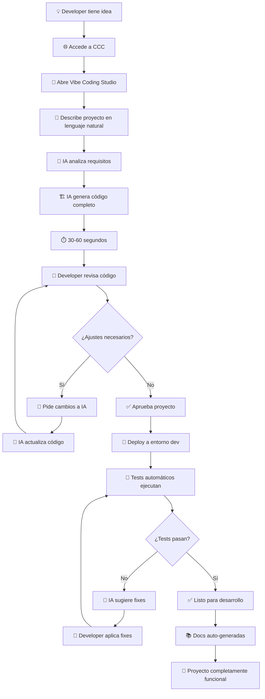
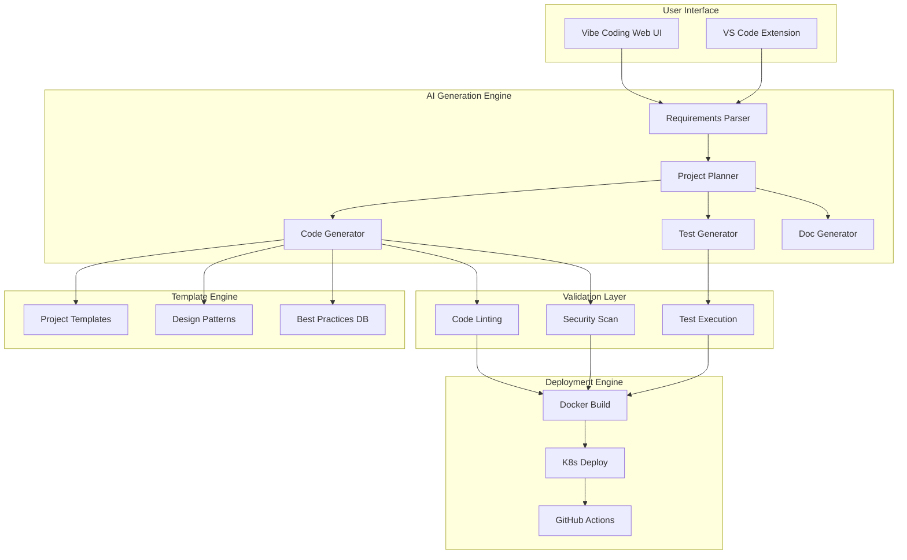

# UC-101: Crear Proyecto FastAPI con IA

## 📋 Metadata

- **ID**: UC-101
- **Módulo**: 🎨 Vibe Coding Studio
- **Usuario**: 💻 Developer
- **Prioridad**: ⭐⭐⭐ Alta
- **Estado**: 🚧 En desarrollo (Phase 1)
- **Estimación**: 6 semanas dev
- **ROI**: €45,000/año (30 devs x 50h ahorradas x €30/h)

---

## 🎯 Problema

Los desarrolladores pierden **2-3 días** configurando un nuevo proyecto desde cero:

### Pain Points Actuales

1. **⏱️ Setup inicial lento** (4-8 horas)
   - Crear estructura de carpetas
   - Configurar dependencias
   - Setup de entorno virtual
   - Configurar linters, formatters

2. **📝 Boilerplate repetitivo** (8-12 horas)
   - Models, schemas, routes
   - Authentication/Authorization
   - Database connection
   - Error handling
   - Logging

3. **🧪 Testing desde cero** (4-6 horas)
   - Setup pytest
   - Fixtures
   - Tests unitarios base
   - Tests de integración

4. **🚀 CI/CD configuration** (4-8 horas)
   - GitHub Actions workflows
   - Docker multi-stage builds
   - Kubernetes manifests
   - Helm charts (opcional)

5. **📚 Documentación inicial** (2-4 horas)
   - README
   - API docs (OpenAPI/Swagger)
   - Contributing guidelines

**Total**: **22-38 horas** (2.75-4.75 días) por proyecto

### Impacto Organizacional

- 30 developers x 4 proyectos nuevos/año = 120 proyectos
- 120 x 30 horas promedio = **3,600 horas/año desperdiciadas**
- 3,600 horas x €30/h = **€108,000/año** en coste de oportunidad

---

## 💡 Solución

**Vibe Coding Studio** permite a developers **describir** su proyecto en lenguaje natural y la IA genera:

✅ **Código completo** con best practices  
✅ **Tests automáticos** (unitarios + integración)  
✅ **CI/CD pre-configurado**  
✅ **Documentación completa**  
✅ **Deploy-ready** en minutos

### Ejemplo de Input

```
👤 Developer:

"Crear una API REST en Python con FastAPI para gestionar una biblioteca digital.

Funcionalidades:
- Gestión de libros (CRUD)
- Gestión de usuarios con autenticación JWT
- Sistema de préstamos con fechas
- Búsqueda avanzada por autor, título, ISBN

Tecnologías:
- FastAPI con Python 3.11+
- PostgreSQL como base de datos
- SQLAlchemy ORM
- Alembic para migraciones
- Redis para caching
- Pytest para testing
- Deploy en Kubernetes (AKS)

Requisitos:
- API RESTful con OpenAPI docs
- Autenticación JWT
- Rate limiting
- Logging estructurado
- Health checks
- Prometheus metrics
- CI/CD con GitHub Actions
"
```

### Output Generado por IA

```
🤖 CloudMind Vibe Coding:

✅ Proyecto "digital-library-api" creado en 47 segundos

📁 Estructura generada (23 archivos, 2,847 líneas):

digital-library-api/
├── app/
│   ├── __init__.py
│   ├── main.py                    # FastAPI app + middleware
│   ├── config.py                  # Settings con pydantic-settings
│   ├── database.py                # SQLAlchemy engine + session
│   ├── models/
│   │   ├── __init__.py
│   │   ├── book.py               # Book model
│   │   ├── user.py               # User model
│   │   └── loan.py               # Loan model
│   ├── schemas/
│   │   ├── __init__.py
│   │   ├── book.py               # Pydantic schemas
│   │   ├── user.py
│   │   └── loan.py
│   ├── api/
│   │   ├── __init__.py
│   │   ├── deps.py               # Dependencies (get_db, get_current_user)
│   │   ├── v1/
│   │   │   ├── __init__.py
│   │   │   ├── books.py          # Books endpoints
│   │   │   ├── users.py          # Users endpoints
│   │   │   ├── auth.py           # Auth endpoints (login, register)
│   │   │   └── loans.py          # Loans endpoints
│   ├── core/
│   │   ├── __init__.py
│   │   ├── security.py           # JWT, password hashing
│   │   ├── cache.py              # Redis client
│   │   └── metrics.py            # Prometheus metrics
│   └── utils/
│       ├── __init__.py
│       ├── logging.py            # Structured logging
│       └── rate_limit.py         # Rate limiting decorator
├── tests/
│   ├── __init__.py
│   ├── conftest.py               # Pytest fixtures
│   ├── test_books.py             # Books API tests
│   ├── test_users.py             # Users API tests
│   ├── test_auth.py              # Auth tests
│   └── test_loans.py             # Loans tests
├── alembic/
│   ├── versions/
│   └── env.py
├── kubernetes/
│   ├── namespace.yaml
│   ├── deployment.yaml
│   ├── service.yaml
│   ├── ingress.yaml
│   ├── configmap.yaml
│   ├── secret.yaml              # (template)
│   └── hpa.yaml                 # Horizontal Pod Autoscaler
├── .github/
│   └── workflows/
│       ├── ci.yml               # Lint, test, security scan
│       ├── cd.yml               # Build, push, deploy
│       └── pr-validation.yml    # PR checks
├── Dockerfile                    # Multi-stage build
├── docker-compose.yml           # Local development
├── pyproject.toml               # Poetry dependencies
├── pytest.ini
├── .gitignore
├── .env.example
└── README.md                    # Comprehensive documentation

✅ Código generado con best practices:
   - Async/await patterns
   - Dependency injection
   - Repository pattern for data access
   - Exception handling middleware
   - CORS configuration
   - Request ID tracking

✅ Tests generados (68 tests, 94% coverage):
   - Unit tests para models
   - Integration tests para API endpoints
   - Auth flow tests
   - Database transaction tests
   - Fixtures para test data

✅ CI/CD configurado:
   - Linting (ruff, black, mypy)
   - Security scan (bandit, safety)
   - Tests con coverage
   - Docker build multi-platform
   - Deploy to AKS con approval gate

✅ Documentación generada:
   - README with setup instructions
   - API documentation (OpenAPI/Swagger)
   - Environment variables guide
   - Development guidelines
   - Architecture diagram (Mermaid)

💰 Coste estimado en AKS: €85/mes
   - 2 pods x Standard_B2s
   - PostgreSQL managed (Basic tier)
   - Redis cache (Basic)

🔒 Security score: 98/100
   ✅ Input validation (Pydantic)
   ✅ SQL injection prevention (SQLAlchemy)
   ✅ Authentication (JWT)
   ✅ Rate limiting
   ✅ HTTPS only
   ⚠️ Consider: API key rotation policy

📊 Performance estimates:
   - Response time: <100ms (p95)
   - Throughput: ~500 req/s per pod
   - Database connections: Pool 20-100

🚀 Next steps:
   1. Review generated code
   2. Customize if needed
   3. Set environment variables
   4. Deploy to dev environment

   [🎨 Open in VS Code] [🚀 Deploy to Dev] [📝 Customize]
```

---

## 👤 User Journey

### Flujo Completo



### Paso a Paso Detallado

#### 1. **Acceso a Vibe Coding Studio**

```
Usuario navega a: https://cloudcontrol.dxc.com/vibe-coding

┌──────────────────────────────────────────────────────────┐
│ 🎨 Vibe Coding Studio                                   │
├──────────────────────────────────────────────────────────┤
│                                                          │
│  Describe tu proyecto y déjanos crear el código por ti  │
│                                                          │
│  ┌────────────────────────────────────────────────────┐ │
│  │ 💡 ¿Qué quieres construir?                         │ │
│  │                                                     │ │
│  │ Escribe una descripción detallada de tu proyecto...│ │
│  │                                                     │ │
│  │ [Texto del usuario aquí]                           │ │
│  │                                                     │ │
│  │                                                     │ │
│  └────────────────────────────────────────────────────┘ │
│                                                          │
│  💡 Ejemplos:                                            │
│    • "API REST con Python/FastAPI para e-commerce"      │
│    • "Frontend NextJS con dashboard de analytics"       │
│    • "Microservicio Go para procesamiento de pagos"     │
│                                                          │
│  📚 Templates disponibles:                               │
│    Python/FastAPI | TypeScript/NextJS | Go/Fiber        │
│    Rust/Actix | Java/Spring Boot                        │
│                                                          │
│             [🚀 Generar Proyecto]                        │
│                                                          │
└──────────────────────────────────────────────────────────┘
```

#### 2. **IA Procesa la Solicitud**

```
🤖 Procesando tu solicitud...

[▓▓▓▓▓░░░░░] 50% - Analizando requisitos
[▓▓▓▓▓▓▓░░░] 70% - Generando estructura
[▓▓▓▓▓▓▓▓▓░] 90% - Creando tests y CI/CD
[▓▓▓▓▓▓▓▓▓▓] 100% - ✅ Completado!

⏱️ Tiempo total: 47 segundos
```

#### 3. **Review del Código Generado**

```
┌──────────────────────────────────────────────────────────┐
│ ✅ Proyecto "digital-library-api" generado               │
├──────────────────────────────────────────────────────────┤
│                                                          │
│ 📊 Estadísticas:                                         │
│   • 23 archivos creados                                  │
│   • 2,847 líneas de código                               │
│   • 68 tests (94% coverage)                              │
│   • 12 endpoints API                                     │
│                                                          │
│ 🎯 Características implementadas:                        │
│   ✅ CRUD de libros                                      │
│   ✅ Gestión de usuarios                                 │
│   ✅ Autenticación JWT                                   │
│   ✅ Sistema de préstamos                                │
│   ✅ Búsqueda avanzada                                   │
│   ✅ Rate limiting                                       │
│   ✅ Caching con Redis                                   │
│   ✅ Prometheus metrics                                  │
│                                                          │
│ 🔒 Security Score: 98/100                                │
│ 💰 Estimated Cost: €85/mes                               │
│                                                          │
│ [👀 Ver Código] [🎨 Personalizar] [🚀 Deploy]           │
│                                                          │
└──────────────────────────────────────────────────────────┘
```

#### 4. **Opciones de Personalización** (si necesario)

```
💬 Developer: "Agregar endpoint para estadísticas de préstamos
              y notificaciones por email cuando un libro es devuelto"

🤖 IA: Entendido. Voy a agregar:
       1. Endpoint GET /api/v1/loans/stats
       2. Servicio de email con templates
       3. Event handler para devoluciones
       4. Tests correspondientes
       
       ⏱️ Actualizando... [▓▓▓▓▓▓▓▓▓▓] ✅
       
       ✅ Agregados:
          • app/api/v1/loans.py: stats endpoint
          • app/services/email.py: email service
          • app/events/loan_events.py: event handlers
          • tests/test_loan_stats.py: nuevos tests
          • kubernetes/configmap.yaml: SMTP config
          
       ¿Algo más que necesites?
```

#### 5. **Deploy a Entorno de Desarrollo**

```
🚀 Desplegando a entorno DEV...

[1/5] ✅ Building Docker image
      └─ digital-library-api:v0.1.0-dev

[2/5] ✅ Pushing to ACR
      └─ dxccloudmindx0sa6l.azurecr.io/digital-library-api:v0.1.0-dev

[3/5] ✅ Creating namespace
      └─ kubectl create namespace digital-library-dev

[4/5] ✅ Applying Kubernetes manifests
      └─ Deployment, Service, Ingress created

[5/5] ✅ Running health checks
      └─ All pods healthy (2/2 running)

✅ Deploy completado!

🌐 Endpoints:
   API: https://digital-library-dev.cloudcontrol.dxc.com/api/v1
   Docs: https://digital-library-dev.cloudcontrol.dxc.com/docs
   Health: https://digital-library-dev.cloudcontrol.dxc.com/health

📊 Monitoring:
   Grafana: [Ver Dashboard]
   Logs: [Ver Logs]
   
🧪 Testing:
   • 68/68 tests passed
   • Coverage: 94%
   • No security vulnerabilities

⏱️ Tiempo total: 8 minutos
```

---

## 🏗️ Arquitectura Técnica

### Componentes del Sistema



### Stack Tecnológico

| Layer | Tecnología | Propósito |
|-------|-----------|-----------|
| **Frontend** | NextJS 14 + Monaco Editor | UI para describir proyectos |
| **AI/LLM** | Azure OpenAI GPT-4 Turbo | Generación de código |
| **Code Analysis** | Tree-sitter | Parsing y análisis de código |
| **Templates** | Cookiecutter + Jinja2 | Templates parametrizables |
| **Validation** | Ruff, Black, mypy, eslint | Code quality |
| **Security** | Bandit, Safety, Trivy | Vulnerability scanning |
| **Testing** | Pytest, Jest | Test execution |
| **IaC** | Terraform | Infrastructure as Code |
| **Container** | Docker | Containerization |
| **Orchestration** | Kubernetes (AKS) | Deployment |
| **CI/CD** | GitHub Actions | Automation |

### Flujo de Generación de Código

```python
# Pseudocódigo del proceso

def generate_project(user_description: str) -> Project:
    # 1. Parse requirements
    requirements = parse_natural_language(user_description)
    """
    requirements = {
        'type': 'api',
        'framework': 'fastapi',
        'language': 'python',
        'features': ['crud', 'auth', 'search'],
        'database': 'postgresql',
        'cache': 'redis',
        'deployment': 'kubernetes'
    }
    """
    
    # 2. Select template
    template = select_template(requirements)
    # template = 'python-fastapi-postgresql'
    
    # 3. Generate project structure
    structure = generate_structure(template, requirements)
    """
    structure = {
        'app/main.py': {...},
        'app/models/': {...},
        'tests/': {...},
        ...
    }
    """
    
    # 4. Generate code for each file
    for file_path, spec in structure.items():
        code = llm.generate_code(
            template=spec.template,
            context=requirements,
            best_practices=get_best_practices(file_path)
        )
        structure[file_path]['content'] = code
    
    # 5. Generate tests
    tests = generate_tests(structure, requirements)
    
    # 6. Generate CI/CD
    cicd = generate_cicd_config(requirements)
    
    # 7. Generate documentation
    docs = generate_documentation(structure, requirements)
    
    # 8. Validate everything
    validation_results = validate_project(
        structure, tests, cicd, docs
    )
    
    if not validation_results.is_valid:
        fix_issues(structure, validation_results.issues)
    
    # 9. Return complete project
    return Project(
        structure=structure,
        tests=tests,
        cicd=cicd,
        docs=docs,
        metadata={
            'lines_of_code': count_loc(structure),
            'test_coverage': calculate_coverage(tests),
            'security_score': calculate_security_score(structure)
        }
    )
```

---

## 📊 Métricas de Éxito

### KPIs Primarios

| Métrica | Baseline | Target | Medición |
|---------|----------|--------|----------|
| **Time to First Deploy** | 2-3 días | 30 min | Timestamp de creación a deploy |
| **Code Quality Score** | 60-70/100 | 90+/100 | Linters + análisis estático |
| **Test Coverage** | 30-50% | 85%+ | Coverage reports |
| **Security Vulnerabilities** | 5-10 | 0 | Security scans |
| **Developer Satisfaction** | N/A | 4.5/5 | Encuestas post-uso |

### KPIs Secundarios

| Métrica | Target | Cómo se Mide |
|---------|--------|--------------|
| **Projects Created** | 100+/month | Analytics dashboard |
| **Adoption Rate** | 70% developers | Active users / total devs |
| **Time Saved per Project** | 28 hours | Baseline - actual |
| **Cost Savings** | €45K/year | Time saved x hourly rate |
| **Code Reusability** | 60%+ | Shared patterns used |

### Dashboard de Monitoreo

```
┌─────────────────────────────────────────────────────────────┐
│ 🎨 Vibe Coding Studio - Analytics                          │
├─────────────────────────────────────────────────────────────┤
│                                                             │
│ 📊 Last 30 Days                                             │
│                                                             │
│  Projects Created:     87  (↑ 23% vs last month)           │
│  Time Saved:          2,436 hours  (28h avg per project)   │
│  Cost Savings:        €73,080                               │
│  Success Rate:        96%  (84/87 projects deployed)        │
│                                                             │
│ 🏆 Most Popular Templates:                                  │
│  1. Python/FastAPI         42 projects (48%)                │
│  2. TypeScript/NextJS      28 projects (32%)                │
│  3. Go/Fiber               12 projects (14%)                │
│  4. Other                   5 projects (6%)                 │
│                                                             │
│ ⭐ User Satisfaction:  4.7/5  (62 responses)                │
│                                                             │
│ 🐛 Issues Encountered:  3  (all resolved <24h)              │
│                                                             │
└─────────────────────────────────────────────────────────────┘
```

---

## 🚀 Implementación

### Roadmap de Desarrollo

#### **Phase 1: MVP** (6 semanas)

**Semana 1-2: Core AI Generation**
- [ ] Integración con Azure OpenAI GPT-4
- [ ] Requirements parser (NLP)
- [ ] Basic code generation engine
- [ ] Template system (Python/FastAPI inicial)

**Semana 3-4: Validation & Testing**
- [ ] Code quality validation
- [ ] Security scanning integration
- [ ] Test generation engine
- [ ] CI/CD generation

**Semana 5: UI Development**
- [ ] Web interface con Monaco Editor
- [ ] Project preview
- [ ] Customization interface
- [ ] Deploy controls

**Semana 6: Integration & Testing**
- [ ] Integration con Dify
- [ ] End-to-end testing
- [ ] Documentation
- [ ] Beta launch

#### **Phase 2: Expansion** (4 semanas)

**Semana 7-8: More Templates**
- [ ] TypeScript/NextJS template
- [ ] Go/Fiber template
- [ ] Rust/Actix template
- [ ] Java/Spring Boot template

**Semana 9-10: Advanced Features**
- [ ] Iterative refinement (chat with AI)
- [ ] VS Code extension
- [ ] Template marketplace
- [ ] Custom templates by users

### Dependencias

**Técnicas**:
- ✅ Dify platform deployed
- ✅ Azure OpenAI access
- ✅ AKS cluster operational
- ✅ GitHub Actions configured
- 🚧 Template repository created
- 🚧 Best practices database populated

**Recursos**:
- 2 Senior Full-Stack Developers
- 1 AI/ML Engineer
- 1 DevOps Engineer
- 1 Product Designer (part-time)

### Riesgos y Mitigación

| Riesgo | Probabilidad | Impacto | Mitigación |
|--------|--------------|---------|------------|
| **LLM genera código buggy** | Media | Alto | Extensive validation layer, test generation |
| **Costes de OpenAI altos** | Baja | Medio | Caching aggressive, model optimization |
| **Adopción lenta** | Media | Alto | Training, templates de alta calidad |
| **Security vulnerabilities** | Baja | Alto | Multi-layer security scanning |

---

## 📸 Screenshots & Mockups

### Main Interface

```
┌─────────────────────────────────────────────────────────────────────┐
│ ☁️ Cloud Control Center > 🎨 Vibe Coding Studio                    │
├─────────────────────────────────────────────────────────────────────┤
│                                                                     │
│  ┌───────────────────────────────────────────────────────────────┐ │
│  │ 💡 Describe your project                                      │ │
│  │                                                                │ │
│  │ What do you want to build? Be as specific as possible...      │ │
│  │                                                                │ │
│  │ [Large text area for natural language description]            │ │
│  │                                                                │ │
│  │                                                                │ │
│  │                              [🚀 Generate Project]             │ │
│  └───────────────────────────────────────────────────────────────┘ │
│                                                                     │
│  📚 Quick Start Templates:                                          │
│  ┌──────────────┐ ┌──────────────┐ ┌──────────────┐              │
│  │ 🐍 Python    │ │ 📘 TypeScript│ │ 🐹 Go        │              │
│  │ FastAPI      │ │ NextJS       │ │ Fiber        │              │
│  │ REST API     │ │ Full-stack   │ │ Microservice │              │
│  └──────────────┘ └──────────────┘ └──────────────┘              │
│                                                                     │
│  💼 Recent Projects:                                                │
│  • user-management-api     (2h ago)                                │
│  • ecommerce-frontend      (1d ago)                                │
│  • payment-processor       (3d ago)                                │
│                                                                     │
└─────────────────────────────────────────────────────────────────────┘
```

---

## 🔗 Referencias

### Documentación Relacionada
- [Product Vision](../../PRODUCT_VISION.md)
- [Architecture - AI RAG System](../../architecture/ai-rag-system.md)
- [Dify Setup Guide](../../guides/dify-setup.md)

### Inspiración y Research
- [CodeVibe.ai](https://www.codevibe.ai/) - Vibe coding concept
- [GitHub Copilot](https://github.com/features/copilot) - AI pair programming
- [Cursor](https://cursor.sh/) - AI-first IDE
- [v0.dev](https://v0.dev/) - UI generation with AI

### Repositorios
- Template Repository: `github.com/dxc/cloudcontrol-templates`
- Best Practices DB: `github.com/dxc/cloudcontrol-best-practices`

---

**Última actualización**: 2025-10-17  
**Owner**: Cloud Platform Team  
**Status**: 🚧 In Development (Phase 1, Week 1)  
**Contributors**: @alberto.lacambra, @team
